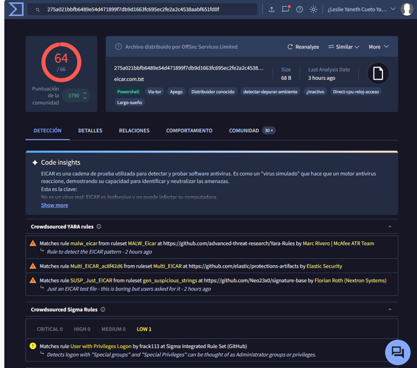
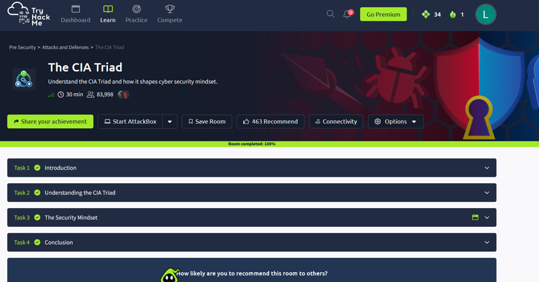
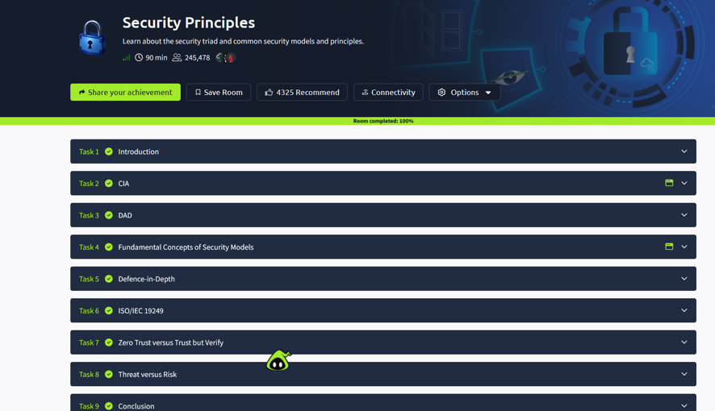
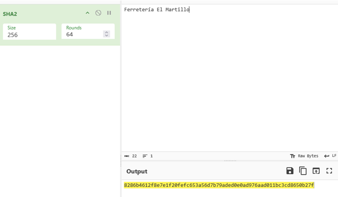
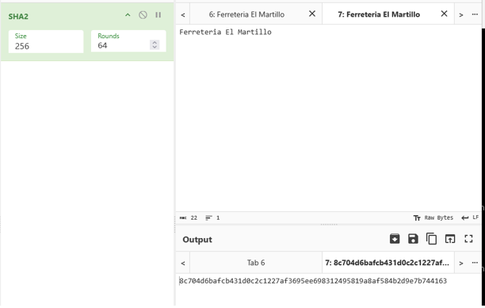
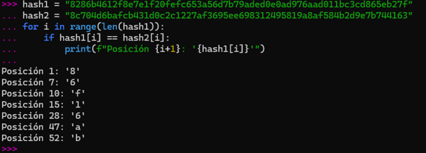
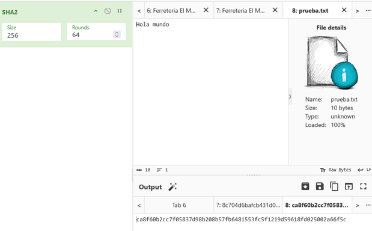
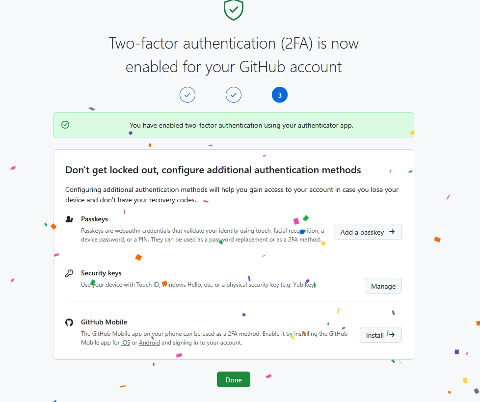
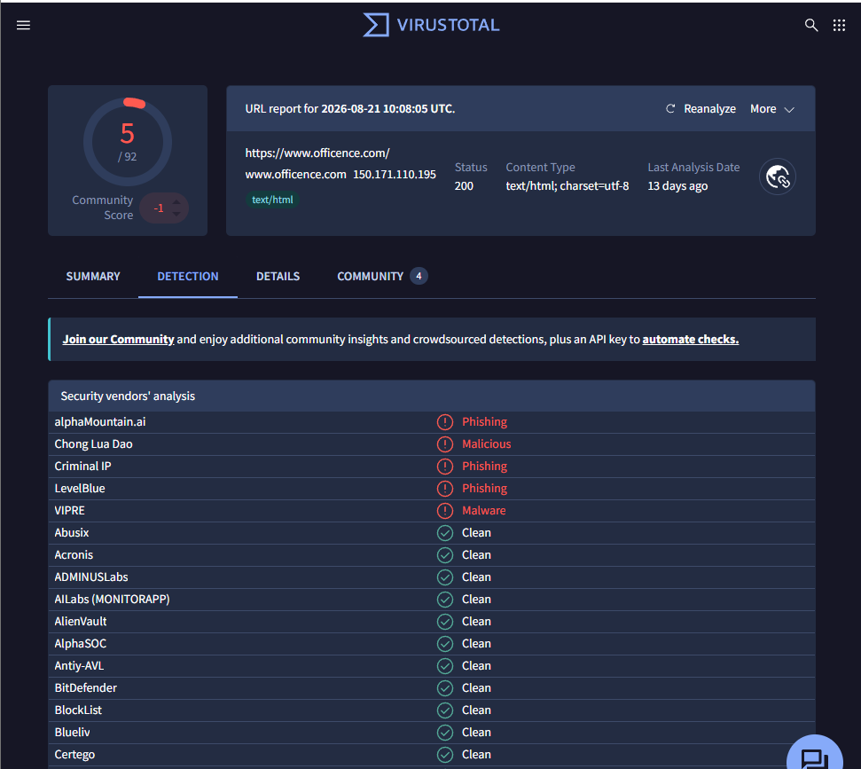
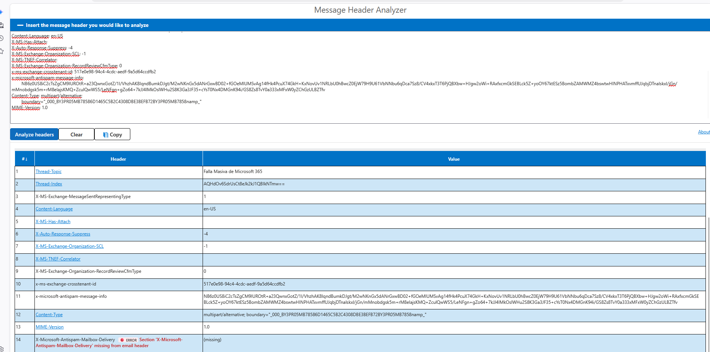

**Autor:** LESLIE YANETH CUETO YAURI

**Curso:** SOC Analyst Bootcamp - Ciberseguridad L1

**Entregable 1 del portafolio** — Análisis de Phishing + Kill Chain Map

**Escenario:** Ferretería El Martillo (pyme de 30 empleados, Lima)

> 📌 **Cómo usar esta plantilla:** cópiala a tu carpeta de trabajo `bootcamp-cyber102/modulo-1/` y renómbrala a `analisis-phishing-kill-chain.md`. Vas a ir completándola clase por clase (Sección 1 en C01, Sección 2 en C02, Sección 3 en C03 y Sección 4 en C04). Reemplaza cada `_____` con tu trabajo. No borres los encabezados.

---

## Sección 1 — Controles presentes y ausentes (Clase 01)

**Escenario:** Ferretería El Martillo (30 empleados, Lima).

### 1.1 Triada CIA — pilares en riesgo

| #   | Incidente                                 | Pilar(es) CIA comprometido(s) | Justificación (1 línea)                                                                |
| --- | ----------------------------------------- | ----------------------------- | -------------------------------------------------------------------------------------- |
| 1   | Un atacante accede al Excel de sueldos    | Confidencialidad (C)          | Se accede a información salarial privada sin autorización.                             |
| 2   | Un ransomware cifra el servidor de ventas | Disponibilidad (A)            | El cifrado bloquea el acceso legítimo al sistema, impidiendo realizar ventas y operar. |
| 3   | Alguien modifica precios en el sistema    | Integridad (I)                | Los datos de precios fueron alterados sin autorización y dejan de ser confiables.      |

### 1.2 Matriz de controles

| #   | Control (presente o ausente)                                       | Tipo       | Dimensión      | Pilar CIA | Justificación (1 línea)                                                                    |
| --- | ------------------------------------------------------------------ | ---------- | -------------- | --------- | ------------------------------------------------------------------------------------------ |
| 1   | Wi-Fi separada para clientes (Presente)                            | Preventivo | Técnico        | C         | Aísla a clientes del tráfico corporativo                                                   |
| 2   | Contraseña segura en Router (Ausente)                              | Preventivo | Técnico        | C         | Cambiar la contraseña por defecto evitaría accesos no autorizados a la red.                |
| 3   | Cifrado de disco externo (Ausente)                                 | Preventivo | Técnico        | C         | El cifrado evitaría que personas no autorizadas accedan a las facturas si roban el disco. |
| 4   | Copias de seguridad del servidor de ventas (Presente)              | Correctivo | Tecnico        | A         | Permitirían recuperar la información y continuar las operaciones después de un incidente.  |
| 5   | Política de seguridad para proteger el Excel de sueldos (Presente) | Preventivo | Administrativo | C         | Establecería reglas para proteger el acceso a la información salarial.                     |
| 6  | MFA resistente al phishing mediante FIDO2/passkeys (Ausente)| Preventivo | Técnico | C         | Reduce el riesgo de accesos no autorizados aunque una contraseña sea robada.

  

**Exploración de herramientas (VirusTotal):**
- ¿Cuántos motores antivirus detectaron el archivo como malicioso? `64 de 66`
- ¿Cuál es la categoría del malware según la mayoría de motores? `EICAR /malware de prueba`
- ¿VirusTotal es un control preventivo o detectivo? `Detectivo, porque permite identificar archivos potencialmente maliciosos mediante el análisis de múltiples motores de seguridad.`

### 1.3 Observaciones del estudiante

En 1 párrafo (máximo 5 líneas): ¿cuál es el control que, si se implementara hoy, tendría mayor impacto en la postura de seguridad de la ferretería? Justifica apoyándote en la matriz de 1.2.

`El control que tendría mayor impacto inmediato sería cambiar la contraseña por defecto del router, ya que actualmente puede facilitar accesos no autorizados a la red de la ferretería. Según la matriz, este control preventivo técnico fortalecería la confidencialidad y reduciría el riesgo de que personas no autorizadas ingresen a la red corporativa. Además, es una medida sencilla que puede implementarse de forma inmediata.`

---

  

  

## Sección 2 — Mecanismos criptográficos en Ferretería El Martillo (Clase 02)

### 2.1 Clasificación por caso de uso

| #   | Caso de uso                                               | Mecanismo criptográfico                | Pilar CIA primario | Justificación                                                                                                                                |
| --- | --------------------------------------------------------- | -------------------------------------- | ------------------ | -------------------------------------------------------------------------------------------------------------------------------------------- |
| 1   | Conexión HTTPS del empleado a Google Workspace            | Cifrado asimétrico + cifrado simétrico | Confidencialidad   | El cifrado asimétrico permite establecer de forma segura las claves de sesión y el simétrico protege el tráfico durante la comunicación.     |
| 2   | Contraseñas almacenadas en el sistema de ventas           | Hash                                   | Confidencialidad   | El hash permite almacenar una representación no reversible de la contraseña, evitando guardar la contraseña original.                        |
| 3   | Factura firmada digitalmente por el contador              | Firma digital                          | Integridad         | La firma digital permite comprobar que la factura no fue modificada y verificar que fue firmada por el contador.                             |
| 4   | Cifrado del disco externo del dueño (BitLocker/VeraCrypt) | Cifrado simétrico                      | Confidencialidad   | El cifrado protege los archivos almacenados para impedir que personas no autorizadas puedan acceder a su contenido.                          |
| 5   | Verificación de que un archivo descargado no fue alterado | Hash                                   | Integridad         | Se compara el hash del archivo descargado con el hash original para detectar cualquier modificación.                                         |
| 6   | Token de sesión del banco online                          | Cifrado simétrico                      | Confidencialidad   | El cifrado protege la información sensible del token para evitar que terceros puedan acceder a ella durante su transmisión o almacenamiento. |

### 2.2 Experimento de hashing

- **Input original:** `Ferretería El Martillo`
- **Hash SHA-256:** `8286b4612f8e7e1f20fefc653a56d7b79aded0e0ad976aad011bc3cd8650b27f`

- **Input modificado (sin tilde):** `Ferreteria El Martillo`
- **Hash SHA-256:** `8c704d6bafcb431d0c2c1227af3695ee698312495819a8af584b2d9e7b744163`

¿Cuántos caracteres del hash son iguales entre los dos inputs? `7`

¿Cómo se llama esta propiedad del hash? **Efecto avalancha**

### Hash de un archivo

  

- ** Nombre del archivo:** `prueba.txt `
- ** Hash SHA-256 del archivo:** `ca8f60b2cc7f05837d98b208b57fb6481553fc5f1219d59618fd025002a66f5c`
- **Tamaño del hash (en caracteres hexadecimales):** `64`

### 2.3 Recomendación para el dueño
En 1 párrafo (máximo 6 líneas), dado lo que viste en la Clase 01 (matriz de controles) y hoy (mecanismos criptográficos), ¿qué 2 medidas criptográficas concretas recomendarías implementar en Ferretería El Martillo en los próximos 30 días? Justifica cada una con la combinación "pilar CIA protegido + caso de uso específico del escenario".

`Recomendaría implementar, en primer lugar, el **cifrado del disco externo del dueño mediante BitLocker o VeraCrypt**, para proteger la **confidencialidad (C)** de las facturas y evitar que personas no autorizadas accedan a la información en caso de robo o pérdida del dispositivo. En segundo lugar, recomendaría implementar el **hash seguro de las contraseñas del sistema de ventas**, para proteger la **confidencialidad (C)** de las credenciales y evitar que las contraseñas originales queden almacenadas directamente en el sistema. Ambas medidas reducirían riesgos relacionados con el acceso no autorizado a información sensible.`

## Sección 3 — Autenticación en Ferretería El Martillo (Clase 03)

### 3.1 Mapeo de mecanismos a factores

| # | Mecanismo de autenticación | Factor (sabes / tienes / eres / haces / dónde) | Ataque conocido contra él | MFA/alternativa resistente |
|---|----------------------------|-----------------------------------------------|----------------------------|-----------------------------|
| 1 | 🔑 Contraseña "martillo2023" del sistema de ventas | Conocimiento / algo que sabes | Phishing, credential stuffing, brute force | MFA / 2FA |
| 2 | 📱 SMS OTP del banco del dueño (código temporal) | Posesión / algo que tienes | SIM swapping, phishing | App autenticadora (TOTP) o FIDO2 |
| 3 | 👆 Huella digital del celular de la contadora | Inherencia / algo que eres | Falsificación de huella, compromiso del dispositivo | Biometría + PIN |
| 4 | 🔢 App autenticadora (TOTP) en Google Workspace | Posesión / algo que tienes | Phishing en tiempo real (Adversary-in-the-Middle) | Llave FIDO2 / passkey |
| 5 | 🔐 Llave física FIDO2 (YubiKey, no la tienen aún) | Posesión / algo que tienes | Pérdida o robo de la llave | FIDO2 + PIN y llave de respaldo |

### 3.2 Ejercicio — MFA con TOTP (Google Authenticator)

- **Cuenta de prueba usada:** Github (el servicio, NO la contraseña)
- **App autenticadora:** Microsoft Authenticator
- **¿El código rota cada 30 s y funciona sin señal/SMS?** Sí. El código cambia aproximadamente cada 30 segundos y puede generarse sin depender de SMS ni de la señal celular.
- **¿Por qué un SIM swap NO captura este código?** Porque el código TOTP se genera directamente en Microsoft Authenticator y no se envía por SMS ni depende de la tarjeta SIM. Por eso, un SIM swap por sí solo no permite al atacante obtener este código.

  

### 3.3 Por qué una MFA puede fallar + protección de identidades

- **¿Por qué el TOTP no siempre alcanza?** Porque la seguridad no depende únicamente del autenticador, sino también de los procesos y del factor humano. Un atacante puede utilizar phishing para obtener credenciales y, en un ataque en tiempo real, capturar el código TOTP antes de que expire.
- **¿Por qué FIDO2 / passkey sí lo resiste?** Porque verifica el dominio del sitio y la autenticación está vinculada al sitio legítimo, por lo que un sitio falso de phishing no puede utilizar la autenticación.

    (pista: verifica el dominio del sitio)

| Identidad | Amenaza más probable | MFA recomendada (SMS: evitar / TOTP / FIDO2) | Por qué |
|-----------|----------------------|----------------------------------------------|---------|
| Dueño → banca en línea | SIM swap / phishing | FIDO2 | Protege una cuenta crítica y ofrece mayor resistencia contra phishing. |
| Contadora → Google Workspace | phishing de credenciales | FIDO2 | Protege contra phishing y evita que un sitio falso utilice la autenticación. |
| Vendedor → sistema de ventas | reúso de contraseña | TOTP | Agrega un segundo factor y mejora la protección frente al uso de contraseñas reutilizadas. |

### 3.4 Caso: Phishing de credenciales a la contadora

**¿Qué factor(es) fueron comprometidos?**
Factor de conocimiento (usuario y contraseña) y factor de posesión (OTP recibido por SMS).

**¿Por qué el OTP por SMS no la protegió?**
Porque el atacante pudo engañarla mediante phishing para obtener también el código OTP y utilizarlo para acceder a la cuenta.

**¿Habría ayudado una app autenticadora (TOTP)? ¿Por qué sí o no?**
Habría sido más segura que SMS frente a un SIM swap, pero no habría detenido necesariamente un phishing en tiempo real, porque el atacante podría capturar el código TOTP y utilizarlo antes de que expire.

**¿Habría ayudado una llave FIDO2? ¿Por qué?**
Sí. FIDO2 es resistente al phishing porque verifica el dominio legítimo y no permite autenticar en un sitio falso.

**Mitigación propuesta para la contadora:**
Implementar FIDO2/passkey como MFA y evitar SMS como segundo factor. Además, capacitar a la contadora para reconocer correos y sitios de phishing y establecer una política de seguridad que indique no ingresar credenciales desde enlaces recibidos por correo.

### 3.5 Conexión con el proyecto

Revisa la matriz de la Sección 1: ¿hay un control de autenticación/MFA? Si no, agrega 1 y justifica en 1 línea: 

**No había un control específico de autenticación/MFA, por lo que se agregó MFA resistente al phishing mediante FIDO2/passkeys para proteger las cuentas críticas y reducir el riesgo de accesos no autorizados.**

---

## Sección 4 — Análisis integrador del Módulo 1 (Clase 04)
### 4.1 Taxonomía del incidente

**Amenaza observada:** Phishing mediante ingeniería social enfocado en la suplantación de identidad institucional para el robo de credenciales corporativas y evasión de MFA.

**Actor probable (perfil):** Cibercriminal de nivel intermedio. No se atribuye a una persona específica, pero el perfil demuestra conocimiento en la inyección de cabeceras de Microsoft Exchange y técnicas de Typosquatting para evadir protecciones perimetrales básicas.

**Vector inicial:** Correo electrónico malicioso dirigido a la víctima (Ismael Delgado), utilizando un enlace fraudulento camuflado para forzar una falsa reautenticación.

---

### 4.2 IOCs extraídos del correo

| Tipo | Valor | Fuente (herramienta usada) |
|------|-------|----------------------------|
| Dominio del remitente | `pichircha.pe` (Suplantación por Typosquatting) | Análisis estático del encabezado `From` |
| Dominio del link     | `www.officence.com` | Cuerpo del correo / Identificado en VirusTotal (5/92) |
| IP de envío (header "Received") | `://outlook.com` | Cabecera `Message-ID` analizada en Message Header Analyzer |
| Hash de adjunto (si hay)        | No aplica (Ataque basado puramente en hipervínculo) | Inspección de estructura MIME |
| URL acortada (si hay)           | No aplica (Usa URL directa con ID de inquilino codificado) | Inspección de etiqueta HTML `<a>` |

  

**Headers anómalos detectados (SPF/DKIM/DMARC):**
- **SPF:** `Fail` (El servidor de Outlook del atacante no está autorizado en los registros DNS para enviar correos legítimos a nombre de la organización suplantada).
- **DKIM:** `Fail` (No existe firma criptográfica válida asociada al cuerpo del mensaje que valide al remitente `pichircha.pe`).
- **DMARC:** `Fail` (Debido a la falta de alineación de identificadores entre el dominio de envío real y el expuesto en el campo `From`).

  

*Nota analítica complementaria:* Se detectó el encabezado crítico **`X-MS-Exchange-Organization-SCL: -1`** (Spam Confidence Level) en Message Header Analyzer. Esto demuestra que el atacante manipuló o inyectó este parámetro para engañar a la plataforma de correo y forzar la entrega directa en la bandeja de entrada, puenteando las carpetas de spam.

**Señal de falsificación del remitente (from vs reply-to):**
El encabezado `From` expone la dirección `Help Desk <mesadeservicio@pichircha.pe>`. Existe una manipulación visual deliberada donde se sustituyó la letra "n" por la "r" (`pichircha` en lugar de `pichincha`) para engañar al destinatario y simular que se trataba de un comunicado oficial interno del equipo de soporte.

---

### 4.3 Indicadores visuales

1. **Urgencia artificial basada en alarmismo técnico:** El asunto *"Falla Masiva de Microsoft 365"* y la alerta de *"intermitencias que requieren revalidar sesiones"* buscan asustar al usuario para que actúe de inmediato sin verificar la fuente por temor a perder acceso a sus herramientas de trabajo.
2. **Uso de enlaces de texto engañosos (Anchor Text Misalignment):** El botón interactivo muestra el texto legítimo *"Ver actividades"*, pero al inspeccionar el hipervínculo web real (`href`), este redirige de forma encubierta a la infraestructura maliciosa externa `https://www.officence.com/...`.
3. **Inconsistencias gramaticales y formato plano:** El cuerpo del mensaje carece de tildes en palabras clave (*"atencion"*, *"configuracion"*), utiliza un saludo genérico no personalizado a pesar de ir dirigido a un usuario específico y su estructura imita de forma burda los colores corporativos mediante un diseño web HTML plano y sospechoso.

### 4.4 Mapa Kill Chain del incidente

| #   | Fase                  | ¿Se observó? | Evidencia concreta (de este correo) |
| --- | --------------------- | ------------ | ----------------------------------- |
| 1   | Reconnaissance        | Sí       | El atacante recolectó información dirigida para identificar los nombres y el dominio exacto de la organización de la víctima (ismael.delgado@pichincha.pe).                               |
| 2   | Weaponization         | Sí       | Configuración de la infraestructura maliciosa: registro del dominio por Typosquatting pichircha.pe, diseño del portal falso en ://officence.com e inyección del parámetro de cabecera SCL: -1.                             |
| 3   | Delivery              | Sí       | El mensaje fraudulento simulando una "Falla Masiva de Microsoft 365" fue transmitido de forma exitosa el día Wed, 2 Sep 2026 17:14:55 +0000 hacia la bandeja de entrada del usuario.                              |
| 4   | Exploitation          | Sí        | El correo explota el miedo del usuario mediante ingeniería social (MFA desincronizado) para forzarlo a interactuar con el enlace engañoso oculto bajo el botón "Ver actividades".                               |
| 5   | Installation          | Sí(Infered)       | Al redirigir a la víctima al portal falso ://officence.com, el sitio está preparado para capturar en caliente las credenciales de acceso y los códigos del token MFA que el usuario ingrese.                              |
| 6   | Command & Control     | Sí(Infered)      | Uso remanente del dominio malicioso externo de recopilación para centralizar y exfiltrar las credenciales interceptadas hacia los sistemas de administración del ciberdelincuente.                              |
| 7   | Actions on Objectives | Sí(Infered)      | El objetivo final del ataque es el robo de identidad corporativa para realizar fraudes financieros, exfiltración de correos confidenciales del banco o ejecución de phishing lateral interno.                              |

### 4.5 Técnicas MITRE ATT&CK observadas

| ID técnica | Nombre | Táctica | Evidencia |
|------------|--------|---------|-----------|
| **T1589.002** | Gather Victim Identity Information: Email Addresses | Reconnaissance | El correo está dirigido con precisión al buzón de Ismael Delgado utilizando el formato corporativo exacto de la entidad (`@pichincha.pe`). |
| **T1566.002** | Phishing: Spearphishing Link | Initial Access | El atacante insertó un hipervínculo malicioso oculto en el código HTML bajo el texto visual "Ver actividades" que apunta al portal falso `://officence.com`. |
| **T1036.005** | Masquerading: Match Legitimate Name or Location | Defense Evasion | Registro deliberado y uso del correo `mesadeservicio@pichircha.pe` (intercambiando la 'n' por la 'r') para engañar visualmente al usuario imitando al banco real. |
| **T1114.002** | Email Collection: Remote Email Services | Collection | El objetivo directo del portal simulado de Microsoft 365 es capturar las credenciales y el token MFA para acceder ilícitamente a los servicios de correo de la víctima en la nube. 

**JSON exportado:** `evidencias/mitre-attack-layer.json` 

### 4.6 Autoevaluación

| Criterio | Mi estimación | Qué mejoraría si tuviera 15 min más |
|----------|---------------|--------------------------------------|
| **1. Análisis técnico** | Excelente | Incluiría capturas adicionales del código HTML crudo para desglosar el token del parámetro codificado del tenant. |
| **2. Uso de herramientas** | Excelente | Configuraría una API automática para automatizar la extracción de IOCs entre Message Header Analyzer y VirusTotal de forma simultánea. |
| **3. Documentación** | Excelente | Puliría los márgenes visuales de la plantilla final para que la exportación directa a formato PDF se alinee exactamente a 4 páginas. |
| **4. Mapeo Kill Chain** | Excelente | Agregarías una columna extra cruzando cada fase del Cyber Kill Chain con el código exacto de la técnica MITRE correspondiente. |
| **5. Desafío Avanzado** | Excelente | Investigaría la estructura del protocolo OAuth2 utilizado en la persistencia del ataque tras la evasión del MFA. |_____                        |

### 4.7 Controles por fase del Kill Chain (Desafío Avanzado)

Para cada fase observada en 4.4, propón 1 control preventivo + 1 detectivo + 1 correctivo.

#### Fase observada: Weaponization
- **Preventivo:** Implementar registros DMARC con política estricta de rechazo (`p=reject`) combinados con filtros perimetrales anti-spoofing. Protege el pilar de **Integridad** al evitar que dominios alterados o falsificados ingresen a la organización.
- **Detectivo:** Monitorizar herramientas de inteligencia de amenazas (Threat Intelligence) y alertas automatizadas de marcas para detectar la creación de dominios por Typosquatting (como `pichircha.pe`) antes de que ejecuten campañas.
- **Correctivo:** Coordinar la denuncia y baja (*takedown*) inmediata del dominio fraudulento con los registradores DNS y proveedores de hosting internacionales (`://officence.com`).

#### Fase observada: Delivery
- **Preventivo:** Restringir mediante políticas del Secure Email Gateway (SEG) cualquier correo entrante externo que intente inyectar o modificar artificialmente cabeceras internas de confianza, específicamente el parámetro `X-MS-Exchange-Organization-SCL: -1`. Protege la **Disponibilidad** y confidencialidad al detener la amenaza en la frontera.
- **Detectivo:** Configurar alertas analíticas en el SIEM que identifiquen picos inusuales de correos entrantes con palabras clave alarmistas (*"Falla Masiva"*, *"Reautenticar MFA"*) provenientes de Tenants externos de Office 365 ajenos.
- **Correctivo:** Habilitar reglas de purga automática posterior a la entrega (*Zero-hour Auto Purge - ZAP*) para eliminar de forma masiva el correo malicioso de todos los buzones corporativos si logró evadir el filtro inicial.

#### Fase observada: Exploitation
- **Preventivo:** Desplegar autenticación multifactor basada en hardware y llaves físicas (**MFA FIDO2**), la cual es 100% resistente al phishing y previene la intercepción de tokens en portales clonados. Protege la **Confidencialidad** del acceso.
- **Detectivo:** Implementar políticas de acceso condicional que gatillen alertas de "viaje imposible" o anomalías de comportamiento cuando se detecten inicios de sesión desde IPs no corporativas inmediatamente después de que un usuario interactúe con enlaces externos.
- **Correctivo:** Revocar inmediatamente todas las sesiones activas en la nube de Microsoft 365 para el usuario afectado (`ismael.delgado@pichincha.pe`), forzar el restablecimiento de contraseñas y aislar preventivamente la cuenta corporativa comprometida.

### 4.8 Recomendación ejecutiva

En ≤6 líneas, para un manager no técnico: ¿qué control implementarías primero y por qué? Justifica con costo relativo (bajo/medio/alto), impacto en usuarios y fase del Kill Chain que ataca.

Recomiendo priorizar la implementación de **autenticación multifactor resistente a phishing (MFA FIDO2 / Llaves físicas)**. Este control actúa en la fase de **Explotación**, neutralizando por completo el robo de credenciales en portales falsos debido a que el token va amarrado exclusivamente al hardware del usuario. El **costo relativo es medio** (adquisición de dispositivos), pero su **impacto en los usuarios es muy bajo** en su día a día y elimina de raíz el riesgo de compromiso de identidades corporativas, protegiendo los activos financieros críticos de la institución sin requerir un gasto masivo en infraestructura.

### 4.9 Reflexión del Módulo 1

* **¿Qué habilidad del Módulo 1 te parece más valiosa? ¿Por qué?**
La habilidad más valiosa ha sido aprender a leer y auditar los encabezados técnicos crudos de un correo electrónico. En la universidad o en la teoría se suele hacer énfasis en los indicadores visuales (como la ortografía o el diseño del logo), pero entender cómo desglosar los parámetros SMTP y Exchange (como el hallazgo del `SCL: -1` y la falta de alineación SPF/DKIM) me da la capacidad analítica real para tomar decisiones de bloqueo infalibles en un entorno SOC, sin depender únicamente de que un software automatizado me diga si algo es malicioso o no.

* **¿Qué cambiarías en tu forma de trabajar a partir de hoy?**
A partir de hoy, cambiaré mi enfoque inicial al clasificar alertas: dejaré de analizar los incidentes como eventos aislados y los abordaré de forma estructurada utilizando marcos de trabajo como el Cyber Kill Chain y MITRE ATT&CK desde el primer minuto. En lugar de saltar desesperadamente a revisar si un enlace está en listas negras, primero documentaré el mapa de comportamiento del atacante. Esto me permitirá identificar patrones repetitivos (TTPs) y proponer mitigaciones de amplio espectro para la empresa, en lugar de jugar al "gato y al ratón" bloqueando IPs únicas que el atacante puede cambiar en segundos.

* **¿Qué área te gustaría explorar más en el Módulo 2?**
Me interesa profundamente profundizar en el análisis técnico de phishing y el análisis de tráfico de red con Wireshark. Quiero comprender a nivel de paquetes de datos cómo se comporta el tráfico cuando una sesión es comprometida y aprender a detectar anomalías en los protocolos de red (como DNS o HTTP) durante la fase de Comando y Control (C2). Además, me entusiasma la idea de analizar muestras de malware reales para entender cómo logran ejecutar persistencia de manera silenciosa dentro de los sistemas de una organización.