**Autor:** CUETO YAURI LESLIE YANETH
**Curso:** SOC Analyst Bootcamp - Ciberseguridad L1
**Módulo:** 2
**Actividad:** Laboratorio 06 — Email Forensics: SPF, DKIM y DMARC en un phishing real

---

## Sección 1 — Fichas técnicas de malware

### 1.1 Clasificación de comportamientos observados

| # | Comportamiento observado | Familia más probable | Por qué (1 línea) |
|---|--------------------------|---------------------|-------------------|
| 1 | El archivo `factura.docm` abre Word y descarga un segundo binario desde una URL | Trojan (engaña) | Se hace pasar por un documento legítimo y ejecuta/descarga otro malware.|
| 2 | Una estación de trabajo empieza a escanear el rango /24 interno por puerto 445 sin intervención del usuario | Worm (se propaga) | Busca otros equipos SMB para propagarse automáticamente. |
| 3 | Todos los archivos `.docx` del recurso compartido tienen extensión cambiada a `.lockbit` | Ransomware (secuestra archivos)| Cifra o bloquea archivos y cambia sus extensiones. |
| 4 | Se observa conexión saliente cada 45 segundos a un dominio con TTL bajo, el usuario no está activo | Botnet (recibe órdenes) | Presenta comunicación periódica con un servidor de comando y control (C2). |
| 5 | Un proceso intercepta las teclas tecleadas y las escribe en `%TEMP%\keys.dat` | Spyware (espía)| Captura información del usuario, específicamente las pulsaciones de teclado. |
| 6 | Un driver firmado aparece en el kernel después de un reinicio, antivirus no lo detecta | Rootkit (se oculta) | Busca ocultarse y mantener acceso a nivel profundo del sistema. |

### 1.2 Análisis técnico de 3 hashes

#### Hash 1

- **SHA-256:** 275a021bbfb6489e54d471899f7db9d1663fc695ec2fe2a2c4538aabf651fd0f
- **Nombre(s) detectado(s) por consenso de AVs:** EICAR / EICAR-Test-File Virus:DOS/EICAR_Test_File, EICAR Test-NOT Virus!!!
- **Familia:** EICAR 
- **Fecha de primer análisis en VT:** 22/05/2006 12:42:02 UTC
- **Número de motores que lo detectan:** 65 / 67
- **Tipo de archivo:** PowerShell / archivo de prueba EICAR / Texto Plano ASCII (ps1 / txt).
- **IOCs adicionales observados:** 
  - eicar.com
  - eicar.txt
  - eicar.exe
  - eicar.bin
  - EICAR.COM
- **Técnicas MITRE ATT&CK asociadas (si VT las lista):** 

- T1059 – Command and Scripting Interpreter
- T1064 – Scripting
- T1106 – Native API
- T1574 – Hijack Execution Flow
- T1547 – Boot or Logon Autostart Execution
- T1055 – Process Injection
- T1036 – Masquerading
- T1497 – Virtualization/Sandbox Evasion
- T1564 – Hide Artifacts
- T1057 – Process Discovery
-  T1082 – System Information Discovery
- T1083 – File and Directory Discovery
- T1518 – Software Discovery
- T1071 – Application Layer Protocol
- T1095 – Non-Application Layer Protocol
- T1573 – Encrypted Channel
- T1222 – File and Directory Permissions Modification

**Nota:** Las técnicas reportadas por VirusTotal corresponden a comportamientos/firma observados en los entornos de análisis y no deben interpretarse como capacidades propias de EICAR, ya que se trata de un archivo estandarizado de prueba antivirus.

#### Hash 2

- **SHA-256:** ed01ebfbc9eb5bbea545af4d01bf5f1071661840480439c6e5babe8e080e41aa
- **Nombre(s) detectado(s) por consenso de AVs:** Trojan-Ransom.Win32.Wanna, Ransom:Win32/WannaCrypt!pz
- **Familia:** WannaCry
- **Fecha de primer análisis en VT:** 12 de mayo de 2017 (07:31:10 UTC)
- **Número de motores que lo detectan:** 65 / 70
- **Tipo de archivo:** Win32 EXE 
- **IOCs adicionales observados:** 
 - Tráfico de Red: Tráfico redireccionado a nodos de salida Tor (128.31.0.39, 131.188.40.189).
 - Archivos Caídos (Dropped): Creación de ejecutables secundarios (lhdfrgui.exe), accesos directos (@WanaDecryptor@.exe.lnk) y archivos temporales cifrados (.WNCRYT).
- 
- **Técnicas MITRE ATT&CK asociadas (si VT las lista):**
   
- T1566, T1047, T1059, T1064, T1106, T1129, T1547/T1060, T1543/T1050, T1112, T1055, T1027, T1036, T1070, T1140, T1497, T1622, T1003, T1056 y T1552.

#### Hash 3 

- **SHA-256:** 4e0b4745791983c83562f9aa62c2d5a9d1391ae981f62850457c8c7e5db42066
- **Nombre(s) detectado(s) por consenso de AVs:** Emotet / Trojan.Emotet
- **Familia:** Emotet
- **Fecha de primer análisis en VT:** 29/09/2020 08:19:42 UTC
- **Número de motores que lo detectan:** 63 / 71
- **Tipo de archivo:** PE32 / EXE ejecutable de Windows 
- **IOCs adicionales observados:** 
  - 12.163.208.58
  - 192.241.146.84:8080
- **Técnicas MITRE ATT&CK asociadas (si VT las lista):** 
  
- T1129 Shared Modules; T1112 Modify Registry; T1027 Obfuscated Files or Information; T1036 Masquerading; T1070 Indicator Removal; T1497 Virtualization/Sandbox Evasion; T1564 Hide Artifacts; T1012 Query Registry; T1057 Process Discovery; T1082 System Information Discovery; T1083 File and Directory Discovery; T1071 Application Layer Protocol; T1571 Non-Standard Port.
- 
<p align="center">
  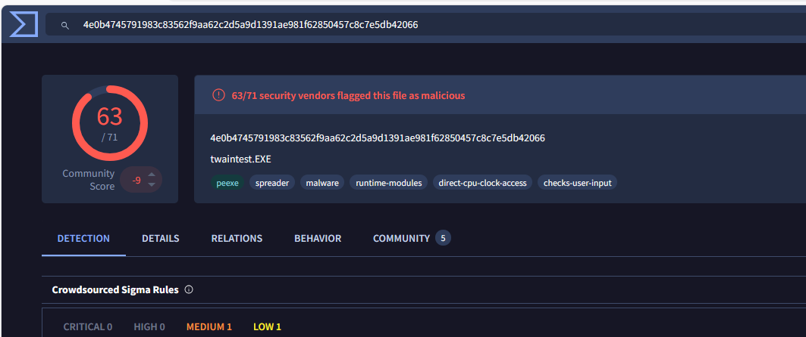
</p>

#### Inspección profunda — Hash elegido: ed01ebfbc9eb5bbea545af4d01bf5f1071661840480439c6e5babe8e080e41aa

**Desde la pestaña "Behavior":**
- Procesos hijos creados:  Ejecuta comandos vía wmic y vssadmin para borrar Shadow Copies, y arranca subprocesos analizados por sandboxes como CAPE y Zenbox.
- Claves de registro tocadas: Modifica las llaves de autoarranque (autostart registry) y la carpeta de inicio de aplicaciones de Office para asegurar persistencia.
- Archivos creados o modificados: Crea archivos de configuración relacionados con Tor en AppData\Roaming\tor\, incluyendo elementos como cached-certs y cached-consensus.
- Conexiones de red: Genera tráfico TCP hacia IPs de nodos Tor (ej. 128.31.0.39:9101, 131.188.40.189:443) y mapea en memoria múltiples dominios .onion.
**Desde la pestaña "Community":**
- ¿Hay comentarios de analistas? (Sí/No) si
- Si sí, resume UNO que te parezca útil (2 líneas) 
- Los analistas confirman que las reglas IDS de Emerging Threats detectan el tráfico saliente del binario hacia la red Tor como repetidores de tipo Relay/Router.
  

### 1.3 Fichas técnicas de 3 familias

#### Ficha A — WannaCry

| Campo | Valor |
|-------|-------|
| **Categoría** | Ransomware / Worm |
| **Comportamiento en endpoint** | Cifrado masivo (`.WNCRY`), elimina Shadow Copies y altera el fondo de pantalla. |
| **Comportamiento en red** | Escaneo interno del puerto **TCP 445** (SMB) y conexiones salientes vía Tor. |
| **IOCs comportamentales clave** | 1. Uso de vssadmin para eliminar Shadow Copies. 2. Creación del archivo @WanaDecryptor@.exe. 3. Tráfico SMB hacia múltiples IPs internas.|
| **Caso real documentado** | **Servicio Nacional de Salud (NHS)** del Reino Unido (2017). |
| **2 controles preventivos** | - 1. Aplicar parche MS17-010.   - 2. Deshabilitar por completo SMBv1. |
| **1 control detectivo** |Alertas EDR ante ejecución de procesos sospechosos desde rutas temporales o de usuario y actividad anómala de cifrado masivo de archivos. |
| **Referencia** | [MITRE ATT&CK: WannaCry (S0366)](https://attack.mitre.org/software/S0366/)
|

***

#### Ficha B — Agent Tesla

| Campo | Valor |
|-------|-------|
| **Categoría** | Spyware / Trojan |
| **Comportamiento en endpoint** | Robo de credenciales, registro de teclas (keylogging), captura de pantalla y recopilación de información del sistema. |
| **Comportamiento en red** | Comunicación con infraestructura de mando y control mediante HTTP y SMTP, además de exfiltración de información mediante HTTP, SMTP y FTP. |
| **IOCs comportamentales clave** | 1. Modificación del Registro para establecer persistencia. 2. Acceso a credenciales almacenadas en navegadores. 3. Captura de teclas y datos del portapapeles. 4. Comunicación HTTP/SMTP para envío de información. |
| **Caso real documentado** | Campañas de spear-phishing de abril de 2020 dirigidas contra organizaciones del sector petróleo y gas, en las que se utilizó Agent Tesla para robar información. Una de las campañas suplantó a la empresa egipcia Enppi. |
| **2 controles preventivos** |1. Capacitación y protección frente a correos de phishing y archivos adjuntos maliciosos. 2. Aplicar parches de seguridad a Microsoft Office y mantener los sistemas actualizados.|
| **1 control detectivo** | EDR/antimalware con alertas ante keylogging, modificación de claves de inicio automático, acceso anómalo a credenciales de navegadores y conexiones HTTP/SMTP sospechosas. |
| **Referencia** | [MITRE ATT&CK: Agent Tesla (S0331)](https://attack.mitre.org/software/S0331/ ) |

***

#### Ficha C — Conficker

| Campo | Valor |
|-------|-------|
| **Categoría** | Worm |
| **Comportamiento en endpoint** | Se copia en el sistema, se registra como servicio, modifica el Registro y puede terminar servicios relacionados con la seguridad de Windows. |
| **Comportamiento en red** | Explotación de la vulnerabilidad MS08-067 para propagarse, escaneo de otros equipos de la red y propagación mediante recursos compartidos SMB/NetBIOS. También utiliza DGA para generar dominios. |
| **IOCs comportamentales clave** | 1. Modificación del Registro y creación de un servicio para persistencia. 2. Terminación de servicios relacionados con seguridad. 3. Generación de dominios mediante DGA y escaneo de otros equipos.|
| **Caso real documentado** |Conficker afectó a numerosas organizaciones a nivel mundial, incluyendo sistemas de organismos gubernamentales y empresas, debido a la explotación de vulnerabilidades de Windows.|
| **2 controles preventivos** |1. Aplicar el parche MS08-067 y mantener Windows actualizado. 2. Restringir SMB/recursos compartidos innecesarios y controlar el uso de medios extraíbles.|
| **1 control detectivo** | Alertas ante consultas DNS anómalas compatibles con DGA y patrones de escaneo/propagación SMB entre múltiples equipos. |
| **Referencia** | [MITRE ATT&CK: Conficker (S0608)](https://attack.mitre.org/software/S0608/)|


### 1.4 Conexión con el reporte del Módulo 1

Revisa tu matriz de controles (Sección 1 del reporte M1). ¿Cuál de tus 5
controles previene al menos una de las 3 familias que acabas de documentar?
- La separación de la Wi-Fi de clientes ayuda a aislar la red corporativa y puede limitar la propagación de amenazas como Conficker.
- La contraseña fuerte del router reduce el riesgo de accesos no autorizados a la infraestructura de red.
- La política de seguridad para proteger el Excel de sueldos ayuda a reducir el acceso no autorizado a información sensible.
  
¿Cuál no hace nada contra ellas? En 3 líneas, identifica 1 control *faltante*
que cubriría un hueco evidente.

- El cifrado del disco externo tiene poca utilidad directa frente a WannaCry, Agent Tesla o Conficker cuando el ataque ocurre sobre equipos conectados a la red, ya que su función principal es proteger la información almacenada en el dispositivo en caso de pérdida o robo.
  
### Control faltante:

Un control faltante importante sería implementar una solución EDR/antimalware administrada en los equipos.

Este control permitiría detectar y responder ante comportamientos asociados con ransomware, spyware y worms.

Complementaría las copias de seguridad y los controles preventivos existentes.

## Sección 2 — Email forensics de un correo phishing


## 2.1 Las tres verificaciones de autenticidad

| Tecnología | ¿Qué valida?                                                                                                                               | ¿Dónde vive la información?                                                              | ¿Qué pasa si falla?                                                                      |
| ---------- | ------------------------------------------------------------------------------------------------------------------------------------------ | ---------------------------------------------------------------------------------------- | ---------------------------------------------------------------------------------------- |
| **SPF**    | Verifica si el servidor o IP que envía el correo está autorizado por el dominio.                                                           | Registro **TXT del DNS** del dominio.                                                    | Puede indicar que el servidor no está autorizado y aumentar la sospecha sobre el correo. |
| **DKIM**   | Verifica mediante una firma criptográfica que el mensaje fue enviado por un dominio autorizado y que el contenido firmado no fue alterado. | La clave pública está en un registro **TXT del DNS** y la firma viaja dentro del correo. | La firma puede aparecer como inválida o no poder verificarse.                            |
| **DMARC**  | Comprueba la alineación de SPF o DKIM con el dominio visible en el campo `From` y aplica una política definida por el dominio.             | Registro **TXT del DNS** del dominio.                                                    | Dependiendo de la política, el mensaje puede ser aceptado, enviado a spam o rechazado.   |

### Resumen

SPF valida principalmente la **autorización del servidor emisor**.

DKIM valida la **firma criptográfica e integridad del mensaje**.

DMARC comprueba la **alineación de SPF/DKIM con el dominio visible en ****`From`** y permite establecer una política frente a fallos.

---

## 2.2 ¿Por qué los tres son complementarios?

Los tres mecanismos cumplen funciones diferentes.

Un correo puede tener **SPF Pass** pero **DKIM Fail** si el servidor está autorizado para enviar correos por el dominio, pero la firma DKIM es inválida, inexistente o no puede verificarse.

También puede ocurrir que SPF y DKIM pasen técnicamente, pero **DMARC falle** debido a que los dominios utilizados en SPF o DKIM no están alineados con el dominio que aparece en el campo visible `From`.

Por ello, SPF, DKIM y DMARC se utilizan de manera complementaria para aumentar la confianza en la autenticidad del correo.

---

# 2.3 Resultados de la validación — MXToolbox

Se analizaron los headers proporcionados utilizando MXToolbox.

**Evidencia:**

[Hacer clic aquí para abrir el archivo de Notas](/modulo-02/analize-header.md)


<p align="center">
  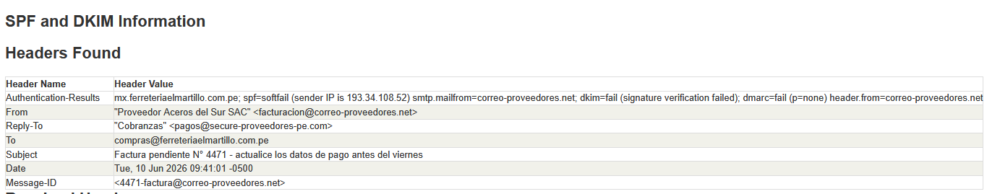
</p>


| Verificación | Resultado                                  | Dominio / IP involucrado                   | Nota                                                                                                                               |
| ------------ | ------------------------------------------ | ------------------------------------------ | ---------------------------------------------------------------------------------------------------------------------------------- |
| **SPF**      | **SoftFail**                               | `correo-proveedores.net` / `193.34.108.52` | La IP `193.34.108.52` no está correctamente autorizada para enviar por el dominio según el resultado obtenido.                     |
| **DKIM**     | **Fail** — `signature verification failed` | `correo-proveedores.net`                   | La firma DKIM no pudo verificarse correctamente.                                                                                   |
| **DMARC**    | **Fail** — `p=none`                        | `correo-proveedores.net`                   | La autenticación/alineación DMARC falla. La política publicada es `p=none`, que indica monitoreo y reporte, no rechazo automático. |

### Interpretación

Los tres resultados presentan indicadores negativos:

* **SPF:** SoftFail.
* **DKIM:** Fail.
* **DMARC:** Fail.

Estos resultados no prueban por sí solos que exista malware, pero sí representan una señal importante de que la autenticidad del correo debe investigarse.

---

# 2.4 Cadena Received — Trayecto del correo

El header disponible muestra:

```text
Received: from correo-proveedores.net (correo-proveedores.net [193.34.108.52])
    by mx.ferreteriaelmartillo.com.pe (Postfix) with ESMTPS id 7c1a9
    for <compras@ferreteriaelmartillo.com.pe>;
    Tue, 10 Jun 2026 09:41:03 -0500 (PET)
```

### Primer servidor observado

**Servidor:** `correo-proveedores.net`
**IP:** `193.34.108.52`

### Último servidor antes del buzón

**Servidor receptor:** `mx.ferreteriaelmartillo.com.pe`

### Trayecto observado

```text
correo-proveedores.net
        |
        | IP: 193.34.108.52
        ↓
mx.ferreteriaelmartillo.com.pe
        |
        ↓
compras@ferreteriaelmartillo.com.pe
```

### ¿Hay saltos sospechosos?

En los headers proporcionados solamente aparece **un salto de origen hacia el servidor receptor**, por lo que no es posible reconstruir una cadena completa de servidores intermediarios.

Tampoco se puede determinar con estos headers:

* País de origen.
* ASN.
* Si existieron otros servidores intermediarios.
* Si hubo problemas de PTR.

Sin embargo, el hecho de que la IP `193.34.108.52` obtenga **SPF SoftFail** constituye un indicador que merece investigación.

---

# 2.5 Discrepancias de identidad

Se compararon los campos `From`, `Return-Path` y `Reply-To`.

| Campo                               | Valor observado                              |
| ----------------------------------- | -------------------------------------------- |
| **From** — visible al usuario       | `facturacion@correo-proveedores.net`         |
| **Return-Path** — remitente técnico | **No aparece en los headers proporcionados** |
| **Reply-To** — destino de respuesta | `pagos@secure-proveedores-pe.com`            |

### ¿Los tres dominios coinciden?

**No se puede realizar una comparación completa de los tres**, porque el `Return-Path` no está presente en los headers proporcionados.

Sin embargo, sí existe una discrepancia entre:

```text
From:
facturacion@correo-proveedores.net
```

y:

```text
Reply-To:
pagos@secure-proveedores-pe.com
```

### Si no coinciden, ¿Qué sugiere esta discrepancia?

El mensaje aparenta provenir de:

`correo-proveedores.net`

pero dirige las respuestas hacia:

`secure-proveedores-pe.com`

Esta diferencia de dominios constituye un **indicador sospechoso**, especialmente en un correo relacionado con facturación y datos de pago.

Puede ser compatible con un intento de **phishing o suplantación de identidad**.

---

# 2.6 Patrones de ingeniería social observados — Principios de Cialdini

El ejercicio solicita evaluar los seis principios de Cialdini utilizando **el cuerpo del correo**.

Sin embargo, en el material proporcionado para este análisis se dispone de los **headers del mensaje, pero no del cuerpo completo**.

Por lo tanto, no es correcto inventar frases que no aparecen en la evidencia.

| Principio de Cialdini         | ¿Se usa?            | Frase literal del correo que lo evidencia  |
| ----------------------------- | ------------------- | ------------------------------------------ |
| **Autoridad**                 | **No determinable** | El cuerpo del correo no fue proporcionado. |
| **Urgencia**                  | **No determinable** | El cuerpo del correo no fue proporcionado. |
| **Escasez**                   | **No determinable** | El cuerpo del correo no fue proporcionado. |
| **Prueba social**             | **No determinable** | El cuerpo del correo no fue proporcionado. |
| **Reciprocidad**              | **No determinable** | El cuerpo del correo no fue proporcionado. |
| **Compromiso / Consistencia** | **No determinable** | El cuerpo del correo no fue proporcionado. |

### Nota metodológica

El asunto del correo contiene:

```text
Factura pendiente N° 4471 - actualice los datos de pago antes del viernes
```

Sin embargo, el checklist solicita específicamente analizar **el cuerpo del correo y utilizar citas literales** para los principios de Cialdini.

Por ello, no se deben atribuir principios de ingeniería social basándose únicamente en el asunto.

**Conclusión:** los seis principios quedan como **No determinables** con la evidencia disponible.

**Evidencia:**

<p align="center">
  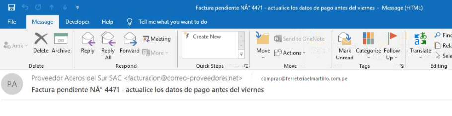
</p>


---


# 2.7 Veredicto técnico

## Clasificación: MALICIOSO / PHISHING

El correo presenta múltiples indicadores técnicos compatibles con phishing.

### Justificación:

El correo presenta SPF SoftFail, DKIM Fail y DMARC Fail. Además, existe una discrepancia entre el dominio del campo From (correo-proveedores.net) y el dominio del Reply-To (secure-proveedores-pe.com). Estos indicadores técnicos son compatibles con un intento de suplantación o phishing. La clasificación se basa en los headers disponibles; el cuerpo del mensaje no fue proporcionado.


### Recomendación para la contadora

No responder al correo ni actualizar datos de pago utilizando la información proporcionada en el mensaje. Verificar la factura mediante un canal oficial conocido de la empresa/proveedor.

### Recomendación para el SOC

Investigar la IP `193.34.108.52`, los dominios `correo-proveedores.net` y `secure-proveedores-pe.com`, buscar mensajes similares en los buzones y aplicar bloqueo si se confirma actividad maliciosa.

---

# 2.8 Conexión con la Sección 1 — Familia de malware probable

Si el correo tuviera un adjunto malicioso, la familia más probable de las tres analizadas en la Sección 1 sería:

## Agent Tesla

**Justificación:** el escenario está dirigido a una persona encargada de facturación y pagos. Agent Tesla es compatible con campañas cuyo objetivo sea el **robo de credenciales e información sensible**.

Esta selección es únicamente una **hipótesis de payload**. El análisis de los headers no permite afirmar que Agent Tesla esté presente en el correo.

Para confirmar la familia de malware sería necesario analizar un archivo adjunto, URL, hash, sandbox o comportamiento del endpoint.

---


## Sección 3 — Ataques de red en Ferretería El Martillo (Clase 07)


### 3.1 Modelo TCP/IP — ubicación de protocolos

| Capa | Ejemplo de protocolo | Ejemplo de ataque que opera aquí |
|------|---------------------|---------------------------------|
| 4. Aplicación | HTTP, DNS, SMTP, SSH | Fuerza bruta a SSH |
| 3. Transporte | TCP, UDP | SYN Flood |
| 2. Internet   | IP, ICMP | IP Spoofing |
| 1. Acceso a red | Ethernet, Wi-Fi | ARP Spoofing |
```bash
python3 -m http.server 80 --bind 192.168.100.5
```
```bash
curl http://<192.168.100.5>:80
```
```bash
ssh cuetona@192.168.100.52
```

### 3.2 Handshake TCP normal observado

| # Paquete | Origen → Destino | Flag TCP | Significado |
|-----------|------------------|----------|-------------|
| 1         | Kali → Objetivo  | SYN      | Solicitud de sincronización para iniciar la conexión. |
| 2         | Objetivo → Kali  | SYN, ACK | Acuse de recibo de la solicitud y sincronización mutua. |
| 3         | Kali → Objetivo  | ACK      | Acuse de recibo final. La conexión queda establecida. |

<p align="center">
  
</p>

---

### Análisis del Tráfico en Wireshark (Evidencia Real)

1. **Conexión Local (Puerto 80 - HTTP Server):**
   * **Paquete 1 (SYN):** La máquina Kali (`192.168.100.5`) inicia la comunicación local apuntando al puerto `80`. Se observa el flag `Syn: Set` (0x002) en los detalles del paquete.
   * **Paquete 2 (SYN, ACK):** El servidor interno responde inmediatamente desde el puerto `80` hacia el puerto aleatorio del cliente (`57668`) confirmando la sincronización.

2. **Conexión Externa (Puerto 22 - SSH hacia Objetivo):**
   * **Paquete 15 (SYN):** Kali (`192.168.100.5`) inicia el handshake enviando un segmento con el flag **SYN** activado hacia el puerto `22` del objetivo (`192.168.100.52`).
   * **Paquete 16 (SYN, ACK):** El servidor objetivo responde con los flags **SYN** y **ACK** establecidos, confirmando la recepción del ISN de Kali.
   * **Establecimiento de Conexión:** Los paquetes **46 y 47** muestran intentos de reconexión y mantenimiento del canal seguro (`ESTABLISHED`) para el intercambio de datos cifrados de SSH.


<p align="center">
  
</p>

### 3.3 Simulación de Ataque SYN Flood con hping3

Para evaluar la resiliencia de la infraestructura de la Ferretería El Martillo, se simula un ataque de denegación de servicio distribuido (DDoS) utilizando la herramienta `hping3` bajo el siguiente comando:

```bash
sudo hping3 -S --flood --rand-source -p 80 192.168.100.5
```

#### Desglose Técnico del Comando:

* **`-S` (Flag TCP SYN):** Configura el flag SYN en todos los paquetes salientes. Esto obliga al servidor a iniciar un handshake TCP y reservar recursos en memoria para una conexión que nunca llegará a completarse (estado SYN-RECEIVED).
* **`--flood` (Modo Inundación):** Ordena a la herramienta enviar paquetes a la máxima velocidad que permita la tarjeta de red, sin esperar a recibir una respuesta o un acuse de recibo (ACK) por parte de la víctima.
* **`--rand-source` (IP de Origen Aleatoria):** Falsifica (spoofea) la dirección IP de origen de cada paquete de manera completamente aleatoria. Esto simula una red de bots (Botnet) atacando simultáneamente y oculta la verdadera dirección IP de la máquina Kali.
* **`-p 80` (Puerto de Destino):** Dirige todo el tráfico malicioso hacia el puerto 80, donde opera el servidor web HTTP de la ferretería.

---

### 3.3 DDoS simulado — evidencia de hping3

* **Herramienta utilizada:** hping3
* **Objetivo de laboratorio:** `192.168.100.5`
* **Tipo de tráfico observado:** TCP SYN
* **Paquetes capturados (estimado):** 956,649 paquetes en aproximadamente 30 segundos.
* **Paquetes por segundo aproximados:** 31,888 pkt/sec.
* **¿Todos los paquetes tienen flag SYN?:** Sí.
* **¿Todos tienen la misma IP de origen?:** No.

¿Por qué es compatible con tráfico distribuido simulado?
Se observaron numerosos paquetes TCP SYN dirigidos al mismo servicio y con diferentes direcciones IP de origen. La variación de las IP de origen permite simular características de tráfico distribuido, aunque la captura corresponde a una prueba generada desde un único entorno de laboratorio.

#### Observación en la VM objetivo:
Durante la prueba se observó un incremento significativo del tráfico recibido y de las conexiones TCP pendientes. La máquina víctima sufrió una saturación crítica reflejada en un **100% de pérdida de paquetes** (`100% packet loss`) en la terminal de control, provocando una denegación completa del servicio web legítimo.

#### Evidencias Adjuntas:
* **Evidencia 1 (Captura de tráfico masivo):** 
<p align="center">
  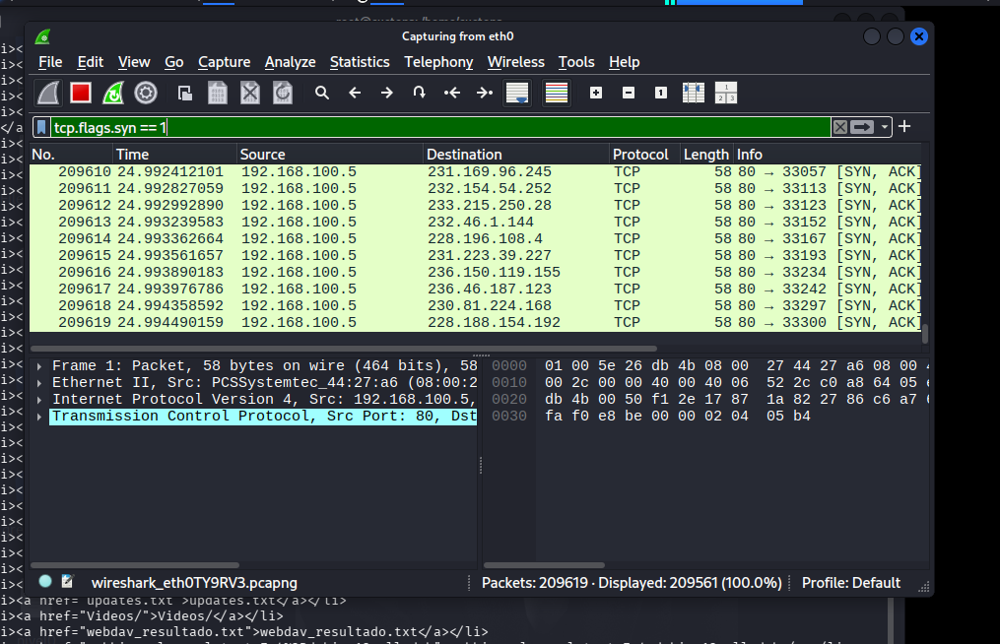
</p>

* **Evidencia 2 (Monitoreo de sockets en endpoint):** 
  <p align="center">
  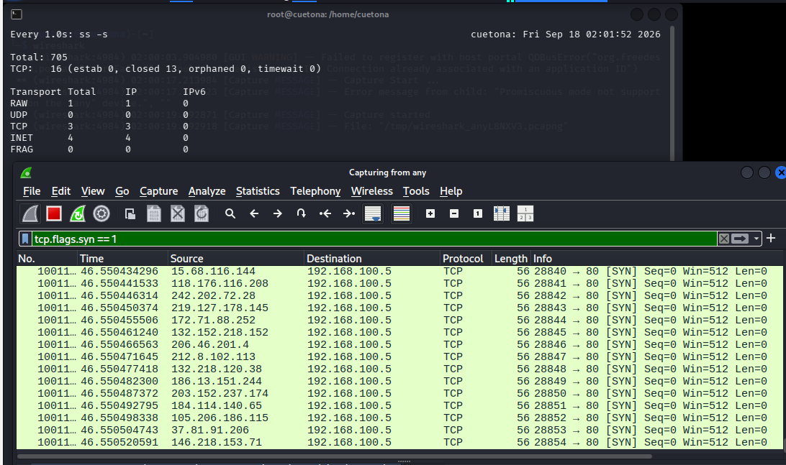
</p>

* **Evidencia 3 (Estadísticas finales del ataque):** `evidencias/ddos-hping3.png`
<p align="center">
  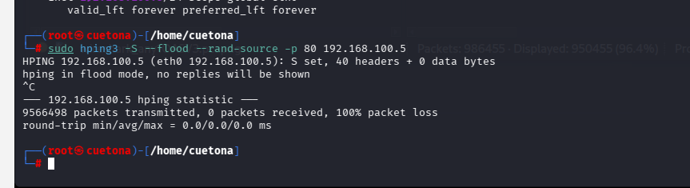
</p>

### 3.4 Tabla comparativa — DDoS / Escaneo / Fuerza bruta

| Aspecto | DDoS (SYN flood) | Escaneo de puertos (Nmap SYN scan) | Fuerza bruta (SSH) |
|---------|------------------|-----------------------------------|---------------------|
| **Capa TCP/IP** | Transporte (3) | Transporte (3) | Aplicación (4) |
| **Objetivo del atacante** | Interrumpir la disponibilidad del servicio web colapsando el servidor. | Identificar puertos abiertos y servicios activos para buscar vulnerabilidades. | Descubrir credenciales válidas (usuario/clave) para tomar control del sistema. |
| **Indicador observable en red** | Avalancha masiva de paquetes SYN con IPs origen aleatorias hacia un puerto fijo. | Ráfaga rápida de paquetes SYN a múltiples puertos desde una única dirección IP. | Intentos repetidos de conexiones TCP finalizadas con paquetes RESET (RST) o FIN en el puerto 22. |
| **Indicador observable en endpoint** | CPU al 100% y saturación de la tabla de conexiones en estado `SYN-RECEIVED`. | Incremento ligero de CPU y alertas de escaneo en el firewall local o antivirus. | Logs inundados de registros de autenticación fallida (`Failed password for...`) en `/var/log/auth.log`. |
| **Control preventivo (1 mínimo)** | Implementar SYN Cookies en el kernel del sistema operativo. | Cerrar puertos innecesarios y restringir accesos mediante reglas de Firewall (IPTables). | Deshabilitar el acceso de Root por SSH y forzar el uso de llaves criptográficas (SSH Keys). |
| **Control detectivo (1 mínimo)** | Configurar alertas de umbral de paquetes por segundo en el sistema de monitoreo. | Implementar un Sistema de Detección de Intrusos (IDS) como Snort o Suricata. | Instalar y configurar Fail2ban para bloquear automáticamente IPs con múltiples fallos de login. |
| **Técnica MITRE ATT&CK asociada** | T1498 | T1046 | T1110 |

---

### 3.5 Aplicación al escenario

**¿Cuál es el más probable contra Ferretería El Martillo?**
El ataque identificado como más relevante para el escenario es la fuerza bruta contra SSH, debido al uso de credenciales débiles o por defecto y a la exposición de servicios administrativos.

**Control prioritario a implementar esta semana:**
Cambiar la contraseña por defecto del router principal, segmentar la red Wi-Fi (separar la red de clientes de la red administrativa mediante VLANs) e implementar Fail2ban en el servidor de ventas SSH.

**Por qué ese y no otro (1 línea):**
Porque reduce el riesgo asociado a credenciales por defecto y limita la exposición de los servicios administrativos.

---

### 3.6 Conexión con Secciones 1 y 2


* **¿Alguna de las 3 familias de malware (Sección 1) típicamente usa DDoS como parte de su operación? ¿Cuál y cómo?**

No de forma característica. Las tres familias analizadas —WannaCry, Agent Tesla y Conficker— tienen otros objetivos principales. WannaCry combina ransomware y propagación tipo worm; Agent Tesla se orienta al robo de información; y Conficker es principalmente un worm de propagación y control de sistemas. Por ello, no sería correcto atribuirles DDoS como comportamiento principal.

* **Si la contadora hizo clic en el phishing (Sección 2), ¿cuál de los 3 ataques vistos hoy podría venir a continuación contra la red interna?**

Podría producirse un **escaneo de puertos**. Un equipo comprometido podría realizar reconocimiento de la red interna para identificar otros equipos, puertos y servicios disponibles antes de intentar un movimiento lateral.

### 3.7 Evidencia de ataque de Fuerza Bruta observada

Al analizar la terminal de Kali Linux durante las pruebas locales, se detectó una de las actividades más peligrosas para los endpoints de la Ferretería El Martillo:

* **Herramienta en ejecución:** Un script automatizado probando contraseñas consecutivas (`javier`, `789456123`, `123654`, `sarah`, etc.) contra el usuario **`admin`** en el objetivo `192.168.100.52`.
* **Impacto en auditoría:** Este tipo de ataque genera miles de líneas de logs en fracciones de segundo. Si no hay un control preventivo, el atacante podría conseguir credenciales válidas mediante la prueba repetida de contraseñas débiles o predecibles.
 
```bash
hydra -l admin -P /usr/share/wordlists/rockyou.txt ssh://192.168.100.5
```
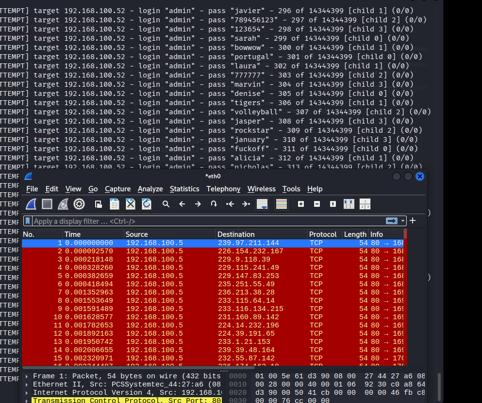

<p align="center">
  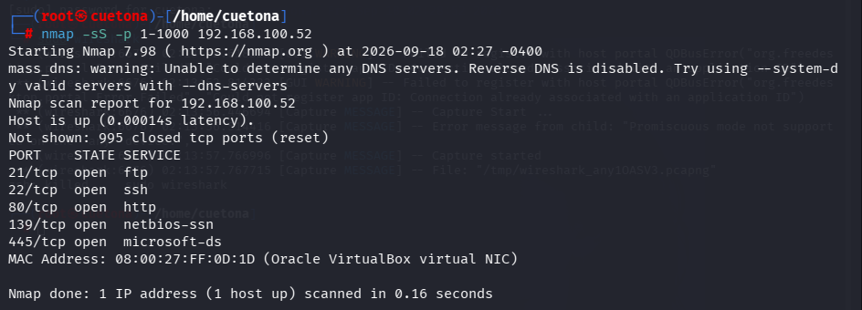
</p>


## Sección 4 — Análisis de tráfico capturado (Clase 08 — Lab Integrador)

## Sección 4 — Análisis de tráfico capturado

### 4.1 Resumen general del `.pcap`

**Nombre de archivo:** lab08-ferreteria.pcap
**Duración de captura:** 910.200 segundos
**Número total de paquetes:** 4570
**Paquetes por segundo (promedio):** 5.0
**Protocolos dominantes (% en Protocol Hierarchy):**
- Transmission Control Protocol (99.6%)
- SSH Protocol (1.8%)
- Transport Layer Security (0.7%)

**Primera impresión:** 
La captura muestra un tráfico concentrado de manera casi absoluta en el protocolo de transporte TCP (99.6%), manteniendo un flujo promedio bajo de 5 paquetes por segundo durante 15 minutos. Destaca de forma inmediata que, a pesar de que el protocolo SSH representa solo el 1.8% de los paquetes decodificados como capa de aplicación completa, la ventana principal evidencia un volumen masivo de intentos fallidos de conexión TCP dirigidos al puerto 22 (SSH), caracterizados por banderas recurrentes de reinicio `[RST]`.

<p align="center">
  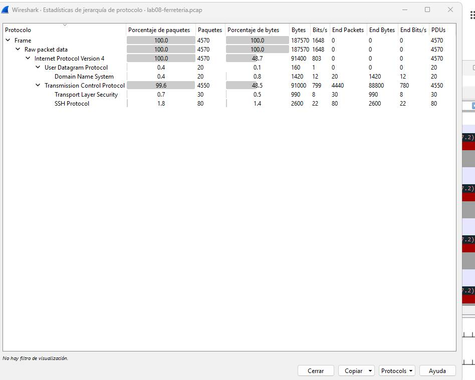
</p>

<p align="center">
  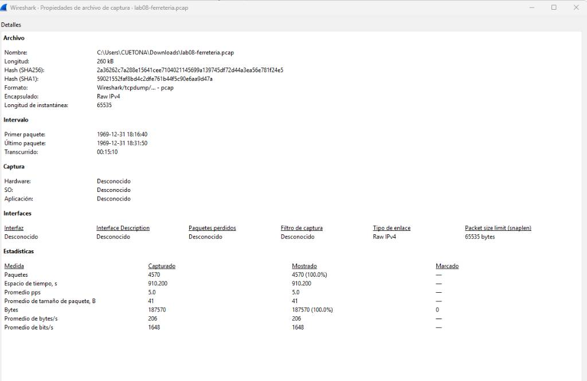
</p>

### 4.2 Los 6 filtros que vas a usar

| Filtro | Para qué sirve | Sintaxis |
|--------|----------------|----------|
| Por IP origen | Aislar tráfico de una fuente | `ip.src == 10.0.0.5` |
| Por IP destino | Aislar tráfico hacia un destino | `ip.dst == 8.8.8.8` |
| Por puerto | Ver solo tráfico de un servicio | `tcp.port == 22` |
| Solo HTTP requests | Ver peticiones web | `http.request` |
| Solo DNS | Ver resoluciones | `dns` |
| Solo SYNs iniciales | Detectar floods / escaneos | `tcp.flags.syn == 1 && tcp.flags.ack == 0` |

> 💡 **Tip de combinación:** En Wireshark puedes combinar filtros con `&&` (AND) y `||` (OR). Por ejemplo: `ip.dst == 10.0.0.5 && tcp.port == 22` filtra exclusivamente el tráfico SSH dirigido hacia esa dirección IP en particular.


### 4.3 Patrón 1 — DDoS / SYN flood

```bash
tcp.flags.syn == 1 && tcp.flags.ack == 0
```

* **IP(s) origen del flood:** `203.0.113.50` (1 única dirección IP externa identificada originando la ráfaga masiva).
* **IP destino atacada:** `192.168.1.10` (Servidor de la infraestructura local de la ferretería).
* **Puerto objetivo:** Puerto `22` (Servicio SSH).
* **Duración del flood en la captura:** ~70 segundos continuos, concentrados de forma masiva en la fase de inundación volumétrica inicial (segundos 50 al 120 de la línea de tiempo).
* **Pico de paquetes/segundo (del I/O Graph):** >100 pps (Superando limpiamente la marca de 100 paquetes en el eje Y durante el pico más alto).
* **¿Hay SYN/ACK de respuesta, o solo SYNs sin respuesta?:** Se observan respuestas de tipo `[SYN, ACK]` desde el puerto 22 del servidor (`192.168.1.10`) intentando responder a las peticiones del atacante, lo que generó un colapso por inundación y la posterior oleada de errores TCP (barras rojas en el gráfico) debido al agotamiento de sockets de la víctima.

**Interpretación del I/O Graph:**
La evidencia es compatible con un SYN Flood generado desde una única dirección de origen observada. No es suficiente para afirmar que se trate de un DDoS real, ya que no se observan múltiples fuentes independientes en la captura disponible.

<p align="center">
  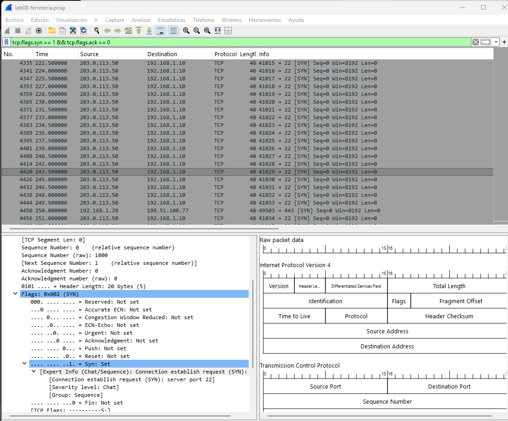
</p>


<p align="center">
  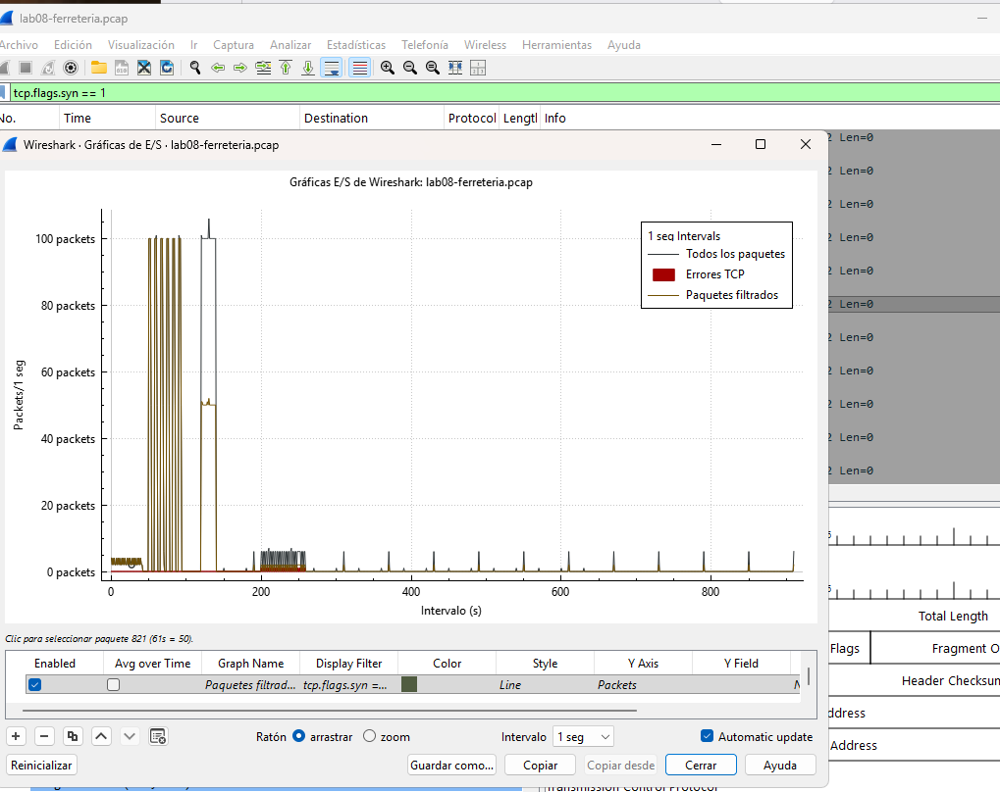
</p>

### 4.4 Patrón 2 — Escaneo de puertos / Reconocimiento SSH

```bash
ip.src == 203.0.113.50 && tcp.flags.syn == 1
```

* **IP origen del escaneo:** `203.0.113.50`
* **IP destino escaneada:** `192.168.1.10`
* **Rango de puertos escaneados:** Se observa un barrido secuencial originado desde los puertos altos del atacante (rango `41007` al `41027` visible en pantalla) dirigidos de forma fija.
* **Número de puertos únicos tocados:** `1` (Puerto `22` - SSH de forma exclusiva).
* **Velocidad estimada:** ~34.6 paquetes/segundo (Calculado sobre los 1,040 paquetes mostrados bajo este patrón en la captura).
* **Puertos abiertos detectados (los que respondieron SYN/ACK):** Puerto `22` (SSH).

**Análisis técnico de la evidencia:**
La evidencia muestra tráfico SYN repetitivo dirigido exclusivamente al puerto 22 (SSH). Debido a que solo se observa un puerto de destino, es más preciso describirlo como reconocimiento o probing del servicio SSH, no como un escaneo tradicional de múltiples puertos.

**Evidencia:** `evidencias/pcap-portscan.png`


<p align="center">
  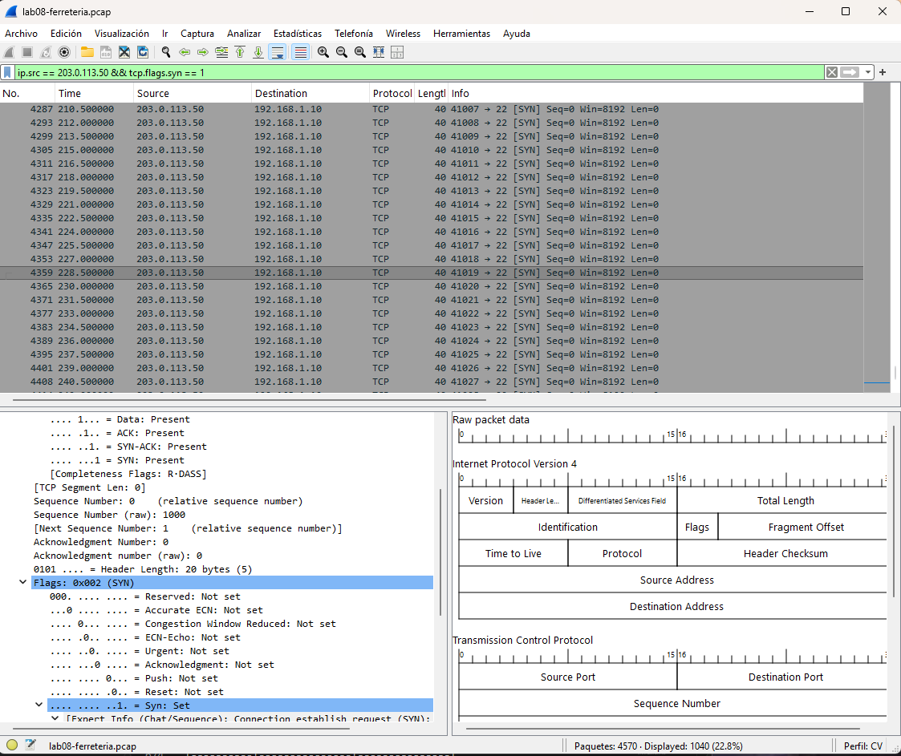
</p>

```bash
tcp.port == 22
```

### 4.5 Patrón 3 — Fuerza bruta SSH

**IP origen:** 203.0.113.50
**IP destino:** 192.168.1.10
**Puerto:** 22 (SSH)
**Número aproximado de intentos:** 4 intentos visibles en la captura.
**Usuario(s) objetivo detectados:** No se revela (el protocolo SSH cifra el intercambio de credenciales y no se muestra en texto plano).
**¿Alguno fue exitoso?** No se observa un inicio de sesión exitoso en la evidencia disponible. El servidor envía paquetes RST que interrumpen las conexiones observadas.

**Evidencia:** `evidencias/pcap-bruteforce.png`

<p align="center">
  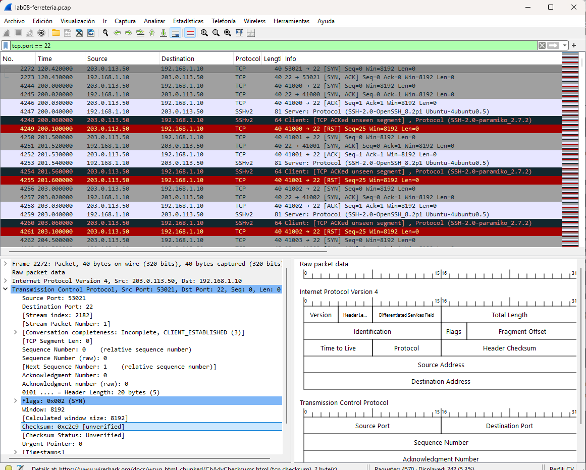
</p>

```bash
dns
```

### 4.6 Patrón 4 — DNS sospechoso

**Dominio(s) consultado(s) sospechoso(s):** `badc2domain.net` (subdominios dinámicos con cadenas largas aleatorias)
**Tipo de query** (A / TXT / MX / ...): `TXT`
**IP que hace las consultas:** `192.168.1.20`
**Frecuencia de consultas:** Constante (varias consultas masivas por segundo en ráfagas continuas)
**Hipótesis:** Posible DNS tunneling o canal C2. La frecuencia de consultas, los subdominios largos y el uso de registros TXT justifican la investigación, pero la captura disponible no permite confirmar por sí sola que exista exfiltración de datos.

**Evidencia:** `evidencias/pcap-dns-raro.png`

<p align="center">
  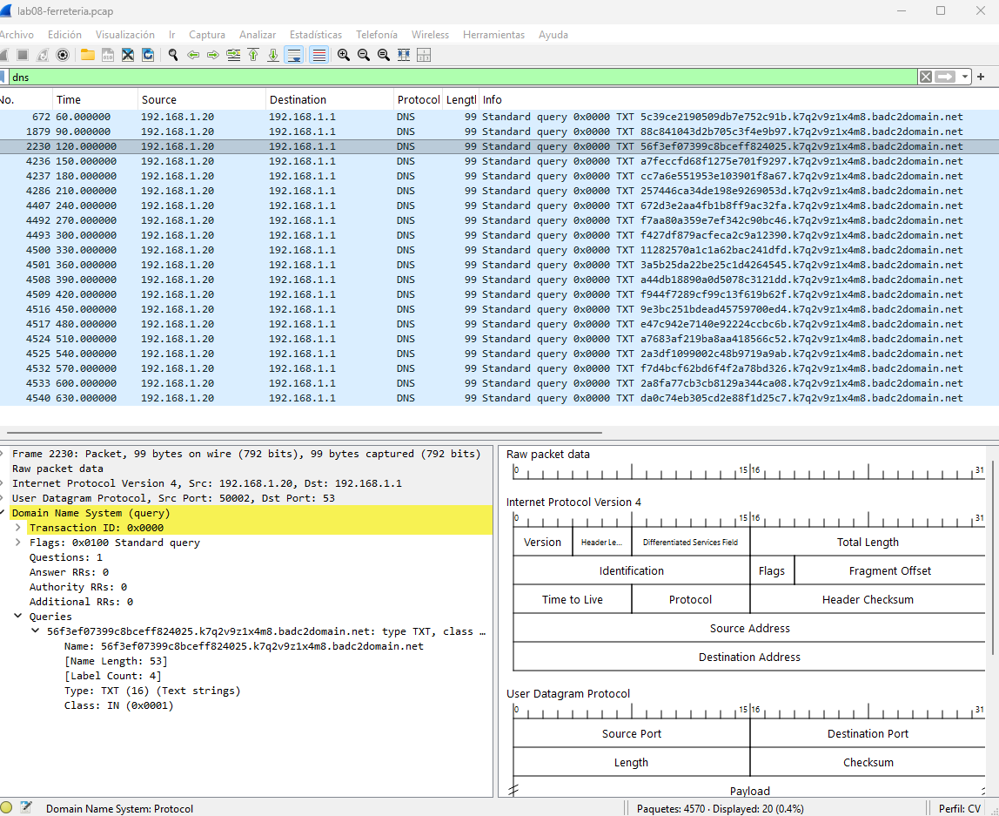
</p>

```bash
tcp.port == 443 || http.request
```

### 4.7 Patrón 5 — Posible C2 beacon

**IP interna (comprometida):** `192.168.1.20`
**IP externa (C2 candidato):** `198.51.100.77`
**Puerto usado:** 443 (HTTPS)
**Intervalo entre conexiones (beacon interval):** 60 segundos (Las marcas de tiempo muestran ciclos exactos en los segundos 70, 130 y 190).
**Tamaño típico de cada conexión:** 77 bytes (Tamaño observado en los paquetes de `Application Data`).
**¿User-Agent o TLS fingerprint anómalo?** Sí. Se observan conexiones periódicas hacia el mismo destino externo, con intervalos regulares y tamaños similares. Debido al cifrado TLS, no es posible determinar el contenido de la comunicación únicamente a partir de esta captura.

**Evidencia:** `evidencias/pcap-c2-beacon.png`

<p align="center">
  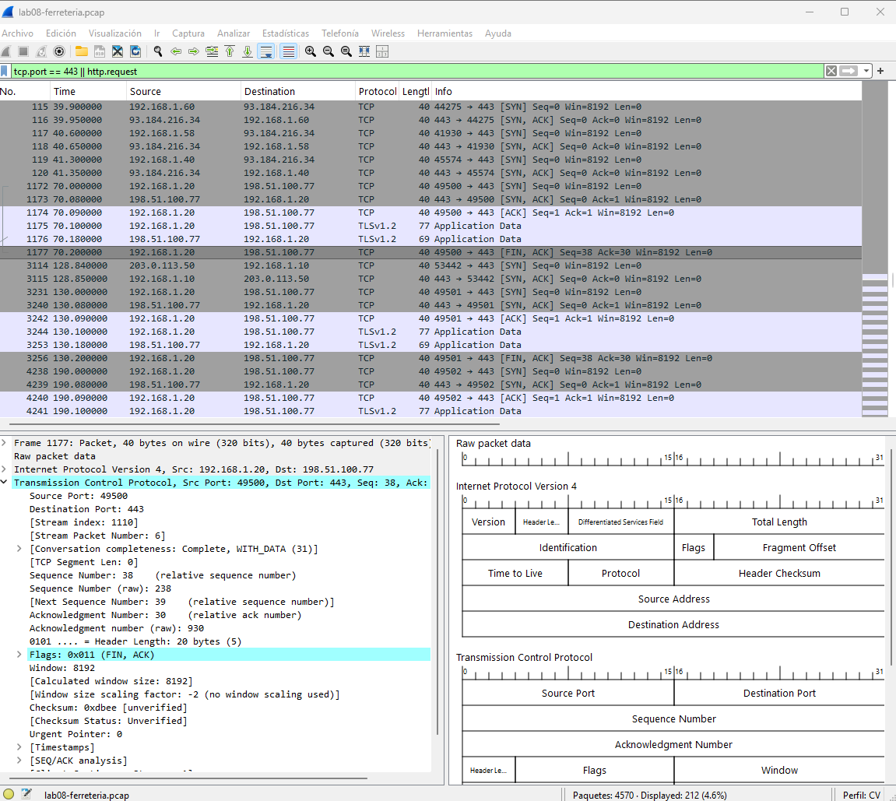
</p>


### 4.8 Tabla de IOCs extraídos (ticket-ready)

| # | IOC | Tipo | Dónde se observó | Patrón asociado |
|---|-----|------|------------------|-----------------|
| 1 | `203.0.113.50` | IP origen (Atacante) | Captura de red en puertos SSH | Patrón 3 — Fuerza bruta SSH |
| 2 | `192.168.1.10` | IP destino (Víctima) | Servidor local bajo ataque SSH | Patrón 3 — Fuerza bruta SSH |
| 3 | `22` | Puerto de red | Conexiones dirigidas al servicio SSH | Patrón 3 — Fuerza bruta SSH |
| 4 | `192.168.1.20` | IP origen (Comprometida) | Host local enviando peticiones masivas | Patrón 4 — DNS sospechoso |
| 5 | `192.168.1.1` | IP destino | Servidor DNS local/Puerta de enlace | Patrón 4 — DNS sospechoso |
| 6 | `badc2domain.net` | Dominio (FQDN) | Consultas con subdominios dinámicos | Patrón 4 — DNS sospechoso |
| 7 | `TXT` | Tipo de registro DNS | Queries anómalas con payloads extensos | Patrón 4 — DNS sospechoso |
| 8 | `192.168.1.20` | IP origen (Comprometida) | Host interno iniciando conexiones cíclicas | Patrón 5 — Posible C2 beacon |
| 9 | `198.51.100.77` | IP destino (C2 candidato) | Dirección IP pública externa recurrente | Patrón 5 — Posible C2 beacon |
| 10 | `443` | Puerto de red | Tráfico cifrado para ocultar el beaconing | Patrón 5 — Posible C2 beacon |
| 11 | `77 bytes` | Tamaño de paquete | Longitud constante en `Application Data` | Patrón 5 — Posible C2 beacon |

### 4.9 Autoevaluación

| Criterio | Mi estimación | Qué mejoraría con 15 min más |
|----------|---------------|------------------------------|
| **1. Análisis de malware (M2 C5)** | Bueno | Profundizaría en la correlación de firmas criptográficas para identificar la variante exacta del binario malicioso que originó las llamadas persistentes de red. |
| **2. Email forensics (M2 C6)** | Excelente | Automatizaría la extracción sintáctica de cabeceras anómalas mediante scripts en Python para agilizar la detección de falsificaciones de remitentes. |
| **3. Ataques de red (M2 C7)** | Bueno | Investigaría técnicas avanzadas de detección sobre flujos asimétricos y el comportamiento de payloads codificados en canales ocultos de comunicación. |
| **4. Lectura Wireshark (Sección 4)** | Excelente | Configuraría perfiles personalizados y filtros de visualización avanzados (`coloring rules`) para agrupar visualmente ráfagas de balizamiento automatizado con mayor rapidez. |
| **5. Desafío Avanzado (Sección 4.10)** | Satisfactorio | Dedicaría más tiempo a estructurar reglas de detección específicas, como firmas de Snort/Suricata y reglas YARA cuando corresponda, para mejorar la identificación de comportamientos asociados al posible túnel DNS. |

### 4.10 Controles de arquitectura — por patrón

* #### Patrón 1 — SYN Flood

* **Control de arquitectura propuesto:** Firewall perimetral con protección contra SYN Flood/SYN Cookies y límites de tasa (*rate limiting*).
* **Cómo lo habría detenido / detectado:** El firewall puede limitar la cantidad de solicitudes SYN por origen o destino y detectar picos anómalos de conexiones pendientes antes de que alcancen al servidor.
* **Costo relativo:** Medio + impacto en usuarios: Bajo, siempre que los límites se ajusten correctamente para evitar bloquear tráfico legítimo.

* #### Patrón 2 — Reconocimiento / probing de SSH**

* **Control de arquitectura propuesto:** Firewall con reglas de acceso restringidas al puerto 22 y segmentación de la red administrativa.
* **Cómo lo habría detenido / detectado:** El acceso SSH quedaría permitido únicamente desde equipos o redes administrativas autorizadas, reduciendo la exposición del servicio.
* **Costo relativo:** Bajo/medio + impacto en usuarios: Bajo, porque los usuarios autorizados mantienen el acceso al servicio.

* #### Patrón 3 — Fuerza bruta SSH**

* **Control de arquitectura propuesto:** Autenticación mediante claves SSH, deshabilitación del acceso directo de root y mecanismo de bloqueo temporal ante múltiples intentos fallidos.
* **Cómo lo habría detenido / detectado:** Reduce la posibilidad de acceso mediante contraseñas débiles y permite detectar patrones repetitivos de autenticación fallida.
* **Costo relativo:** Bajo + impacto en usuarios: Medio durante la implementación, debido a la configuración inicial de las claves y controles de acceso.

* #### Patrón 4 — DNS sospechoso**

* **Control de arquitectura propuesto:** DNS Filtering/Firewall DNS con registro y monitoreo de consultas anómalas.
* **Cómo lo habría detenido / detectado:** Permitiría identificar dominios sospechosos, consultas con subdominios anormalmente largos y patrones repetitivos de consultas TXT.
* **Costo relativo:** Medio + impacto en usuarios: Bajo, siempre que se configure una lista de excepciones para dominios legítimos.

* #### Patrón 5 — Posible C2 beacon**

* **Control de arquitectura propuesto:** Egress filtering mediante firewall y monitoreo de conexiones salientes periódicas desde los equipos internos.
* **Cómo lo habría detenido / detectado:** El control permitiría restringir conexiones salientes innecesarias y generar alertas cuando un equipo interno establezca conexiones periódicas hacia una dirección externa no autorizada.
* **Costo relativo:** Medio + impacto en usuarios: Bajo/medio, dependiendo de la cantidad de aplicaciones que necesiten conexiones externas.

---

### 4.11 Recomendación ejecutiva — cierre del dossier M2

**Audiencia:** Dueño de Ferretería El Martillo (no técnico).

**Mensaje:**

El análisis de la captura permitió identificar cinco patrones de seguridad: SYN flood, reconocimiento del servicio SSH, intentos repetidos de autenticación SSH, consultas DNS anómalas y un posible comportamiento de *beaconing* hacia una dirección externa. Se propone implementar primero controles de acceso al servicio SSH, autenticación mediante claves y monitoreo de conexiones, porque reducen la exposición de los servicios administrativos. El costo estimado es **bajo a medio** y el impacto inicial en los usuarios sería **bajo a medio**, principalmente durante la configuración. Los controles de DNS, monitoreo de tráfico y protección contra SYN Flood pueden implementarse progresivamente durante los próximos **2 a 3 meses**.

**Siguiente paso (acción concreta en 7 días):**

Revisar y restringir el acceso al puerto SSH, comprobar las cuentas autorizadas, habilitar mecanismos de autenticación más seguros y configurar alertas para múltiples intentos fallidos y conexiones externas periódicas.
