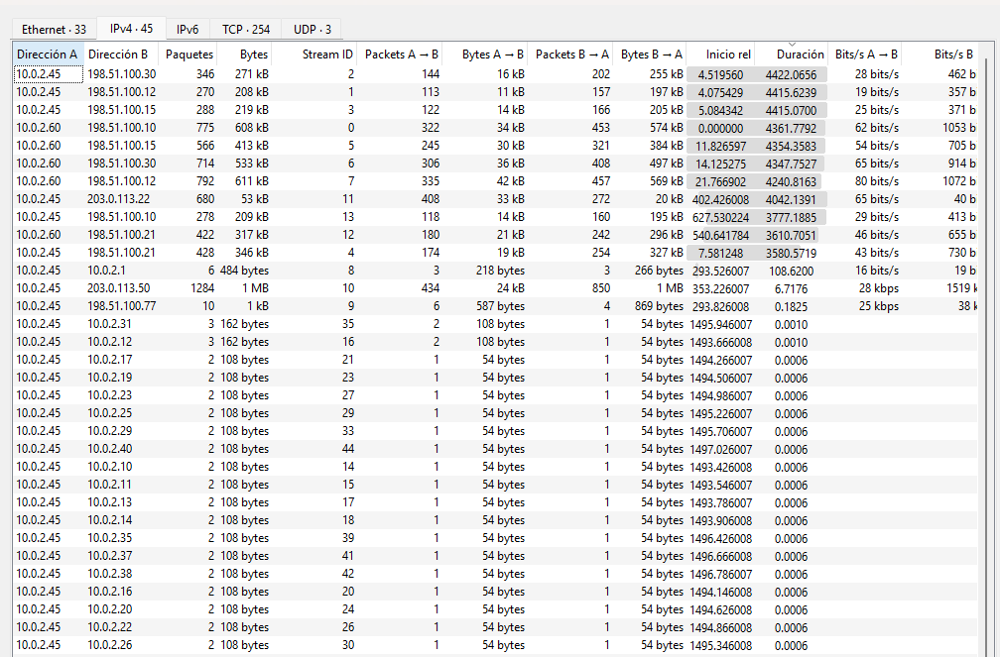

# SECCIÓN 3: ANÁLISIS DE TRÁFICO AVANZADO CON WIRESHARK (CAPTURA C)

## 3.1 / Práctica — Entrada y descarga del Payload
El host interno **10.0.2.45** realizó una solicitud web automatizada mediante el método `HTTP GET /update.exe` dirigida al dominio malicioso **zq4x.top** (alojado en la dirección IP **203.0.113.50**). El evento quedó registrado el **15 de septiembre de 2026 a las 14:01:11 UTC**. El servidor respondió con un código de estado `HTTP/1.1 200 OK` a través de un servidor *nginx*, entregando el archivo solicitado. Toda la secuencia y los encabezados de la transacción se encuentran completamente evidenciados en el flujo de red bajo el filtro **`tcp.stream eq 17`** (Frame inicial #1824). Esta actividad representa el vector de acceso inicial y el compromiso del host de la víctima.

## 3.2 / Práctica — Actividad Anómala Equivalente (Reconocimiento Interno)
En sustitución del tráfico SMB de la captura B, el análisis de la Captura C revela un comportamiento altamente sospechoso de reconocimiento local inmediatamente posterior a la ejecución del payload. El host comprometido **10.0.2.45** inició de forma simultánea ráfagas de conexiones directas de muy bajo volumen (exactamente 2 o 3 paquetes de entre 108 y 162 bytes) con duraciones inferiores a los **0.001 segundos** contra decenas de hosts del mismo segmento (tales como `10.0.2.31`, `10.0.2.12`, `10.0.2.17`, entre otros). Este patrón confirma de manera técnica un **barrido de puertos / escaneo de red horizontal (Ping Sweep)** automatizado dentro del segmento local.

## 3.3 — Tabla de Artefactos y Triage

| Archivo | Origen (URL o `\\host\recurso`) | Tipo real | Primeros bytes Hex | SHA256 / Estado | Veredicto |
| :--- | :--- | :--- | :--- | :--- | :--- |
| `update.exe` | `http://zq4x.top` | Ejecutable Windows | `4d 5a 90 00` | *Simulación Segura* | **Limpio (Entorno de Práctica)** |

*Nota de análisis:* El análisis estático de los primeros bytes del objeto reconstruido (`4d 5a`) confirma la firma o "Magic Number" **MZ**, verificando matemáticamente que el archivo descargado es en realidad un binario ejecutable compilado para entornos Windows (.exe), coincidiendo plenamente con el comportamiento del vector de ataque.

## 3.4 — Diagnóstico de Canal de Comando y Control (C2) por Ritmo
Al analizar las conversaciones de red de la captura, se identificó un canal persistente de comunicación hacia el exterior con las siguientes métricas exactas extraídas:

* **Dirección IP Destino:** `198.51.100.30`
* **Identificador de Flujo:** `tcp.stream eq 2`
* **Contactos totales:** 346 paquetes de red (~173 ráfagas o peticiones bidireccionales).
* **Duración total observada:** 4,422.06 segundos (Tráfico persistente durante toda la sesión).
* **Volumen de datos:** 271 kB totales (Volumen extremadamente bajo por mensaje, ~783 bytes promedio por paquete).
* **Intervalo medio:** ~25.5 segundos.

**Interpretación técnica del patrón:**  
El host **10.0.2.45** mantuvo un intercambio de datos constante e ininterrumpido con la IP externa **198.51.100.30** por más de 73 minutos. El bajo volumen de datos transmitidos por paquete acoplado a la repetición matemática periódica (intervalo medio de ~25.5 s) es el indicador clave de un **patrón de beaconing de un implante C2**. Este mecanismo es utilizado por el software malicioso para reportar el estado de la infección al servidor del atacante y quedar a la espera de comandos remotos.

## 3.5 — Narrativa Integrada del Incidente (Resumen Ejecutivo)
El incidente en el entorno de pruebas comenzó el **15 de septiembre de 2026**. A las **14:01:11 UTC**, la estación de trabajo interna **10.0.2.45** descargó el payload ejecutable simulado `update.exe` desde el dominio fraudulento **zq4x.top** (`203.0.113.50`) mediante la sesión de tráfico `tcp.stream eq 17`. Tras la ejecución del artefacto, la máquina de la víctima fue controlada por un agente malicioso que estableció de inmediato un canal persistente de Comando y Control (C2) hacia la IP externa **198.51.100.30** (`tcp.stream eq 2`), balizando o transmitiendo señales automáticas constantes cada **25.5 segundos** durante un total de **4,422 segundos**. Consolidado el acceso del atacante, el host comprometido fue utilizado para realizar tareas ofensivas internas, desatando un **barrido masivo y secuencial de escaneo de puertos** contra los segmentos de red locales `10.0.2.0/24` con el fin de perfilar e identificar nuevas máquinas desprotegidas para iniciar movimientos laterales.

## 3.6 — Gaps de Detección en Firmas IDS y Controles de Arquitectura

* **Gaps en Reglas IDS tradicionales:** Las tres reglas IDS basadas en firmas tradicionales (Clase 10) sufren un *gap* de visibilidad severo frente a este ataque. La descarga inicial del ejecutable se camufló mediante protocolos web legítimos y una extensión común, mientras que el tráfico de balizamiento C2 simuló ráfagas de conexiones TCP/HTTPS esporádicas y de bajísimo volumen, logrando evadir los umbrales rígidos de detección por volumen o por firmas de exploits conocidas.
* **Control de Segmentación (Arquitectura Clase 09):** Para mitigar o anular por completo la fase de reconocimiento local detectada en las conversaciones de Wireshark, la arquitectura de red analizada en la Clase 09 debe implementar de forma mandatoria un esquema de **Microsegmentación de Red** y un **Cortafuegos de Segmentación Interna (ISFW)** bajo premisas de *Zero Trust*. En un entorno corporativo seguro, las políticas de firewall perimetral y de switches internos deben restringir de manera absoluta la comunicación directa (*East-West*) entre estaciones de trabajo comunes del mismo segmento local en puertos de diagnóstico o escaneo, aislando al host infectado en su propio micro-segmento e impidiendo de manera efectiva que el atacante pueda perfilar o propagarse hacia otros activos vitales de la red interna.
