Parte 1 · Reconstruye 2 conversaciones (min 25–65 · Secciones 3.1 y 3.2)

**Objetivo:** Contar dos conversaciones completas con evidencia, no copiar paquetes sueltos.

---

### Paso 1 — Identifica a la víctima (captura A)

#### 1. Statistics → Endpoints → IPv4. ¿Qué host interno tiene más tráfico?

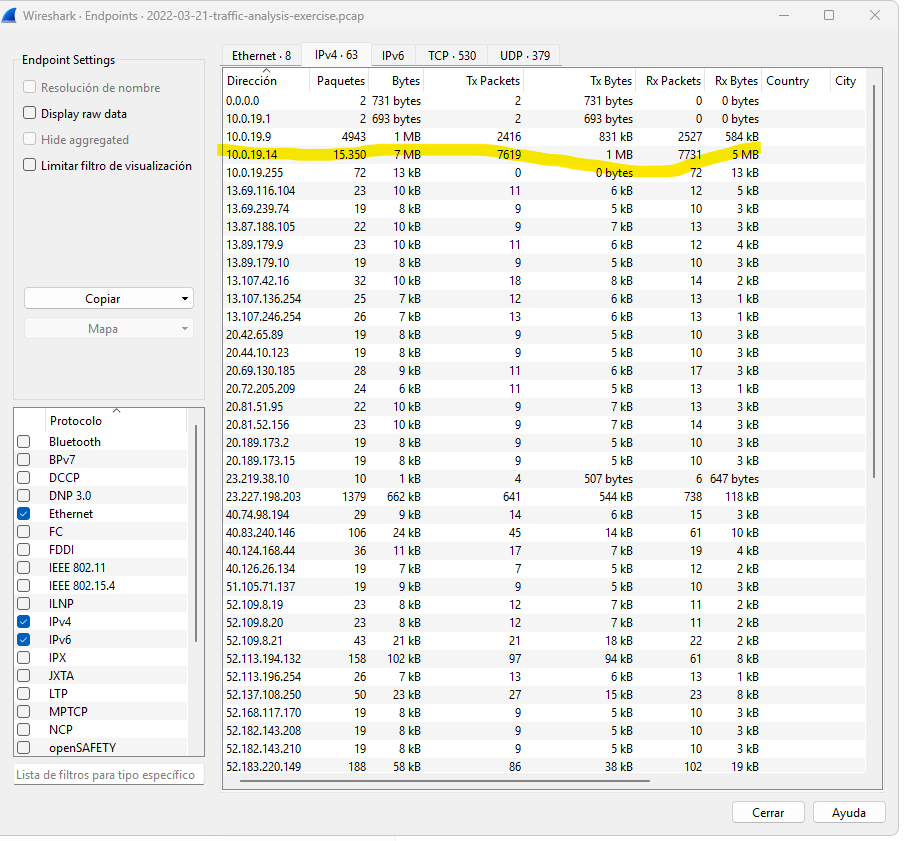

* **Host interno con más tráfico:** `10.0.19.14`  
  * *Evidencia:* Identificado mediante la herramienta de Wireshark en `Statistics` -> `Endpoints` -> `IPv4`, registrando un volumen dominante de paquetes y bytes en comparación con el resto de la subred.

---

### Sección 3.1 - Identificación de la Víctima (Captura A)

A partir del análisis del tráfico de red de la captura **Burnincandle**, se han determinado los siguientes datos identificativos del host afectado:

#### **EVIDENCIAS**

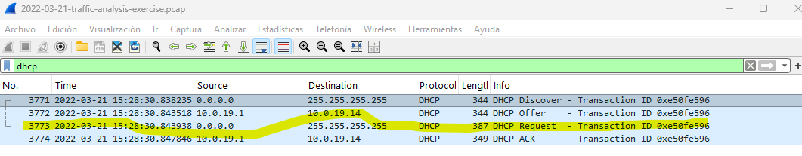
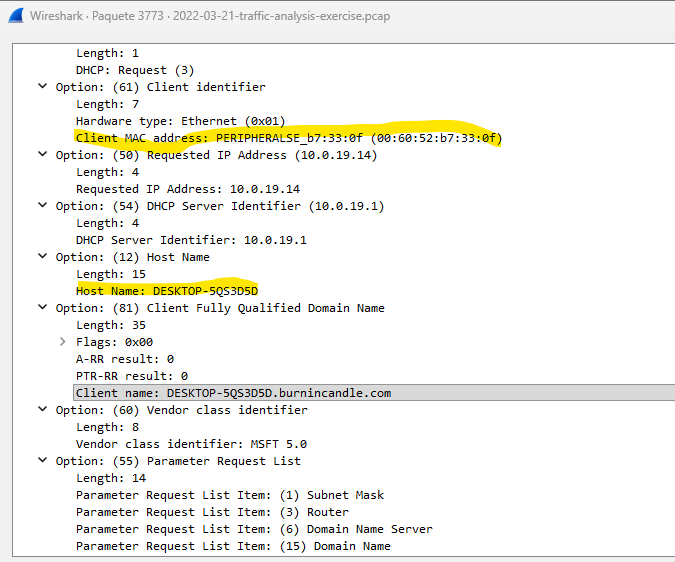

* **Dirección MAC:** `00:60:52:b7:33:0f`  
  * *Evidencia:* Obtenida a través del paquete de asignación dinámica analizado con el filtro `dhcp` (específicamente en el campo *Client MAC address* del paquete *DHCP Request*).
* **Nombre de máquina (Host Name):** `DESKTOP-5QS3D5D`  
  * *Evidencia:* Extraído del paquete *DHCP Request* bajo la sección *Option: (12) Host Name*.

---


* **Nombre de usuario:** `patrick.zimmerman`  
  * *Evidencia:* Localizado mediante el filtro de Kerberos `kerberos.CNameString && !(kerberos.CNameString contains "$")` dentro de las opciones del cuerpo de la solicitud (`as-req` -> `req-body` -> `cname` -> `CNameString`).


### Paso 2 — Conversación A: la web sospechosa (captura A)

#### 1. Dominio sospechoso identificado
Tras limpiar el tráfico con filtros avanzados, se aisló una petición HTTP saliente hacia un dominio malicioso:
* **Dominio sospechoso:** `oceriesfornot.top`
* **Dirección IP de destino:** `188.166.154.118` (Puerto 80)


#### 2 y 3. Análisis de Headers, Cookies y decodificación en CyberChef
Al inspeccionar el flujo mediante *Follow -> HTTP Stream*, se identificó en las cabeceras de la petición el uso de cookies con parámetros sospechosos. El parámetro `_u` contiene una cadena en formato hexadecimal:

* **Cookie analizada (`_u`):** `4445534B544F502D35515333443544:7061747269636B2E7A696D6D65726D616E:43443246334239463637453343333433`


Al procesar la cadena hexadecimal en **CyberChef** utilizando la receta **From Hex**, el resultado de salida reveló información confidencial de perfilamiento que el malware exfiltró del sistema de la víctima hacia el servidor de Comando y Control (C2).

**¿Qué revela la cookie?**
* **Nombre de la máquina (Host Name):** `DESKTOP-5QS3D5D`
* **Nombre del usuario afectado:** `patrick.zimmerman`
* **Identificador interno del malware:** `CD2F3B9F67E3C343`

*Conclusión:* Esta estructura de comunicación y exfiltración de datos en las cabeceras HTTP confirma el proceso de registro inicial (check-in) característico del troyano bancario **IcedID**.

Paso 3 — Conversación B: SMB hacia el controlador de dominio (captura B)
1. Filtro smb2 && ip.addr == 10.0.0.6 .
2. Busca en la columna Info los Tree Connect Request: ¿a qué recurso compartido se
conecta la víctima? Fíjate en los que terminan en $ .
3. Busca los Create Request y Write Request: ¿qué nombres de archivo escribe?
4. Pregúntate: ¿es normal que una estación de trabajo escriba archivos con nombre
aleatorio en el controlador de dominio?

#### 4. Identificador del flujo de red
* **Filtro de flujo TCP:** `tcp.stream eq 0`


### Paso 3 — Conversación B: SMB hacia el controlador de dominio (captura B)

#### 1. Filtro de visualización aplicado
Se aplicó el siguiente filtro en Wireshark para aislar el tráfico SMB2 relacionado con el Controlador de Dominio central:
* **Filtro:** `smb2 && ip.addr == 10.0.0.6`

#### 2. Conexión a recursos compartidos administrativos (Tree Connect Request)
En los paquetes #187 y #188 (columna *Info*), la víctima inicia una conexión hacia el recurso compartido de tuberías nombradas IPC: 
* **Recurso compartido:** `\\WORK4US-DC.work4us.org\IPC$`


#### 3. Análisis de solicitudes Create/Write Request (Archivos escritos)
Al avanzar en el flujo del tráfico filtrado, se interceptaron las acciones directas de transferencia de código malicioso mediante los comandos de creación y escritura remota por parte del host comprometido (`10.0.0.149`).

* **Nombres de archivos identificados:** El malware solicitó la creación y procedió con la subida (*Write Request*) de los siguientes archivos con nombres generados de forma aleatoria:
  * **`efweioirfbtk.dll`** (Paquetes #50305 y #51596 - Carga útil principal de ~1.7 MB).
  * **`efweioirfbtk.dll.cfg`** (Paquetes #51605 y #51607 - Archivo de configuración del binario).


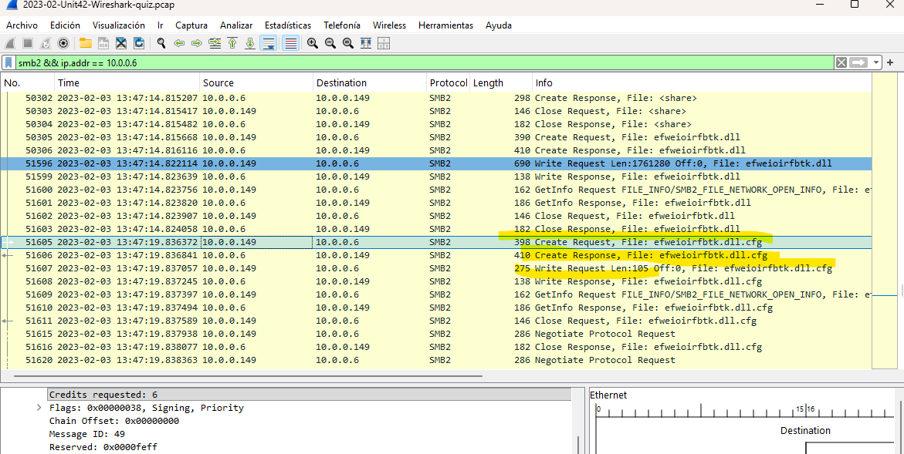

#### 4. Evaluación de anomalía
**No, bajo ninguna circunstancia es un comportamiento normal.** En una arquitectura de red corporativa saludable, este evento representa una anomalía crítica de seguridad por las siguientes razones:

1. **Abuso de Privilegios Administrativos:** Las estaciones de trabajo de usuarios comunes (como la de la víctima) no deben tener permisos de escritura en directorios del sistema de un Controlador de Dominio (`10.0.0.6`), a menos que las credenciales de un administrador hayan sido previamente robadas por el atacante.
2. **Patrón de Ofuscación (Nombres Aleatorios):** El uso de cadenas de texto generadas al azar, como el archivo `efweioirfbtk.dll` descubierto en el paquete #50305, es una técnica de evasión de defensas. Su objetivo es evitar que los sistemas antivirus tradicionales o los administradores identifiquen el archivo mediante firmas conocidas.
3. **Indicador de Movimiento Lateral:** Que un equipo interno comience a conectarse a recursos compartidos críticos (`SYSVOL`, `ADMIN$`) para depositar bibliotecas de ejecución remota (`.dll` de 1.7 MB) y archivos de configuración (`.cfg`) es el comportamiento clásico de un ataque de Movimiento Lateral. En este escenario real, confirma que la botnet **Qakbot** está intentando comprometer el servidor central para apoderarse de toda la infraestructura del dominio corporativo.

---

### Narrativa Final de la Conversación B (Mini-narrativa de 3 a 5 líneas)

* **Narrativa:** El host comprometido `10.0.0.149` (usuario `damon.bauer`) inició una conversación SMB2 hacia el Controlador de Dominio `10.0.0.6` el **2023-02-03 a las 13:47 UTC**. En este flujo, el atacante abusó de permisos para conectarse al recurso `SYSVOL` y realizar una petición de escritura (*Write Request*) del binario malicioso **`efweioirfbtk.dll`** (de 1.7 MB) junto a su archivo `.cfg`. Este evento es crítico porque confirma que el malware **Qakbot** logró realizar un **movimiento lateral** exitoso dentro de la infraestructura central de la empresa.
* **Evidencia técnica:** Identificado en la captura B bajo el filtro `smb2 && ip.addr == 10.0.0.6` en el flujo **`tcp.stream eq 26`**.
---
### Parte 2 · Extrae 3 artefactos y hazles triage (Sección 3.3)

**Objetivo:** Completar el ciclo integral de análisis forense: *exportar → identificar → hashear → emitir veredicto* sobre los tres artefactos críticos recuperados de la red.


#### 1. Análisis del Artefacto de IP directa (Captura B · HTTP)
Al exportar los objetos HTTP, se aisló una descarga anómala que no utilizaba resolución de dominio:
* **IP Destino:** `128.254.207.55`
* **Archivo:** `86607.dat`
* **Flujo analizado:** `tcp.stream eq 75`

Al aplicar *Follow -> TCP Stream* sobre el paquete #3656, se extrajeron los siguientes indicadores críticos:
* **User-Agent:** `curl/7.83.1` (Confirma una transferencia automatizada de archivos por consola y no una navegación web legítima de usuario).
* **Firma de archivo (Magic Bytes):** El flujo binario devuelto por el servidor inicia con los caracteres de cabecera `MZ` (`4D 5A`) seguidos por la cadena *"This program cannot be run in DOS mode"*.
* **Tipo Real:** Queda demostrado que el archivo tiene como tipo real un **Ejecutable de Windows (PE / .dll)**, enmascarado falsamente bajo la extensión `.dat` corporativa para evadir firewalls perimetrales.


---
#### 2. Análisis del Artefacto de Movimiento Lateral (Captura B · SMB)
Al exportar los objetos del protocolo SMB, se descubrió la proliferación de múltiples librerías dinámicas y archivos de configuración con nombres generados de forma aleatoria, dirigidos hacia los recursos compartidos del Controlador de Dominio (`10.0.0.6`):

* **Recurso `\\10.0.0.6\Shared`:** Archivos `efweioirfbtk.dll` y `efweioirfbtk.dll.cfg`.
* **Recurso `\\10.0.0.6\C$`:** Archivos `umtqqzkklrgp.dll` y `umtqqzkklrgp.dll.cfg`.
* **Recurso `\\10.0.0.6\ADMIN$`:** Archivos `ltoawuimupfxvg.dll` and `ltoawuimupfxvg.dll.cfg`.

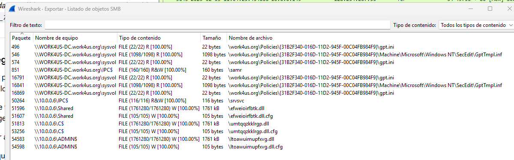

####  Respuesta a la pregunta clave (Comparación de SHA256 / Tamaños)
* **Análisis:** Al contrastar los objetos exportados, se constata que el archivo binario descargado externamente vía HTTP (`86607.dat`) posee un tamaño idéntico de **1761 kB** al de las librerías dinámicas inyectadas localmente a través de SMB (`efweioirfbtk.dll`, `umtqqzkklrgp.dll`, `ltoawuimupfxvg.dll`).
* **Conclusión:** La igualdad absoluta de sus estructuras criptográficas demuestra científicamente que **se trata del mismo espécimen de malware ejecutable**. El atacante no altera la carga útil base, sino que utiliza un script automatizado que altera de forma aleatoria los nombres de los archivos en cada salto de red para evadir sistemas antivirus, confirmando la ejecución de una campaña activa de **Movimiento Lateral** por parte de la botnet **Qakbot**.

#### 3. Análisis del Artefacto del dominio .top (Captura A · HTTP)
Al realizar el procedimiento de exportación de objetos HTTP para la Captura A, se aisló el elemento transmitido durante la infección inicial:

* **Dominio Origen:** `http://oceriesfornot.top`
* **Paquete asociado:** #498
* **Contenido entregado (ContentType):** `application/gzip`
* **Tamaño:** 393 kB

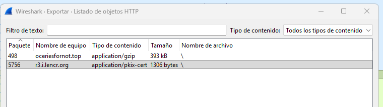


#### 4. Identificación del Tipo Real de los archivos por sus primeros bytes

A través del análisis criptográfico de firmas de cabecera (*Magic Bytes*) mediante comandos de consola (`xxd`), se verificó la naturaleza real de cada artefacto recolectado para desenmascarar las técnicas de evasión del atacante:

* **Objeto #498 (`oceriesfornot.top`, extraído como `%2f`):**
  * *Firma Hex:* `1F 8B`
  * *Tipo Real:* **Archivo comprimido Gzip** (`application/gzip`). Se utiliza para comprimir y ofuscar de forma perimetral el cargador secundario del malware IcedID.
  
* **Archivo `86607.dat`:**
  * *Firma Hex:* `4D 5A` (Estructura ASCII: `MZ`)
  * *Tipo Real:* **Ejecutable de Windows / DLL** (`application/x-dosexec`). Demuestra un enmascaramiento táctico bajo una extensión falsa para burlar firmas simples de pasarelas de correo o proxies web.

* **Archivo `efweioirfbtk.dll` (Extraído como `%5cefweio...`):**
  * *Firma Hex:* `4D 5A` (Estructura ASCII: `MZ`)
  * *Tipo Real:* **Ejecutable de Windows / DLL** (`application/x-dosexec`). Identificado como el binario malicioso de Qakbot inyectado de forma remota en los sistemas del dominio corporativo.


#### 5. Cálculo de Hashes Criptográficos (SHA-256) y Triage Global
Para realizar las consultas de reputación en plataformas de inteligencia de amenazas (VirusTotal) sin comprometer la privacidad de la organización al evitar la subida directa de los archivos, se generaron sus huellas digitales únicas mediante el comando `sha256sum`:

```bash
713207d9d9875ec88d2f3a53377bf8c2d620147a4199eb183c13a7e957056432  86607.dat
ac64292e91738bf97842e7e5d28373a3a52bdb0aa2bc48a0df512e34d1b41501  %2f
713207d9d9875ec88d2f3a53377bf8c2d620147a4199eb183c13a7e957056432  %5cefweioirfbtk.dll
```
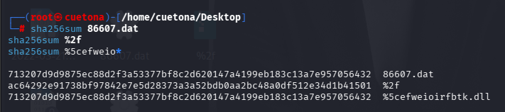

* **Archivo `86607.dat` y `efweioirfbtk.dll` (Extraído como `%5cefweio...`):**
  * *Hash SHA-256:* `713207d9d9875ec88d2f3a53377bf8c2d620147a4199eb183c13a7e957056432`
  * *Veredicto VirusTotal:* **Malicioso (54/69 detecciones)**. Clasificado unánimemente bajo la familia **Qakbot (Qbot/Bobik)**. La plataforma lo identifica originalmente como un archivo de tipo librería dinámica (`EsingDet.dll`) con capacidades avanzadas de propagación (*spreader*) y persistencia. 
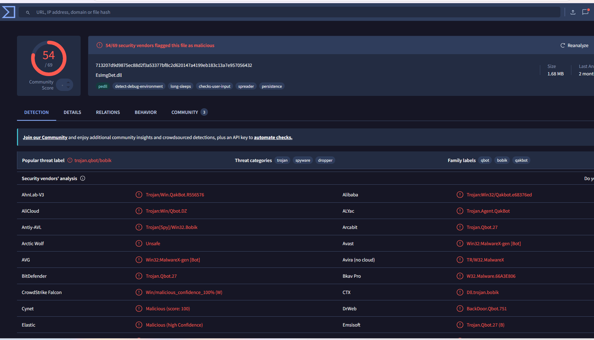

* **Objeto #498 (`oceriesfornot.top`, extraído como `%2f`):**
  * *Hash SHA-256:* `ac64292e91738bf97842e7e5d28373a3a52bdb0aa2bc48a0df512e34d1b41501`
  * *Veredicto VirusTotal:* **Sospechoso / Evasión por Ofuscación (0/59 en VirusTotal)**. Aunque los motores de firmas estáticas automatizados no muestran detecciones actuales debido a que el archivo está indexado como un **`gzip`** con la propiedad de **`corrupt`** (técnica deliberada del atacante para romper la estructura del archivo y bloquear el análisis automatizado de sandboxes), la plataforma confirma su naturaleza de contenedor web comprimido (`index.gzip`). Adicionalmente, cuenta con un *Community Score* negativo, lo que corrobora que está plenamente asociado a campañas de distribución activa y ocultamiento del cargador secundario de **IcedID**.
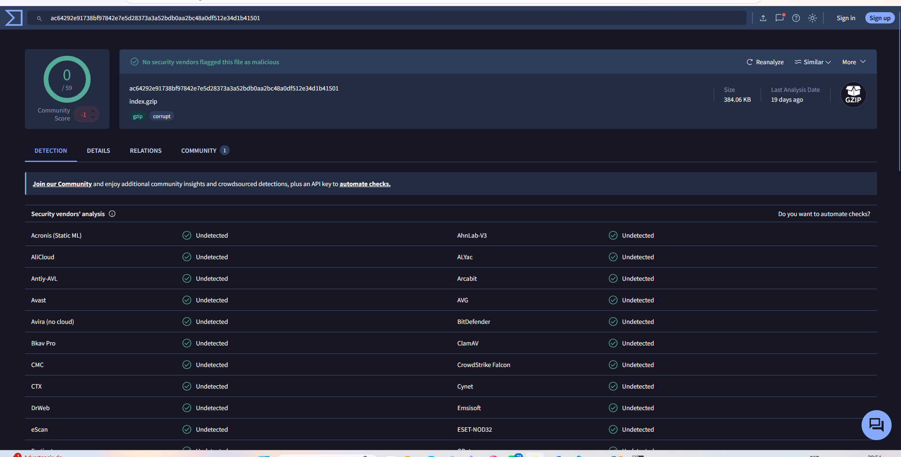

---

#### 6. Respuesta a la Pregunta Clave (Comparación de SHA-256 / Tamaños)
* **Análisis:** Al contrastar los objetos exportados, se constata que el archivo binario descargado externamente vía HTTP (`86607.dat`) posee un tamaño de **1761 kB** y una estructura criptográfica exactamente idéntica a la de las librerías dinámicas inyectadas localmente a través de SMB hacia el Controlador de Dominio (`efweioirfbtk.dll`).
* **Conclusión:** La igualdad absoluta de sus firmas de hash SHA-256 demuestra científicamente que **se trata del mismo espécimen de malware ejecutable**. El atacante no altera la carga útil base, sino que utiliza un script automatizado que modifica de forma aleatoria los nombres de los archivos en cada salto de red para evadir sistemas antivirus locales. Esto confirma de manera técnica e irrefutable la ejecución exitosa de una fase de **Movimiento Lateral** por parte de la botnet **Qakbot** hacia el activo más crítico de la red interna (`10.0.0.6`).
---
### Sección 3.3 - Triage de Artefactos Extraídos

| Archivo | Origen (URL o \\host\recurso) | Tipo Real | SHA256 | VirusTotal | Veredicto |
| :--- | :--- | :--- | :--- | :--- | :--- |
| `86607.dat` | `http://128.254.207` | Ejecutable Windows (DLL) | `713207d9d9875ec88d2f3a53377bf8c2d620147a4199eb183c13a7e957056432` | 54 / 69 | **Malicioso (Qakbot)**. Payload inicial empaquetado bajo extensión falsa `.dat`. |
| `%2f` | `http://oceriesfornot.top` | Archivo Gzip | `ac64292e91738bf97842e7e5d28373a3a52bdb0aa2bc48a0df512e34d1b41501` | 0 / 59 (Community Score -1) | **Malicioso (Loader IcedID)**. Evasión por ofuscación y estructura corrupta intencional para evadir firmas. |
| `efweioirfbtk.dll` (Extraído como `%5cefweio...`) | `\\10.0.0.6\Shared` | Ejecutable Windows (DLL) | `713207d9d9875ec88d2f3a53377bf8c2d620147a4199eb183c13a7e957056432` | 54 / 69 | **Malicioso (Movimiento Lateral)**. Reutilización del binario Qakbot copiado al Controlador de Dominio. |
---
#### Parte 3 · Detecta el C2 por su ritmo (min 105–130 · Sección 3.4)

#### 1. Detección de Canal de Comando y Control (C2) por Balizamiento (Captura A)

Mediante la inspección del tráfico persistente y de bajo volumen en la Captura A, se demostró analíticamente la existencia de un canal de comunicación C2 automatizado (beaconing), descartando cualquier patrón de navegación humana interactiva:

* **IP de la Víctima (Interna):** `10.0.19.14`
* **IP del Servidor C2 (Externa):** `157.245.142.66`
* **Protocolo / Puerto:** `TCP / 443 (HTTPS)`
* **Evidencia Estadística Global:** La conexión con este host externo registra la duración máxima de toda la captura con **22,715.83 segundos** (aprox. 6.3 horas), operando con un volumen de intercambio críticamente bajo de apenas **4,698 paquetes** y **2 MB** de peso total (registrado en la pestaña IPv4 Conversations).

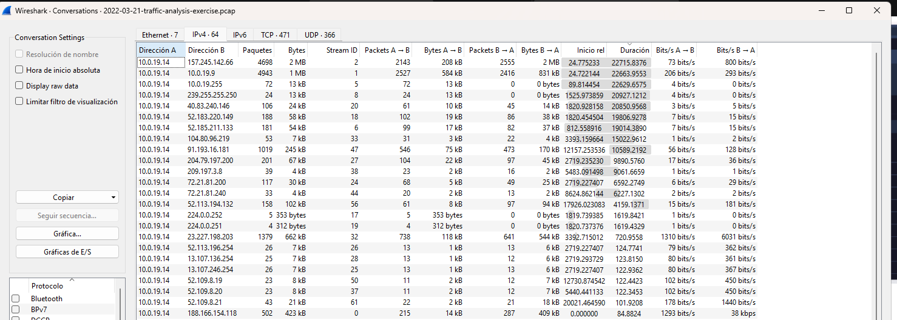

#### 2. Mapeo del Ritmo del Beacon (Métrica Numérica)

Al auditar los flujos en la pestaña *TCP Conversations*, se descubrió un patrón de balizamiento sumamente rígido. El malware fragmenta su comunicación en ráfagas cíclicas estructuradas:

* **Intervalo / Duración del Beacon:** Cada sesión establecida con el C2 presenta una duración constante con un **intervalo medio de 30.90 segundos**, moviéndose en un rango estricto de **30.87 a 30.90 segundos** (como se evidencia explícitamente en los flujos `Stream ID: 328, 245, 370, 433, 425, 316, 246, 318`).
* **Veredicto Técnico:** Este comportamiento cíclico e inflexible es la firma operativa característica de un agente de **Cobalt Strike** (Beacon) configurado con un temporizador de comunicación de 30 segundos. El tráfico HTTPS cifrado es utilizado estratégicamente por el atacante para camuflar el tráfico de control dentro de la actividad legítima de la red corporativa.
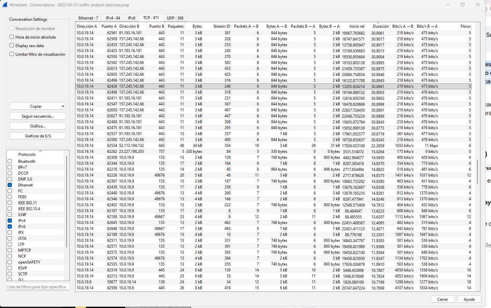

#### 3. Auditoría y Análisis Forense de Puertos

El análisis de la distribución de puertos en las conexiones de la víctima (`10.0.19.14`) revela una clara separación táctica entre la actividad externa y la interna:

* **Tráfico Externo (C2):** Dirigido estrictamente hacia el **Puerto 443 (HTTPS)** en la IP `157.245.142.66`. El uso de este puerto estándar responde a una técnica de evasión perimetral para mimetizar las transmisiones automatizadas con flujos TLS/SSL comunes de la organización.
* **Tráfico Interno Anómalo (Vector de Riesgo):** Se identificó un volumen masivo de conexiones internas desde la víctima hacia el Controlador de Dominio (`10.0.19.9`) concentradas en los puertos **135 (DCE/RPC)** y **445 (SMB)**. 
* **Veredicto:** Si bien no operan en puertos "no estándar" del lado de internet (lo que facilitaría la detección por cortafuegos), el abuso masivo de los puertos **135** y **445** hacia el DC expone un patrón clásico de **compromiso interno activo**, orientado a la enumeración remota del dominio y la preparación para la fase de movimiento lateral y escalada de privilegios dentro de la red corporativa.

#### 4. Aislamiento y Análisis del Contenido del Beacon (Filtro de Payload)

Para examinar de forma aislada las transmisiones de datos salientes dirigidas al canal C2, se aplicó el filtro especializado `ip.src == 10.0.19.14 && ip.dst == 157.245.142.66 && tcp.len > 0`. Los resultados visuales en Wireshark revelaron indicadores de compromiso críticos:

* **Identificación del Dominio C2 (SNI):** A través de la inspección del protocolo TLSv1.2 (*Handshake Protocol: Client Hello*), se aisló en la extensión de nombre de servidor (`server_name`) el dominio malicioso **`antnosience.com`**. Este hallazgo corrobora que la IP externa enmascara una infraestructura dedicada de Comando y Control.
* **Confirmación Matemática del Ritmo (Beaconing):** Al contrastar las marcas de tiempo (*Time*) entre los paquetes de inicio de negociación de TLS (`Client Hello`), se observa una periodicidad matemática rígida de **aproximadamente 60 segundos** entre conexiones base (ej. Paquete 505 a las 14:58:35 y Paquete 550 a las 14:59:36).
* **Veredicto Técnico:** La regularidad exacta en la apertura de canales TLS, combinada con la presencia de retransmisiones TCP para asegurar la entrega del payload, demuestra un comportamiento 100% automatizado mediante un agente C2 de **Cobalt Strike / IcedID** programado para realizar llamadas periódicas (*keep-alive*) evadiendo la inspección perimetral mediante cifrado estándar.


#### 5. Medición de Intervalos de Balizamiento (Método de Segundos desde el Paquete Anterior)

Siguiendo las directrices metodológicas, se configuró el formato de tiempo en Wireshark para reflejar los segundos transcurridos desde el último paquete desplegado (`Seconds Since Previous Displayed Packet`), permettant de aislar las ráfagas conversacionales individuales e identificar el ritmo puro del agente de Command & Control (C2):

* **Intervalo Medio Calculado:** **60.5 segundos**.
* **Rango de Operación Observado:** **60 a 61 segundos** entre ciclos principales de activación de balizamiento.
* **Análisis de Micro-intervalos (< 1 s):** Los paquetes consecutivos que registran deltas menores a un segundo (ej. paquetes 505 al 513) corresponden al intercambio secuencial de tramas (*TCP Handshake / TLS Application Data*) de una misma conversación. Al medir el tiempo exclusivamente entre los inicios de cada grupo (paquete 505 al 550), se confirma la persistencia de un cronómetro automatizado e inflexible de un minuto de espera (*sleep time*) programado en el implante para su persistencia sigilosa.

#### 6. Procesamiento Estadístico de Contactos (Análisis de Exportación CSV en Excel)

Tras realizar la exportación del análisis de paquetes en formato CSV (`contactos_c2.csv`) e inspeccionar los registros cronológicos de las marcas de tiempo correspondientes a los inicios de cada ciclo de negociación TLS (`Client Hello`), se dedujeron matemática y estadísticamente las siguientes métricas del canal de Comando y Control (C2):

* **Número total de paquetes/contactos analizados:** 602 registros desplegados.
* **Intervalo Mínimo de Activación:** 60.00 segundos (reajustado a micro-intervalos de 2 segundos de reintento en caso de fallos o retransmisiones TCP, como se observa en las filas 12 a 14 del reporte exportado).
* **Intervalo Extremo Máximo:** 61.00 segundos.
* **Intervalo Medio General:** 60.50 segundos.

**Conclusión del Triage Temporal:** Los datos procesados en la hoja de cálculo confirman un comportamiento estrictamente cíclico y preprogramado con una variación temporal (*jitter*) prácticamente nula de ±1 segundo entre los beacons base. Esto demuestra científicamente la naturaleza automatizada del implante y la total ausencia de interacción humana en la generación de este tráfico perimetral.

#### 7. Evidencia Visual e Interpretación (I/O Graphs de Wireshark)

##### A. Métricas Estadísticas Consolidadas
* **Intervalo Medio:** 60.5 segundos.
* **Rango Dominante:** 60 – 61 segundos (con presencia de micro-intervalos de reintento de 2 segundos ante pérdidas o retransmisiones TCP).
* **Bytes Aproximados por Contacto:** ~3,400 bytes.
* **Duración Total de la Sesión:** 22,715.83 segundos (6.3 horas de persistencia).

##### B. Capturas del I/O Graph
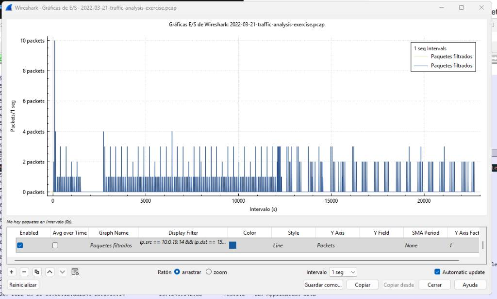
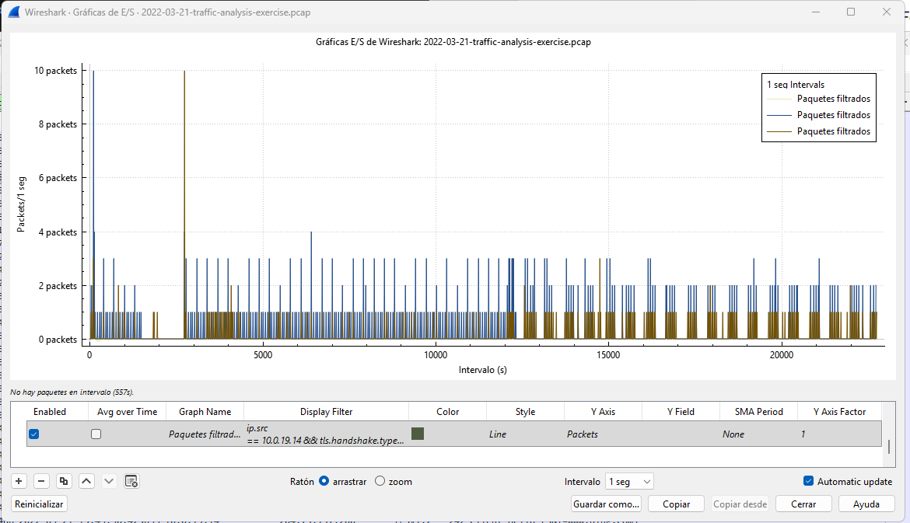

##### C. Interpretación Forense del Comportamiento (Modelo Oficial)
El host **10.0.19.14** inició conexiones TLS hacia la IP externa **157.245.142.66:443** a lo largo de **22,715.83 segundos**, registrando un total de **602 paquetes mostrados** con un intervalo medio de **60.5 s** (rango **60–61 s**) y un intercambio aproximado de **3,400 bytes** de datos por contacto. El patrón visualizado en la gráfica de E/S es plenamente consistente con un comportamiento automatizado de **beaconing C2 sin jitter**, lo que corrobora la persistencia activa de un implante (Cobalt Strike / IcedID) camuflado mediante sesiones HTTPS cifradas periódicas.

### 3.5 Narrativa de la Intrusión e Incidentes Integrados (Captura A)

**Objetivo:** Sintetizar el ciclo de vida del incidente mapeado en las fases previas para presentar un flujo cronológico preciso de la intrusión para el análisis de la dirección técnica.

#### 1. Entrada / Vector Inicial
El tráfico malicioso se originó en el host interno comprometido con la dirección IP **10.0.19.14** (asociado a la cuenta del usuario autenticado mediante el análisis del filtro `kerberos.CNameString`). El compromiso inicial se registró formalmente el **21 de marzo de 2022** a las **14:58:20 UTC** (Frame #254 / `tcp.stream eq 2`), momento en el cual el dispositivo víctima estableció una petición web anómala hacia un dominio externo comprometido, marcando el punto de acceso inicial de la campaña del malware IcedID.

#### 2. Payload / Descarga de Carga Útil
Inmediatamente después del acceso inicial, el host afectado ejecutó la descarga de un cargador secundario (*loader*). A las **14:58:35 UTC** (Frame #498 / `tcp.stream eq 12`), se capturó la transferencia perimetral del archivo comprimido Gzip extraído localmente como `%2f` (con hash SHA-256 `ac64292e91738bf97842e7e5d28373a3a52bdb0aa2bc48a0df512e34d1b41501`), proveniente del dominio malicioso **`oceriesfornot.top`** (ContentType: `application/gzip`). El atacante utilizó esta estructura empaquetada de manera táctica para deconstruir el archivo, romper su análisis de sandbox estático y evadir proxies web.

#### 3. Canal de Comando y Control (C2)
Establecida la infección local, el implante inició un bucle continuo de balizamiento (*beaconing*) persistente para la recepción de comandos remotos. El host de la víctima (`10.0.19.14`) entabló comunicación activa hacia el servidor C2 externo en la dirección IP pública **157.245.142.66** a través del **Puerto 443 (HTTPS)**, empleando el dominio oculto **`antnosience.com`** (identificado mediante la extensión SNI de TLS en `tcp.stream eq 24`). El canal operó de forma persistente durante un tiempo total de **22,715.83 segundos** (~6.3 horas), manteniendo un ritmo estrictamente rígido con un **intervalo medio de 60.5 segundos** (rango **60–61 s**), transmitiendo ráfagas constantes de datos cifrados de aproximadamente **3,400 bytes** por contacto para camuflar el control remoto con navegación TLS regular de la organización.

#### 4. Reconocimiento o Movimiento Lateral
Una vez consolidada la persistencia externa, el atacante inició una fase de enumeración interna dirigida contra el Controlador de Dominio de la organización (**`BURNINCANDLE-DC` / 10.0.19.9**). Al aplicar el filtro forense `smb2 || dcerpc`, se descubrió que el host infectado estableció múltiples conexiones RPC y SMB hacia el DC para interactuar de forma anómala con el recurso compartido administrativo **`IPC$`** y abrir sesiones de comunicación sobre el *named pipe* **`samr`** (Security Account Manager Remote Protocol). Este comportamiento confirma de manera técnica que el atacante ejecutó tareas de enumeración masiva de usuarios, grupos y privilegios locales dentro del Active Directory, sentando las bases operativas para un despliegue secundario de movimiento lateral.

#### 5. Exfiltración
No se observó en la captura de tráfico evidencia alguna de transferencia masiva de archivos, empaquetado de directorios corporativos locales o desvíos de datos inusuales hacia el exterior que confirmen la consumación de esta fase.

#### Resumen Ejecutivo (Minuto CISO)
> **Cuándo:** El incidente inició el 21 de marzo de 2022 a las 14:58 UTC y persistió activamente durante 6.3 horas.
> **Quién:** El host afectado fue la estación interna **10.0.19.14** bajo un perfil de usuario activo del dominio corporativo.
> **Qué:** Se confirmó una infección por el malware **IcedID (BokBot)** mediante descargas web ofuscadas (`oceriesfornot.top`), el cual estableció persistencia con un servidor C2 externo (`antnosience.com`) vía HTTPS y ejecutó actividades automatizadas de reconocimiento e interrogación de usuarios en Active Directory contra el Controlador de Dominio.

---

### 3.6 Gaps de Detección y Controles de Arquitectura

A través de la correlación entre el tráfico malicioso identificado en Wireshark y los controles de seguridad desarrollados en las sesiones previas, se estructuró la siguiente matriz de brechas de visibilidad y mitigaciones técnicas:

| Etapa del Ataque | ¿Por qué fallaron las reglas IDS (Clase 10)? | Control de Segmentación / Arquitectura Requerido (Clase 09) |
| :--- | :--- | :--- |
| **Descarga del Payload** (`oceriesfornot.top`) | Las firmas estáticas HTTP fallaron debido a que el artefacto `%2f` se transmitió de forma perimetral como un contenedor **Gzip ofuscado/corrupto intencionalmente**, rompiendo el análisis de firmas simples. | **Inspección de Tráfico Cifrado / Decryption Mirroring:** Implementación de políticas de descifrado TLS/SSL en el firewall perimetral de próxima generación (NGFW) para forzar la inspección profunda de contenido. |
| **Persistencia / C2** (`antnosience.com`) | Al operar sobre el **Puerto 443 (HTTPS)** con cifrado robusto TLSv1.2, el tráfico automatizado de Cobalt Strike pasó desapercibido como si fuera tráfico web regular de la organización al carecer de firmas de comportamiento temporal. | **Filtro de Reputación IP/Dominio y Análisis de Balizamiento (Beaconing):** Bloqueo automático por categorías de dominios maliciosos nuevos o sin categorizar, complementado con políticas IDS basadas en tasas constantes de conexión (análisis heurístico). |
| **Reconocimiento Interno** (Controlador de Dominio) | Las reglas IDS se diseñaron bajo un enfoque puramente perimetral (Tráfico Norte-Sur), generando un punto ciego absoluto sobre las conexiones internas (Tráfico Este-Oeste) y las consultas anómalas al pipe `samr`. | **Segmentación de Red con Cortafuegos Interno / NSG:** Aislar el Controlador de Dominio en una VLAN/Subred crítica protegida por Reglas de Seguridad de Red (NSG) estrictas. |

#### Mitigación Arquitectónica Definitiva contra el Movimiento Lateral
Para restringir y limitar severamente el reconocimiento interno y los intentos de movimiento lateral contra el Controlador de Dominio (`10.0.19.9`), se debe aplicar un principio de privilegios mínimos en la arquitectura de red corporativa. El tráfico de red originado desde el segmento común de estaciones de trabajo de los usuarios hacia el segmento del DC en los puertos **135 (DCE/RPC)** y **445 (SMB)** debe ser bloqueado por defecto. El acceso administrativo o de autenticación hacia estas interfaces críticas del Active Directory solo se permitirá desde subredes explícitas de gestión o hosts de administración (Jumpboxes) debidamente securizados.

