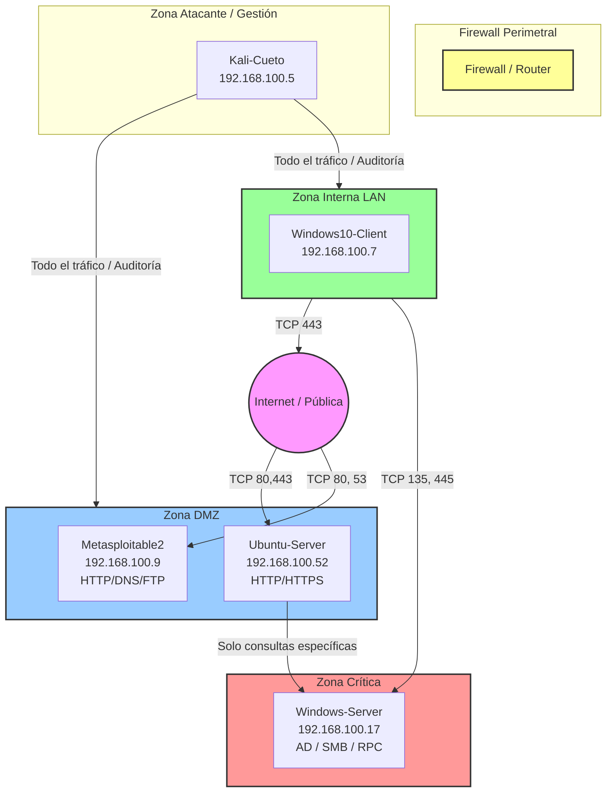

**Autor:** CUETO YAURI LESLIE YANETH
**Curso:** SOC Analyst Bootcamp - Ciberseguridad L1
**Entregable 2 del portafolio** — Reporte de Análisis de Tráfico
**Escenario:** Ferretería El Martillo (pyme de 30 empleados, Lima)

---
## Sección 1 — Diseño de arquitectura segmentada

### 1.1 Zonas de confianza identificadas

| Zona                     | Propósito                                                                                            | Nivel de confianza | Ejemplos de hosts                                            |
| ------------------------ | ---------------------------------------------------------------------------------------------------- | ------------------ | ------------------------------------------------------------ |
| **Pública / Clientes**   | Proporcionar acceso a clientes y dispositivos no corporativos sin acceso a los recursos internos.    | Bajo               | Wi-Fi pública, smartphones y laptops de clientes             |
| **DMZ**                  | Alojar servicios que necesitan exposición externa, manteniéndolos aislados de la red interna.        | Medio              | Servidor web público con Nginx, landing page y tienda online |
| **Interna / Empleados**  | Permitir las actividades diarias de los trabajadores y el acceso controlado a recursos corporativos. | Medio-alto         | 15 PCs Windows 10, Wi-Fi corporativa, impresoras             |
| **Crítica / Servidores** | Proteger los sistemas que contienen información y servicios importantes para el negocio.             | Alto               | Servidor de ventas, PostgreSQL y backend web                 |


```bash
Descubre qué IPs están activas en la red interna
sudo nmap -sn 10.0.2.0/24

```

```text
Por cada IP viva, descubre servicios
sudo nmap -sV <IP> -p 1-1000

```

### 1.2 Inventario de hosts descubiertos (Nmap)

| IP | Hostname (si se resuelve) | SO detectado | Servicios abiertos | Zona propuesta |
|----|----------------------------|--------------|---------------------|----------------|
| **192.168.100.5** | Kali-Cueto (Host local) | Linux (Kali) | Ninguno (1000 puertos filtrados) | **Zona Atacante / Gestión** |
| **192.168.100.7** | Windows10-Client | Windows 10 | Ninguno (1000 puertos filtrados) | **Zona Interna (LAN)** |
| **192.168.100.9** | metasploitable.localdomain | Linux (Ubuntu) | 21/FTP, 22/SSH, 23/Telnet, 25/SMTP, 53/DNS, 80/HTTP, 111/RPC, 139-445/Samba, 512-514/R-services | **DMZ (Demilitarized Zone)** |
| **192.168.100.17** | Windows-Server | Windows | 135/MSRPC, 139/NetBIOS, 445/SMB | **Zona Crítica Interna** |
| **192.168.100.52** | Ubuntu-Server | Linux (Ubuntu) | 21/FTP, 22/SSH, 80/HTTP, 139-445/Samba | **DMZ (Demilitarized Zone)** |


**Ejemplo de justificación esperada:**

* **Host 192.168.100.5 (Kali):** Lo clasifico en **Zona Atacante/Gestión** porque es el host auditor desde donde se administran las herramientas de penetración y control del laboratorio.
* **Host 192.168.100.7 (Windows 10):** Lo clasifico en **Zona Interna (LAN)** porque al tener todos sus puertos cerrados/filtrados actúa como un cliente típico de la red interna que consume recursos pero no aloja servicios públicos.
* **Host 192.168.100.9 (Metasploitable2):** Lo clasifico en **DMZ** debido a que expone servicios públicos como Apache HTTP (puerto 80) e ISC BIND DNS (puerto 53), sirviendo como la plataforma expuesta del laboratorio.
* **Host 192.168.100.17 (Windows Server):** Lo clasifico en **Zona Crítica Interna** debido a la presencia de MSRPC y SMB activos (puertos 135 y 445), indicando que aloja servicios centrales de infraestructura corporativa que jamás deben ver el exterior.
* **Host 192.168.100.52 (Ubuntu Server):** Lo clasifico en **DMZ** porque ejecuta un servidor web Apache visible (puerto 80) destinado a interactuar con peticiones externas sin comprometer la seguridad de la red interna.

**EVIDENCIAS** 


###  Diagrama de Arquitectura de Red (Mermaid)



---

### 1.3 Reglas de flujo inter-zona

| Origen | Destino | Puerto / Protocolo | ¿Permitido? | Justificación |
|--------|---------|---------------------|-------------|---------------|
| Internet | DMZ Web Server | TCP/80, TCP/443 | ✅ | Tráfico web público a landing, tienda y servidores web expuestos (Ubuntu y Metasploitable). |
| Internet | Interna | * | ❌ | Ningún host interno de los usuarios debe ser accesible de forma directa desde la red externa insegura. |
| Pública (Wi-Fi clientes) | Interna | * | ❌ | Los usuarios de la red de invitados o externa no deben tener visibilidad ni alcance sobre la LAN corporativa. |
| Pública (Wi-Fi clientes) | DMZ | TCP/80, TCP/443 | ✅ | Permitir que usuarios externos e invitados consuman los servicios corporativos web públicos. |
| Interna (LAN) | Crítica | TCP/135, TCP/445 | ✅ | Permite la autenticación de los clientes (Windows 10) ante el Controlador de Dominio (Windows Server) mediante SMB/RPC. |
| Interna (LAN) | Internet | TCP/443 | ✅ | Salida estándar segura de los usuarios hacia internet para navegación y consultas HTTPS. |
| DMZ | Crítica | Selectivo (TCP/445) | ✅ | Tráfico estrictamente limitado y controlado para almacenamiento o replicación específica desde aplicaciones autorizadas. |
| DMZ | Interna (LAN) | * | ❌ | **[Regla Denegada Explicita]** Si un servidor de la DMZ es comprometido, jamás debe poder iniciar conexiones hacia los hosts de la LAN interna. |
| Internet | Zona Crítica | * | ❌ | **[Regla Denegada Explicita]** Aislamiento absoluto de la infraestructura core (Windows Server); blindaje total contra accesos externos directos. |

---


### 1.4 Conexión con patrones del Módulo 2

Análisis retrospectivo basado en la implementación estricta del diagrama y reglas propuestos:

1. **DDoS (Ataque de denegación de servicio distribuido):**
   * **¿Qué zona/s habrían sido afectadas?:** Habría afectado principalmente a la **DMZ** (servidores web expuestos).
   * **¿Habría sido contenido o propagado?:** Habría sido **contenido** en la DMZ. Al estar aislada de la zona interna y crítica, el agotamiento de recursos del servidor afectado no tumbaría los servicios de infraestructura interna.
   * **¿Qué regla específica lo bloquea/detecta?:** Mitigado por la regla perimetral de la DMZ combinado con umbrales de rate-limiting (limitación de tasa) en el Firewall perimetral.

2. **Escaneo de puertos (Port Scanning):**
   * **¿Qué zona/s habrían sido afectadas?:** Únicamente la **DMZ**, ya que las zonas Interna y Crítica rechazan por defecto todo paquete entrante no solicitado de fuera.
   * **¿Habría sido contenido o propagado?:** Totalmente **contenido**. El atacante externo solo recibiría respuestas de los puertos permitidos (80, 443, 53) en la DMZ; el resto de la red parecería invisible ("stealth" o filtrada).
   * **¿Qué regla específica lo bloquea/detecta?:** Regla por defecto implícita de denegación (*Deny All*) desde Internet hacia las zonas Interna y Crítica.

3. **Brute Force SSH (Fuerza bruta al puerto 22):**
   * **¿Qué zona/s habrían sido afectadas?:** Afectaría a la **DMZ** si el puerto 22 estuviera expuesto por error hacia Internet.
   * **¿Habría sido contenido o propagado?:** **Contenido**. Si un servidor en la DMZ cae bajo fuerza bruta, el atacante se queda atrapado en esa zona porque las reglas impiden que la DMZ salte (pivotee) hacia la Zona Interna o Crítica.
   * **¿Qué regla específica lo bloquea/detecta?:** Reglas de denegación total de tráfico originado en la **DMZ → Interna / Crítica**, además de la ausencia de publicación del puerto 22 en el Firewall perimetral hacia Internet.

4. **DNS Raro / Anómalo (Tunelización o Exfiltración):**
   * **¿Qué zona/s habrían sido afectadas?:** Afectaría a la **Zona Interna (LAN)** o **DMZ** si un host interno intentara usar peticiones maliciosas hacia afuera.
   * **¿Habría sido contenido o propagado?:** **Propagado** hacia afuera si se permite tráfico UDP/53 irrestricto hacia servidores DNS externos no controlados.
   * **¿Qué regla específica lo bloquea/detecta?:** Se detecta/bloquea obligando a que la zona Interna y DMZ realicen consultas exclusivamente al servidor DNS interno autorizado (Metasploitable o un Forwarder seguro en la zona de Gestión), bloqueando salidas directas al puerto UDP/53 en Internet.

5. **C2 Beacon (Balizamiento hacia servidor de Comando y Control):**
   * **¿Qué zona/s habrían sido afectadas?:** Se originaría en la **Zona Interna (LAN)** tras una infección inicial de un usuario.
   * **¿Habría sido contenido o propagado?:** **Contenido en su salida**. El malware intentaría comunicarse con el exterior a través de puertos aleatorios o HTTP/HTTPS.
   * **¿Qué regla específica lo bloquea/detecta?:** Se bloquea restringiendo las salidas de la LAN hacia Internet exclusivamente al puerto **TCP/443 (HTTPS)** bajo inspección profunda de paquetes (DPI) y proxy del Firewall, bloqueando cualquier salida por puertos no estándar.


## Sección 2 — Controles técnicos de red (Clase 10)

### 2.1 Firewall vs IDS vs IPS vs Proxy
| Control | Qué hace | Dónde se ubica | Previene o detecta |
|---------|----------|----------------|---------------------|
| Firewall | _____ | _____ | _____ |
| IDS | _____ | _____ | _____ |
| IPS | _____ | _____ | _____ |
| Proxy | _____ | _____ | _____ |

### 2.2 Orden de procesamiento del tráfico
_____

### 2.3 Incidentes detectados en logs (3)
| # | Evidencia en el log | Interpretación |
|---|---------------------|----------------|
| 1 | _____ | _____ |
| 2 | _____ | _____ |
| 3 | _____ | _____ |

### 2.4 Reglas IDS propuestas (3, estilo Snort/Suricata)
```
_____
```

### 2.5 Conexión con el diagrama de la Sección 1
_____

---

## Sección 3 — Análisis forense avanzado con Wireshark (Clase 11)

### 3.1 Conversación A — reconstrucción (Follow Stream)
Endpoints + hallazgo concreto: _____

### 3.2 Conversación B — reconstrucción
_____

### 3.3 Artefactos extraídos (Export Objects)
| Artefacto | Hash SHA-256 | Veredicto VT (x/total) |
|-----------|--------------|------------------------|
| _____ | _____ | _____ |

### 3.4 Canal C2 detectado (timing analysis)
IP interna/externa + intervalo + evidencia I/O Graph: _____

### 3.5 Narrativa del incidente post-compromiso (6–10 líneas)
_____

### 3.6 Conexión con las reglas IDS de la Clase 10
¿Cuál de tus reglas habría detectado esto y qué regla adicional agregarías? _____

---

## Sección 4 — Arquitectura cloud y reporte final (Clase 12)

### 4.1 Modelo de Responsabilidad Compartida (IaaS/PaaS/SaaS)
| Modelo | Responsabilidad del proveedor | Responsabilidad del cliente |
|--------|-------------------------------|------------------------------|
| _____ | _____ | _____ |

### 4.2 NSG configurado en Azure
Las 3 reglas (con prioridad) + captura: _____

### 4.3 Aplicación de controles cloud al `.pcap` del M2
Por cada uno de los 5 patrones del M2, qué control cloud aplica: _____

### 4.4 Tabla consolidada de IOCs (≥15 filas)
| Valor | Tipo | Origen (M2/M3) | Patrón asociado |
|-------|------|----------------|-----------------|
| _____ | _____ | _____ | _____ |

### 4.5 Recomendaciones priorizadas (con costo/impacto)
| # | Recomendación | Costo (bajo/medio/alto) | Impacto | Plazo (7d/30d/90d) |
|---|---------------|--------------------------|---------|---------------------|
| 1 | _____ | _____ | _____ | _____ |

### 4.6 Autoevaluación
| Criterio | Mi estimación | Qué mejoraría |
|----------|---------------|---------------|
| Segmentación / arquitectura | _____ | _____ |
| Controles de red + reglas IDS | _____ | _____ |
| Análisis forense Wireshark | _____ | _____ |
| Reporte final + cloud | _____ | _____ |

### 4.7 Controles de identidad por zona — siembra Módulo 4
3 controles IAM por cada zona (12 en total): _____

### 4.8 Cierre del reporte — mensaje final al CISO
En ≤5 líneas, lenguaje no técnico: _____

---

> **Nota:** el resumen ejecutivo y la portada van **al inicio** del reporte final (los redactas en C12 a partir de todo lo anterior). El apéndice técnico (capturas, comandos, salidas crudas) va al final.