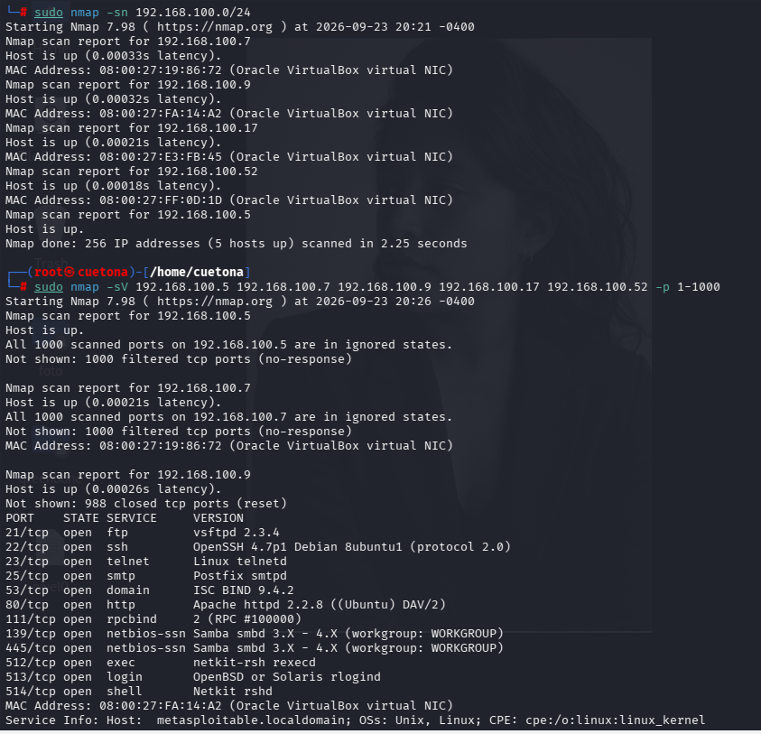
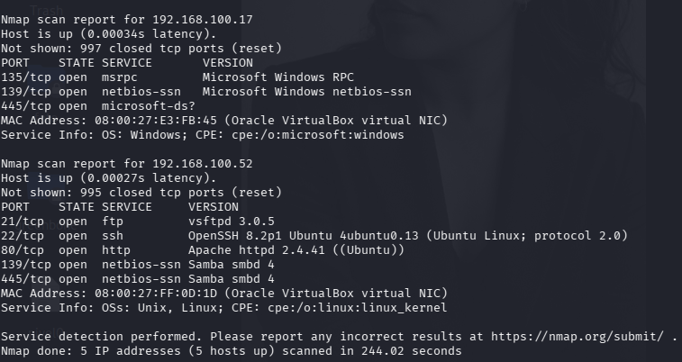
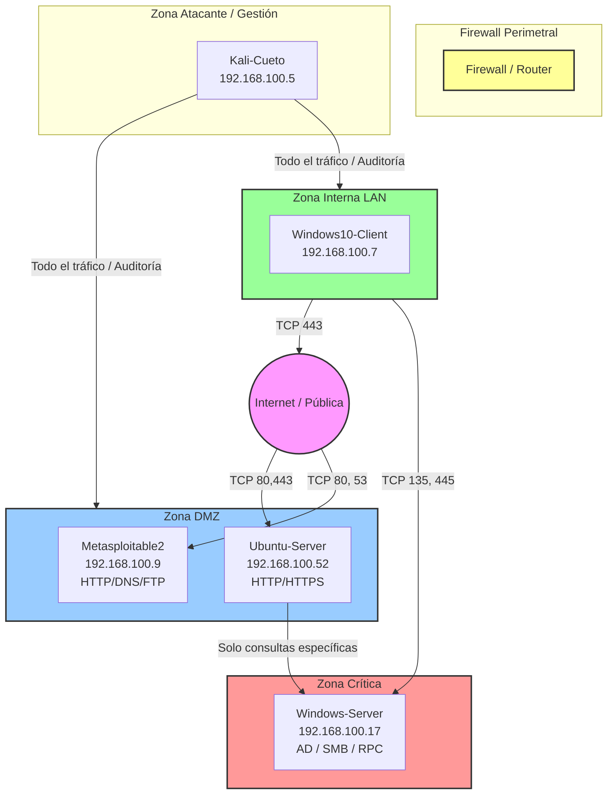

**Autor:** CUETO YAURI LESLIE YANETH
**Curso:** SOC Analyst Bootcamp - Ciberseguridad L1
**Entregable 2 del portafolio** — Reporte de Análisis de Tráfico
**Escenario:** Ferretería El Martillo (pyme de 30 empleados, Lima)

---
## Sección 1 — Diseño de arquitectura segmentada

### 1.1 Zonas de confianza identificadas

| Zona                     | Propósito                                                                                            | Nivel de confianza | Ejemplos de hosts                                            |
| ------------------------ | ---------------------------------------------------------------------------------------------------- | ------------------ | ------------------------------------------------------------ |
| **Pública / Clientes**   | Proporcionar acceso a clientes y dispositivos no corporativos sin acceso a los recursos internos.    | Bajo               | Wi-Fi pública, smartphones y laptops de clientes             |
| **DMZ**                  | Alojar servicios que necesitan exposición externa, manteniéndolos aislados de la red interna.        | Medio              | Servidor web público con Nginx, landing page y tienda online |
| **Interna / Empleados**  | Permitir las actividades diarias de los trabajadores y el acceso controlado a recursos corporativos. | Medio-alto         | 15 PCs Windows 10, Wi-Fi corporativa, impresoras             |
| **Crítica / Servidores** | Proteger los sistemas que contienen información y servicios importantes para el negocio.             | Alto               | Servidor de ventas, PostgreSQL y backend web                 |


```bash
Descubre qué IPs están activas en la red interna
sudo nmap -sn 10.0.2.0/24

```

```text
Por cada IP viva, descubre servicios
sudo nmap -sV <IP> -p 1-1000

```

### 1.2 Inventario de hosts descubiertos (Nmap)

| IP | Hostname (si se resuelve) | SO detectado | Servicios abiertos | Zona propuesta |
|----|----------------------------|--------------|---------------------|----------------|
| **192.168.100.5** | Kali-Cueto (Host local) | Linux (Kali) | Ninguno (1000 puertos filtrados) | **Zona Atacante / Gestión** |
| **192.168.100.7** | Windows10-Client | Windows 10 | Ninguno (1000 puertos filtrados) | **Zona Interna (LAN)** |
| **192.168.100.9** | metasploitable.localdomain | Linux (Ubuntu) | 21/FTP, 22/SSH, 23/Telnet, 25/SMTP, 53/DNS, 80/HTTP, 111/RPC, 139-445/Samba, 512-514/R-services | **DMZ (Demilitarized Zone)** |
| **192.168.100.17** | Windows-Server | Windows | 135/MSRPC, 139/NetBIOS, 445/SMB | **Zona Crítica Interna** |
| **192.168.100.52** | Ubuntu-Server | Linux (Ubuntu) | 21/FTP, 22/SSH, 80/HTTP, 139-445/Samba | **DMZ (Demilitarized Zone)** |


**Ejemplo de justificación esperada:**

* **Host 192.168.100.5 (Kali):** Lo clasifico en **Zona Atacante/Gestión** porque es el host auditor desde donde se administran las herramientas de penetración y control del laboratorio.
* **Host 192.168.100.7 (Windows 10):** Lo clasifico en **Zona Interna (LAN)** porque al tener todos sus puertos cerrados/filtrados actúa como un cliente típico de la red interna que consume recursos pero no aloja servicios públicos.
* **Host 192.168.100.9 (Metasploitable2):** Lo clasifico en **DMZ** debido a que expone servicios públicos como Apache HTTP (puerto 80) e ISC BIND DNS (puerto 53), sirviendo como la plataforma expuesta del laboratorio.
* **Host 192.168.100.17 (Windows Server):** Lo clasifico en **Zona Crítica Interna** debido a la presencia de MSRPC y SMB activos (puertos 135 y 445), indicando que aloja servicios centrales de infraestructura corporativa que jamás deben ver el exterior.
* **Host 192.168.100.52 (Ubuntu Server):** Lo clasifico en **DMZ** porque ejecuta un servidor web Apache visible (puerto 80) destinado a interactuar con peticiones externas sin comprometer la seguridad de la red interna.

**EVIDENCIAS** 





###  Diagrama de Arquitectura de Red (Mermaid)



---

### 1.3 Reglas de flujo inter-zona

| Origen | Destino | Puerto / Protocolo | ¿Permitido? | Justificación |
|--------|---------|---------------------|-------------|---------------|
| Internet | DMZ Web Server | TCP/80, TCP/443 | ✅ | Tráfico web público a landing, tienda y servidores web expuestos (Ubuntu y Metasploitable). |
| Internet | Interna | * | ❌ | Ningún host interno de los usuarios debe ser accesible de forma directa desde la red externa insegura. |
| Pública (Wi-Fi clientes) | Interna | * | ❌ | Los usuarios de la red de invitados o externa no deben tener visibilidad ni alcance sobre la LAN corporativa. |
| Pública (Wi-Fi clientes) | DMZ | TCP/80, TCP/443 | ✅ | Permitir que usuarios externos e invitados consuman los servicios corporativos web públicos. |
| Interna (LAN) | Crítica | TCP/135, TCP/445 | ✅ | Permite la autenticación de los clientes (Windows 10) ante el Controlador de Dominio (Windows Server) mediante SMB/RPC. |
| Interna (LAN) | Internet | TCP/443 | ✅ | Salida estándar segura de los usuarios hacia internet para navegación y consultas HTTPS. |
| DMZ | Crítica | Selectivo (TCP/445) | ✅ | Tráfico estrictamente limitado y controlado para almacenamiento o replicación específica desde aplicaciones autorizadas. |
| DMZ | Interna (LAN) | * | ❌ | **[Regla Denegada Explicita]** Si un servidor de la DMZ es comprometido, jamás debe poder iniciar conexiones hacia los hosts de la LAN interna. |
| Internet | Zona Crítica | * | ❌ | **[Regla Denegada Explicita]** Aislamiento absoluto de la infraestructura core (Windows Server); blindaje total contra accesos externos directos. |

---


### 1.4 Conexión con patrones del Módulo 2

Análisis retrospectivo basado en la implementación estricta del diagrama y reglas propuestos:

1. **DDoS (Ataque de denegación de servicio distribuido):**
   * **¿Qué zona/s habrían sido afectadas?:** Habría afectado principalmente a la **DMZ** (servidores web expuestos).
   * **¿Habría sido contenido o propagado?:** Habría sido **contenido** en la DMZ. Al estar aislada de la zona interna y crítica, el agotamiento de recursos del servidor afectado no tumbaría los servicios de infraestructura interna.
   * **¿Qué regla específica lo bloquea/detecta?:** Mitigado por la regla perimetral de la DMZ combinado con umbrales de rate-limiting (limitación de tasa) en el Firewall perimetral.

2. **Escaneo de puertos (Port Scanning):**
   * **¿Qué zona/s habrían sido afectadas?:** Únicamente la **DMZ**, ya que las zonas Interna y Crítica rechazan por defecto todo paquete entrante no solicitado de fuera.
   * **¿Habría sido contenido o propagado?:** Totalmente **contenido**. El atacante externo solo recibiría respuestas de los puertos permitidos (80, 443, 53) en la DMZ; el resto de la red parecería invisible ("stealth" o filtrada).
   * **¿Qué regla específica lo bloquea/detecta?:** Regla por defecto implícita de denegación (*Deny All*) desde Internet hacia las zonas Interna y Crítica.

3. **Brute Force SSH (Fuerza bruta al puerto 22):**
   * **¿Qué zona/s habrían sido afectadas?:** Afectaría a la **DMZ** si el puerto 22 estuviera expuesto por error hacia Internet.
   * **¿Habría sido contenido o propagado?:** **Contenido**. Si un servidor en la DMZ cae bajo fuerza bruta, el atacante se queda atrapado en esa zona porque las reglas impiden que la DMZ salte (pivotee) hacia la Zona Interna o Crítica.
   * **¿Qué regla específica lo bloquea/detecta?:** Reglas de denegación total de tráfico originado en la **DMZ → Interna / Crítica**, además de la ausencia de publicación del puerto 22 en el Firewall perimetral hacia Internet.

4. **DNS Raro / Anómalo (Tunelización o Exfiltración):**
   * **¿Qué zona/s habrían sido afectadas?:** Afectaría a la **Zona Interna (LAN)** o **DMZ** si un host interno intentara usar peticiones maliciosas hacia afuera.
   * **¿Habría sido contenido o propagado?:** **Propagado** hacia afuera si se permite tráfico UDP/53 irrestricto hacia servidores DNS externos no controlados.
   * **¿Qué regla específica lo bloquea/detecta?:** Se detecta/bloquea obligando a que la zona Interna y DMZ realicen consultas exclusivamente al servidor DNS interno autorizado (Metasploitable o un Forwarder seguro en la zona de Gestión), bloqueando salidas directas al puerto UDP/53 en Internet.

5. **C2 Beacon (Balizamiento hacia servidor de Comando y Control):**
   * **¿Qué zona/s habrían sido afectadas?:** Se originaría en la **Zona Interna (LAN)** tras una infección inicial de un usuario.
   * **¿Habría sido contenido o propagado?:** **Contenido en su salida**. El malware intentaría comunicarse con el exterior a través de puertos aleatorios o HTTP/HTTPS.
   * **¿Qué regla específica lo bloquea/detecta?:** Se bloquea restringiendo las salidas de la LAN hacia Internet exclusivamente al puerto **TCP/443 (HTTPS)** bajo inspección profunda de paquetes (DPI) y proxy del Firewall, bloqueando cualquier salida por puertos no estándar.


## Sección 2 — Controles técnicos de red

### 2.1 Firewall vs IDS vs IPS vs Proxy

A continuación se detalla la matriz comparativa de los controles técnicos de seguridad perimetral y de red, analizando sus capacidades operativas, modos de despliegue y tecnologías de referencia en la industria:

| Control | ¿Qué hace? | ¿Bloquea? | ¿Dónde se ubica? | Ejemplo producto |
|---------|-----------|-----------|-------------------|-------------------|
| **Firewall stateful** | Inspecciona paquetes a nivel de capas 3 y 4 (IP/Puertos). Realiza un seguimiento del estado de las conexiones activas en una tabla de estados (*state table*) para autorizar de forma automática el tráfico de retorno legítimo. | **Sí** | En el perímetro de la red y sirviendo de puerta de enlace (*gateway*) para la segmentación lógica entre distintas zonas de confianza (LAN, DMZ, WAN). | iptables, pfSense, FortiGate, Check Point |
| **IDS** (Intrusion Detection System) | Analiza el contenido profundo de los paquetes (Capas 4 a 7) de forma pasiva mediante firmas y anomalías para identificar comportamientos maliciosos o exploits, generando alertas sin interferir en el tráfico. | **No** (Solo alerta y registra) | Conectado a un puerto espejo (**SPAN port**), un **TAP de red** de hardware, o desplegado de forma lógica en modo pasivo/escucha. | Snort, Suricata, Zeek (Corelight) |
| **IPS** (Intrusion Prevention System) | Realiza una inspección profunda de paquetes (DPI) al igual que el IDS, pero procesa el tráfico en tiempo real. Analiza las cargas útiles (*payloads*) de los protocolos y detiene las amenazas activas de manera inmediata. | **Sí** (Descarta paquetes maliciosos o corta conexiones TCP RST) | Desplegado **Inline** (en línea directa). Todo el tráfico de la red está obligado a fluir físicamente a través del dispositivo para ser analizado. | Snort (IPS mode), Suricata (IPS mode), Cisco FirePOWER |
| **Proxy forward** | Actúa como un intermediario centralizado para las peticiones de salida de los clientes internos hacia Internet. Oculta las IPs de la LAN, optimiza el ancho de banda con caché y aplica políticas de filtrado URL/Contenido. | **Sí** (Aplica políticas de denegación y filtrado web) | En la salida perimetral de la red corporativa, situado entre los clientes de la LAN interna e Internet. | Squid Proxy, Zscaler Internet Access (ZIA) |
| **Proxy reverse** | Actúa como un intermediario frente a los servidores web internos. Recibe las peticiones entrantes de usuarios externos de Internet, las inspecciona, distribuye la carga (*load balancing*) y puede aplicar funciones de protección WAF. | **Sí** (Bloquea peticiones HTTP/HTTPS maliciosas si integra módulos WAF) | En el perímetro de la **DMZ**, colocado directamente de cara a Internet por delante de las aplicaciones web y bases de datos internas. | Nginx, HAProxy, Cloudflare WAF, F5 BIG-IP |


### 2.2 ¿En qué orden procesan el tráfico?

Para un paquete de datos entrante que se dirige desde **Internet → DMZ Web Server**, el flujo de análisis técnico sigue la secuencia óptima de seguridad y rendimiento de hardware:

**Orden correcto:** **A** (Firewall stateful) → **B** (IDS) → **C** (Nginx reverse proxy) → **D** (Web server)

#### Justificación del Orden Técnico:
El firewall filtra primero el tráfico no autorizado, luego el IDS inspecciona el tráfico permitido, después Nginx recibe y enruta la solicitud, y finalmente el servidor web procesa la aplicación.

### 2.3 Incidentes detectados en logs

#### Incidente 1 — Escaneo de Puertos Vertical desde Red Externa

- **IP origen:** `185.220.101.47`
- **IP destino:** `10.0.2.50`
- **Puerto(s) objetivo:** `80` (HTTP) y `22` (SSH)
- **Acción del firewall:** `block`
- **Ventana de tiempo:** 22 de Abril a las 14:23:01 UTC
- **Volumen:** 31 intentos en menos de 1 segundo (tráfico automatizado en ráfaga).
- **Evidencia (2–3 líneas del log):**
```text
Apr 22 14:23:01 pfsense filterlog: 12,,,1000000103,igb0,match,block,in,4,0x0,,64,0,0,none,6,tcp,60,185.220.101.47,10.0.2.50,54321,22,40,S,,,,mss
Apr 22 14:23:01 pfsense filterlog: 12,,,1000000103,igb0,match,block,in,4,0x0,,64,0,0,none,6,tcp,60,185.220.101.47,10.0.2.50,54321,80,40,S,,,,mss
```
- **Hipótesis:** Un único host externo está realizando una actividad de reconocimiento activo (Escaneo de Puertos Vertical automatizado) mediante el envío de paquetes TCP SYN (`S`) en una misma ventana de tiempo milimétrica, buscando identificar vectores de entrada expuestos en la DMZ. El firewall mitigó la amenaza de forma efectiva.

---

#### Incidente 2 — Sonda Temática y Enumeración de Aplicaciones Web (HTTP)

- **IP origen:** `185.220.101.47`
- **IP destino:** `10.0.2.50`
- **Puerto(s) objetivo:** `80` (TCP)
- **Acción del firewall:** `block`
- **Ventana de tiempo:** 22 de Abril a las 14:23:01 UTC
- **Volumen:** 17 intentos en menos de 1 segundo.
- **Evidencia (2–3 líneas del log):**
```text
Apr 22 14:23:01 pfsense filterlog: 12,,,1000000103,igb0,match,block,in,4,0x0,,64,0,0,none,6,tcp,60,185.220.101.47,10.0.2.50,54321,80,40,S,,,,mss
```
- **Hipótesis:** El patrón de 17 intentos TCP SYN contra el puerto 80 en una ventana de tiempo muy corta es compatible con una actividad automatizada de reconocimiento del servicio web. El log del firewall por sí solo no permite confirmar enumeración de directorios o explotación HTTP.
---

#### Incidente 3 — Intento de Descubrimiento de Terminales de Administración Remota (SSH)

- **IP origen:** `185.220.101.47`
- **IP destino:** `10.0.2.50`
- **Puerto(s) objetivo:** `22` (TCP)
- **Acción del firewall:** `block`
- **Ventana de tiempo:** 22 de Abril a las 14:23:01 UTC
- **Volumen:** 14 intentos en menos de 1 segundo.
- **Evidencia (2–3 líneas del log):**
```text
Apr 22 14:23:01 pfsense filterlog: 12,,,1000000103,igb0,match,block,in,4,0x0,,64,0,0,none,6,tcp,60,185.220.101.47,10.0.2.50,54321,22,40,S,,,,mss
```
- **Hipótesis:** Los 14 intentos TCP SYN contra el puerto 22 son compatibles con reconocimiento automatizado del servicio SSH. El registro permite identificar el intento de conexión, pero no confirma por sí solo un posterior ataque de fuerza bruta.


#### 📷 Evidencias de Auditoría Activa


### 2.4 Reglas IDS propuestas

#### Regla para Incidente 1 (Detección de Escaneo de Puertos Vertical)

```text
alert tcp $EXTERNAL_NET any -> $HOME_NET any (msg:"POSIBLE ESCANEO DE PUERTOS VERTICAL"; flags:S; flow:stateless; threshold:type both, track by_src, count 20, seconds 2; sid:1000001; rev:1;)
```

* **Umbral elegido y justificación:** 
  Se configura un umbral de 20 eventos en 2 segundos agrupados por IP origen (track by_src). Se justifica porque los 31 intentos observados en los logs muestran una ráfaga de tráfico TCP SYN dirigida al mismo host y a diferentes puertos.
* **False positive rate esperado:** 
  **Bajo**
* **¿Qué tráfico legítimo podría dispararla? (falsos positivos previsibles):**
Podría activarse por balanceadores de carga, sistemas de monitoreo o administradores de TI realizando pruebas de conectividad o auditorías autorizadas.
* **¿Cómo la ajustarías si la FPR es demasiado alta?:**
 Incrementaría el count a 50 eventos o excluiría mediante una lista de confianza las IP de monitoreo y administración autorizadas.

---

#### Regla para Incidente 2 (Detección de Sondas en Aplicaciones Web - HTTP)

```text
alert tcp $EXTERNAL_NET any -> $DMZ_NET 80 (msg:"WEB-SERVER INTENSIVE SCAN Sonda Temática HTTP"; flags:S; flow:stateless; threshold:type both, track by_src, count 15, seconds 1; sid:1000002; rev:1;)
```

* **Umbral elegido y justificación:**
  Se establece un umbral de 15 paquetes SYN dirigidos al puerto 80 en 1 segundo por IP origen. El log registra 17 intentos bloqueados contra el puerto 80, por lo que este umbral permite detectar ráfagas similares de conexiones TCP al servicio web.
* **False positive rate esperado:**
  **Medio**
* **¿Qué tráfico legítimo podría dispararla? (falsos positivos previsibles):**
Un elevado número de conexiones simultáneas provenientes de usuarios legítimos, sistemas de monitoreo o servicios automatizados podría activar la alerta.
* **¿Cómo la ajustarías si la FPR es demasiado alta?:**
  Aumentaría el umbral, por ejemplo a 30 eventos por segundo, y excluiría las IP de confianza. Para identificar realmente enumeración HTTP, complementaría esta regla con firmas específicas de HTTP.

---

#### Regla para Incidente 3 (Detección de Enumeración Invasiva SSH)

```text
alert tcp $EXTERNAL_NET any -> $HOME_NET 22 (msg:"INFRASTRUCTURE RECONNAISSANCE Intento masivo SSH"; flags:S; flow:stateless; threshold:type both, track by_src, count 5, seconds 1; sid:1000003; rev:1;)
```

* **Umbral elegido y justificación:**
Se configura un umbral de 5 intentos SYN en 1 segundo. El log registra 14 intentos bloqueados contra el puerto 22, por lo que una ráfaga de esta magnitud es compatible con reconocimiento automatizado del servicio SSH.
* **False positive rate esperado:**
  **Muy Bajo**
* **¿Qué tráfico legítimo podría dispararla? (falsos positivos previsibles):**
  Sistemas de administración, automatización o monitoreo que realicen múltiples conexiones SSH podrían generar una alerta.
* **¿Cómo la ajustarías si la FPR es demasiado alta?:**
Aumentaría el umbral o excluiría las IP administrativas autorizadas mediante una lista de confianza. No utilizaría la ubicación geográfica de la IP como criterio único de bloqueo.

---

### 2.5 Conexión con diagrama de la Sección 1

A continuación se detalla la lógica de despliegue, el modo de operación y el análisis de riesgo de ingeniería de seguridad para cada una de las tres reglas propuestas:

#### 1. Regla 1 — Detección de Escaneo de Puertos HTTP (Puerto 80)
* **¿En qué frontera de zona se implementaría?:** Se debe implementar en la frontera de red situada **entre la Zona Pública (Internet) y la DMZ**. Esta es la primera línea perimetral que recibe las peticiones externas hacia el *Ubuntu-Server* y *Metasploitable2*.
* **¿Es regla de IDS (alerta) o de IPS (bloqueo automático)? ¿Por qué?:** Es una regla de **IDS (Modo Alerta)**. Debido a que el Firewall stateful perimetral ya está configurado para denegar de forma nativa el tráfico no autorizado en capas 3 y 4, procesar ráfagas masivas de escaneo de la calle en modo IPS generaría una sobrecarga innecesaria de CPU en el motor de inspección profunda.
* **Si fuera IPS y tiene FPR media/alta, ¿qué riesgo operativo implica?:** Implica el riesgo de bloquear de forma automatizada a clientes legítimos o usuarios de internet que estén navegando concurrentemente de forma rápida por la landing page o la tienda web, provocando una **Denegación de Servicio Autoinfligida (DDoS interno)** y pérdida de disponibilidad.

---

#### 2. Regla 2 — Detección de Enumeración Invasiva SSH (Puerto 22)
* **¿En qué frontera de zona se implementaría?:** Se debe implementar en la frontera perimetral **entre la Zona Pública (Internet) y la DMZ**, y como control secundario en el segmento de **egress/salida de la Zona Interna (LAN)** para evitar que un host comprometido intente saltar hacia el servicio SSH de la consola de administración.
* **¿Es regla de IDS (alerta) o de IPS (bloqueo automático)? ¿Por qué?:** Es una regla de **IPS (Bloqueo Automático)**. Al tratarse SSH de un servicio crítico de administración remota de infraestructura, cualquier ráfaga automatizada que intente enumerar credenciales debe cortarse de forma inmediata en la tarjeta de red (enviando un TCP RST o bloqueando la IP) antes de que logre interactuar con el prompt de autenticación.
* **Si fuera IPS y tiene FPR media/alta, ¿qué riesgo operativo implica?:** Implica el riesgo de **bloquear el acceso de los propios administradores de TI o ingenieros de seguridad del SOC** hacia las consolas de control del servidor ante un mínimo error de automatización o fallo repetido en la clave pública, dejándolos fuera del sistema en medio de un incidente de soporte.

---

#### 3. Regla 3 — Alerta de Reputación por IP Atacante Conocida (IOC 185.220.101.47)
* **¿En qué frontera de zona se implementaría?:** Se implementa directamente en el gateway perimetral externo, bloqueando el tráfico en el sentido **Pública (Internet) hacia cualquier zona interna (DMZ / Interna / Crítica)**.
* **¿Es regla de IDS (alerta) o de IPS (bloqueo automático)? ¿Por qué?:** Se debe desplegar en **modo IPS (Bloqueo Automático)**. Al ser una firma estricta basada en reputación de un Indicador de Compromiso (IOC) previamente verificado con actividades maliciosas (escáner perimetral activo), no hay razón para permitir que sus paquetes crucen el umbral del firewall.
* **Si fuera IPS y tiene FPR media/alta, ¿qué riesgo operativo implica?:** Para esta regla específica el riesgo operativo es **Cero o Mínimo**. Al tratarse de una firma de coincidencia exacta basada en una IP externa hostil confirmada en los logs, no existe la posibilidad de interrumpir procesos legítimos o flujos comerciales internos de la empresa.


## Sección 3 — Análisis forense avanzado con Wireshark (Clase 11)

### 3.1 Conversación A — reconstrucción (Follow Stream)
Endpoints + hallazgo concreto: _____

### 3.2 Conversación B — reconstrucción
_____

### 3.3 Artefactos extraídos (Export Objects)
| Artefacto | Hash SHA-256 | Veredicto VT (x/total) |
|-----------|--------------|------------------------|
| _____ | _____ | _____ |

### 3.4 Canal C2 detectado (timing analysis)
IP interna/externa + intervalo + evidencia I/O Graph: _____

### 3.5 Narrativa del incidente post-compromiso (6–10 líneas)
_____

### 3.6 Conexión con las reglas IDS de la Clase 10
¿Cuál de tus reglas habría detectado esto y qué regla adicional agregarías? _____

---

## Sección 4 — Arquitectura cloud y reporte final (Clase 12)

### 4.1 Modelo de Responsabilidad Compartida (IaaS/PaaS/SaaS)
| Modelo | Responsabilidad del proveedor | Responsabilidad del cliente |
|--------|-------------------------------|------------------------------|
| _____ | _____ | _____ |

### 4.2 NSG configurado en Azure
Las 3 reglas (con prioridad) + captura: _____

### 4.3 Aplicación de controles cloud al `.pcap` del M2
Por cada uno de los 5 patrones del M2, qué control cloud aplica: _____

### 4.4 Tabla consolidada de IOCs (≥15 filas)
| Valor | Tipo | Origen (M2/M3) | Patrón asociado |
|-------|------|----------------|-----------------|
| _____ | _____ | _____ | _____ |

### 4.5 Recomendaciones priorizadas (con costo/impacto)
| # | Recomendación | Costo (bajo/medio/alto) | Impacto | Plazo (7d/30d/90d) |
|---|---------------|--------------------------|---------|---------------------|
| 1 | _____ | _____ | _____ | _____ |

### 4.6 Autoevaluación
| Criterio | Mi estimación | Qué mejoraría |
|----------|---------------|---------------|
| Segmentación / arquitectura | _____ | _____ |
| Controles de red + reglas IDS | _____ | _____ |
| Análisis forense Wireshark | _____ | _____ |
| Reporte final + cloud | _____ | _____ |

### 4.7 Controles de identidad por zona — siembra Módulo 4
3 controles IAM por cada zona (12 en total): _____

### 4.8 Cierre del reporte — mensaje final al CISO
En ≤5 líneas, lenguaje no técnico: _____

---

> **Nota:** el resumen ejecutivo y la portada van **al inicio** del reporte final (los redactas en C12 a partir de todo lo anterior). El apéndice técnico (capturas, comandos, salidas crudas) va al final.