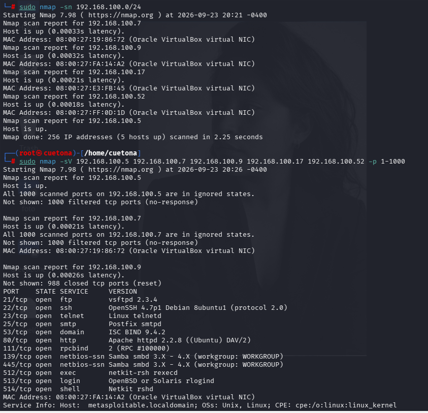
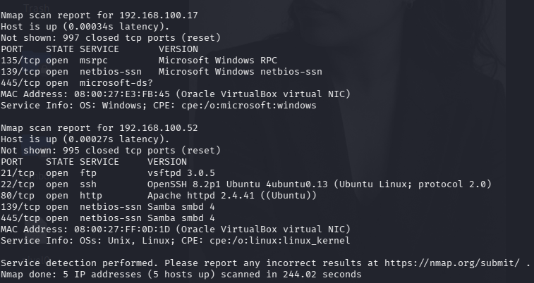
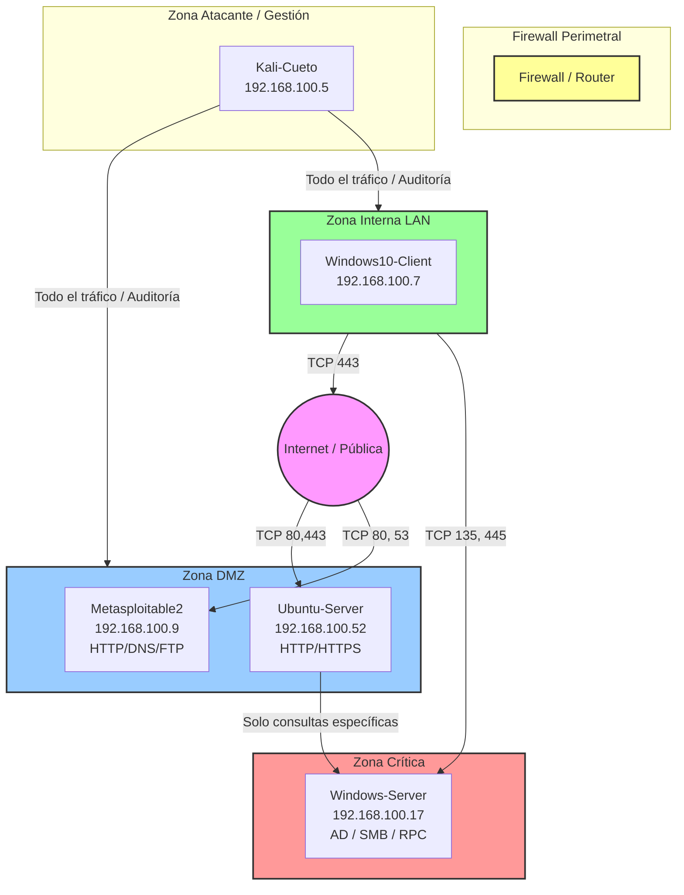
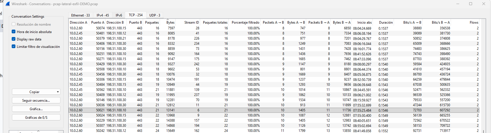
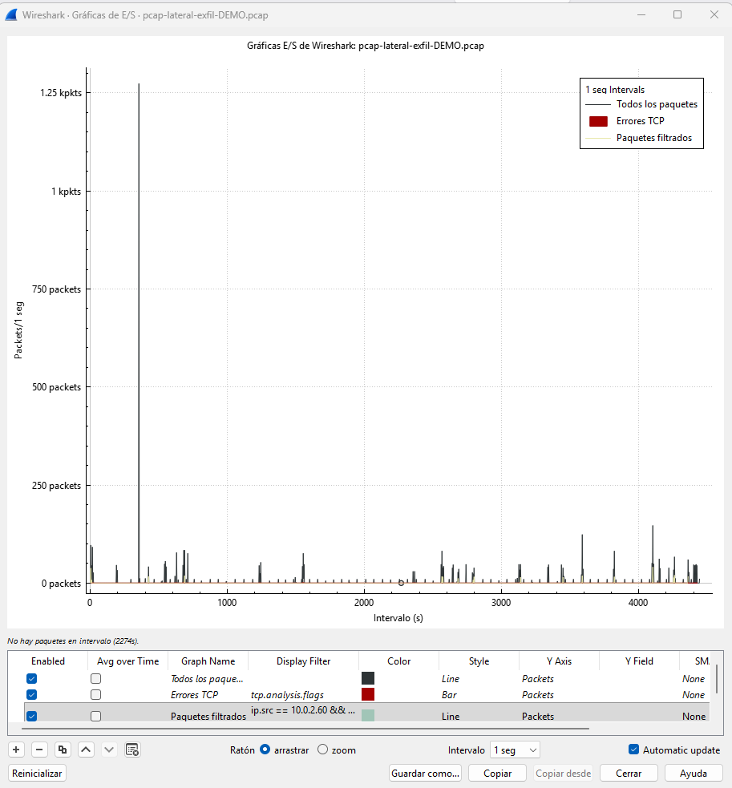
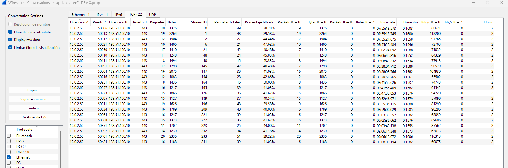
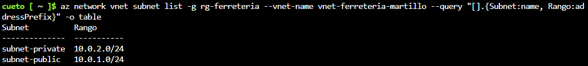
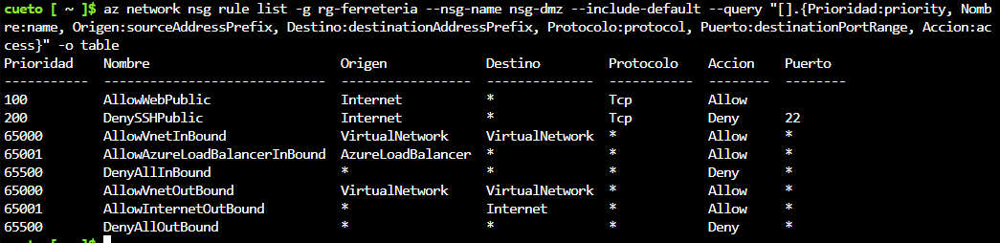

**Autor:** CUETO YAURI LESLIE YANETH
**Curso:** SOC Analyst Bootcamp - Ciberseguridad L1
**Entregable 2 del portafolio** — Reporte de Análisis de Tráfico
**Escenario:** Ferretería El Martillo (pyme de 30 empleados, Lima)


## Resumen ejecutivo (para CISO / no técnico)

En el análisis de tráfico de red de Ferretería El Martillo, se identificaron **5 categorías de amenazas activas** contra la infraestructura actual: DDoS (SYN flood), Escaneo de puertos, Fuerza bruta SSH, DNS Anómalo (Tunelización) y Balizamiento (Beaconing) de Comando y Control (C2).

**Impacto actual estimado:** **Alto**. La presencia de balizamiento C2 activo y ráfagas concurrentes expone a la empresa a una exfiltración inminente de datos financieros y al despliegue de ransomware que detendría la operación comercial.

**Causa raíz:** La arquitectura actual es una **red plana** sin segmentación, lo que permite que un compromiso en cualquier host de la ferretería se propague lateralmente al resto de la empresa debido a la falta de fronteras de seguridad internas.

**Recomendación principal (acción en 7 días):** Implementar la segmentación de red con Network Security Groups (NSG) creando subredes públicas (DMZ) y privadas para aislar los servidores críticos y denegar accesos no autorizados.

**Inversión requerida (priorizada):**
- **Corto plazo (7 días):** Bajo (Costo lógico absorbido por la configuración de red y despliegue del NSG `nsg-dmz` en Azure).
- **Medio plazo (30 días):** Medio (Habilitación de Azure Firewall Premium con IDPS para inspección profunda de Capa 7).
- **Largo plazo (90 días):** Alto (Implementación y centralización de registros mediante el SIEM Azure Sentinel para alertas del SOC).

**Las secciones siguientes detallan el análisis técnico, la arquitectura propuesta, y el plan de implementación.**

---

## Sección 1 — Diseño de arquitectura segmentada

### 1.1 Zonas de confianza identificadas

| Zona                     | Propósito                                                                                            | Nivel de confianza | Ejemplos de hosts                                            |
| ------------------------ | ---------------------------------------------------------------------------------------------------- | ------------------ | ------------------------------------------------------------ |
| **Pública / Clientes**   | Proporcionar acceso a clientes y dispositivos no corporativos sin acceso a los recursos internos.    | Bajo               | Wi-Fi pública, smartphones y laptops de clientes             |
| **DMZ**                  | Alojar servicios que necesitan exposición externa, manteniéndolos aislados de la red interna.        | Medio              | Servidor web público con Nginx, landing page y tienda online |
| **Interna / Empleados**  | Permitir las actividades diarias de los trabajadores y el acceso controlado a recursos corporativos. | Medio-alto         | 15 PCs Windows 10, Wi-Fi corporativa, impresoras             |
| **Crítica / Servidores** | Proteger los sistemas que contienen información y servicios importantes para el negocio.             | Alto               | Servidor de ventas, PostgreSQL y backend web                 |


```bash
Descubre qué IPs están activas en la red interna
sudo nmap -sn 10.0.2.0/24

```

```text
Por cada IP viva, descubre servicios
sudo nmap -sV <IP> -p 1-1000

```

### 1.2 Inventario de hosts descubiertos (Nmap)

| IP | Hostname (si se resuelve) | SO detectado | Servicios abiertos | Zona propuesta |
|----|----------------------------|--------------|---------------------|----------------|
| **192.168.100.5** | Kali-Cueto (Host local) | Linux (Kali) | Ninguno (1000 puertos filtrados) | **Zona Atacante / Gestión** |
| **192.168.100.7** | Windows10-Client | Windows 10 | Ninguno (1000 puertos filtrados) | **Zona Interna (LAN)** |
| **192.168.100.9** | metasploitable.localdomain | Linux (Ubuntu) | 21/FTP, 22/SSH, 23/Telnet, 25/SMTP, 53/DNS, 80/HTTP, 111/RPC, 139-445/Samba, 512-514/R-services | **DMZ (Demilitarized Zone)** |
| **192.168.100.17** | Windows-Server | Windows | 135/MSRPC, 139/NetBIOS, 445/SMB | **Zona Crítica Interna** |
| **192.168.100.52** | Ubuntu-Server | Linux (Ubuntu) | 21/FTP, 22/SSH, 80/HTTP, 139-445/Samba | **DMZ (Demilitarized Zone)** |


**Ejemplo de justificación esperada:**

* **Host 192.168.100.5 (Kali):** Lo clasifico en **Zona Atacante/Gestión** porque es el host auditor desde donde se administran las herramientas de penetración y control del laboratorio.
* **Host 192.168.100.7 (Windows 10):** Lo clasifico en **Zona Interna (LAN)** porque al tener todos sus puertos cerrados/filtrados actúa como un cliente típico de la red interna que consume recursos pero no aloja servicios públicos.
* **Host 192.168.100.9 (Metasploitable2):** Lo clasifico en **DMZ** debido a que expone servicios públicos como Apache HTTP (puerto 80) e ISC BIND DNS (puerto 53), sirviendo como la plataforma expuesta del laboratorio.
* **Host 192.168.100.17 (Windows Server):** Lo clasifico en **Zona Crítica Interna** debido a la presencia de MSRPC y SMB activos (puertos 135 y 445), indicando que aloja servicios centrales de infraestructura corporativa que jamás deben ver el exterior.
* **Host 192.168.100.52 (Ubuntu Server):** Lo clasifico en **DMZ** porque ejecuta un servidor web Apache visible (puerto 80) destinado a interactuar con peticiones externas sin comprometer la seguridad de la red interna.

**EVIDENCIAS** 





###  Diagrama de Arquitectura de Red (Mermaid)


```mermaid
graph TD
    %% Definición de Nubes e Internet
    Internet((Internet / Pública))
    
    %% Firewall Principal
    subgraph Perímetro_Seguridad [Firewall Perimetral]
        FW[Firewall / Router]
    end

    %% Zona Atacante / Gestión
    subgraph Zona_Atacante [Zona Atacante / Gestión]
        Kali[Kali-Cueto <br> 192.168.100.5]
    end

    %% Zona DMZ
    subgraph DMZ [Zona DMZ]
        Meta[Metasploitable2 <br> 192.168.100.9 <br> HTTP/DNS/FTP]
        Ubuntu[Ubuntu-Server <br> 192.168.100.52 <br> HTTP/HTTPS]
    end

    %% Zona Interna LAN
    subgraph LAN [Zona Interna LAN]
        Win10[Windows10-Client <br> 192.168.100.7]
    end

    %% Zona Crítica Interna
    subgraph Zona_Critica [Zona Crítica]
        WinServer[Windows-Server <br> 192.168.100.17 <br> AD / SMB / RPC]
    end

    %% Conexiones y Flujos Permitidos
    Internet -->|TCP 80,443| Ubuntu
    Internet -->|TCP 80, 53| Meta
    Kali -->|Todo el tráfico / Auditoría| DMZ
    Kali -->|Todo el tráfico / Auditoría| LAN
    LAN -->|TCP 443| Internet
    LAN -->|TCP 135, 445| WinServer
    Ubuntu -->|Solo consultas específicas| WinServer
    
    %% Estilos Visuales
    style Internet fill:#f9f,stroke:#333,stroke-width:2px
    style FW fill:#ff9,stroke:#333,stroke-width:2px
    style Zona_Critica fill:#f99,stroke:#333,stroke-width:2px
    style DMZ fill:#9cf,stroke:#333,stroke-width:2px
    style LAN fill:#9f9,stroke:#333,stroke-width:2px
```

---

### 1.3 Reglas de flujo inter-zona

| Origen | Destino | Puerto / Protocolo | ¿Permitido? | Justificación |
|--------|---------|---------------------|-------------|---------------|
| Internet | DMZ Web Server | TCP/80, TCP/443 | ✅ | Tráfico web público a landing, tienda y servidores web expuestos (Ubuntu y Metasploitable). |
| Internet | Interna | * | ❌ | Ningún host interno de los usuarios debe ser accesible de forma directa desde la red externa insegura. |
| Pública (Wi-Fi clientes) | Interna | * | ❌ | Los usuarios de la red de invitados o externa no deben tener visibilidad ni alcance sobre la LAN corporativa. |
| Pública (Wi-Fi clientes) | DMZ | TCP/80, TCP/443 | ✅ | Permitir que usuarios externos e invitados consuman los servicios corporativos web públicos. |
| Interna (LAN) | Crítica | TCP/135, TCP/445 | ✅ | Permite la autenticación de los clientes (Windows 10) ante el Controlador de Dominio (Windows Server) mediante SMB/RPC. |
| Interna (LAN) | Internet | TCP/443 | ✅ | Salida estándar segura de los usuarios hacia internet para navegación y consultas HTTPS. |
| DMZ | Crítica | Selectivo (TCP/445) | ✅ | Tráfico estrictamente limitado y controlado para almacenamiento o replicación específica desde aplicaciones autorizadas. |
| DMZ | Interna (LAN) | * | ❌ | **[Regla Denegada Explicita]** Si un servidor de la DMZ es comprometido, jamás debe poder iniciar conexiones hacia los hosts de la LAN interna. |
| Internet | Zona Crítica | * | ❌ | **[Regla Denegada Explicita]** Aislamiento absoluto de la infraestructura core (Windows Server); blindaje total contra accesos externos directos. |

---


### 1.4 Conexión con patrones del Módulo 2

Análisis retrospectivo basado en la implementación estricta del diagrama y reglas propuestos:

1. **DDoS (Ataque de denegación de servicio distribuido):**
   * **¿Qué zona/s habrían sido afectadas?:** Habría afectado principalmente a la **DMZ** (servidores web expuestos).
   * **¿Habría sido contenido o propagado?:** Habría sido **contenido** en la DMZ. Al estar aislada de la zona interna y crítica, el agotamiento de recursos del servidor afectado no tumbaría los servicios de infraestructura interna.
   * **¿Qué regla específica lo bloquea/detecta?:** Mitigado por la regla perimetral de la DMZ combinado con umbrales de rate-limiting (limitación de tasa) en el Firewall perimetral.

2. **Escaneo de puertos (Port Scanning):**
   * **¿Qué zona/s habrían sido afectadas?:** Únicamente la **DMZ**, ya que las zonas Interna y Crítica rechazan por defecto todo paquete entrante no solicitado de fuera.
   * **¿Habría sido contenido o propagado?:** Totalmente **contenido**. El atacante externo solo recibiría respuestas de los puertos permitidos (80, 443, 53) en la DMZ; el resto de la red parecería invisible ("stealth" o filtrada).
   * **¿Qué regla específica lo bloquea/detecta?:** Regla por defecto implícita de denegación (*Deny All*) desde Internet hacia las zonas Interna y Crítica.

3. **Brute Force SSH (Fuerza bruta al puerto 22):**
   * **¿Qué zona/s habrían sido afectadas?:** Afectaría a la **DMZ** si el puerto 22 estuviera expuesto por error hacia Internet.
   * **¿Habría sido contenido o propagado?:** **Contenido**. Si un servidor en la DMZ cae bajo fuerza bruta, el atacante se queda atrapado en esa zona porque las reglas impiden que la DMZ salte (pivotee) hacia la Zona Interna o Crítica.
   * **¿Qué regla específica lo bloquea/detecta?:** Reglas de denegación total de tráfico originado en la **DMZ → Interna / Crítica**, además de la ausencia de publicación del puerto 22 en el Firewall perimetral hacia Internet.

4. **DNS Raro / Anómalo (Tunelización o Exfiltración):**
   * **¿Qué zona/s habrían sido afectadas?:** Afectaría a la **Zona Interna (LAN)** o **DMZ** si un host interno intentara usar peticiones maliciosas hacia afuera.
   * **¿Habría sido contenido o propagado?:** **Propagado** hacia afuera si se permite tráfico UDP/53 irrestricto hacia servidores DNS externos no controlados.
   * **¿Qué regla específica lo bloquea/detecta?:** Se detecta/bloquea obligando a que la zona Interna y DMZ realicen consultas exclusivamente al servidor DNS interno autorizado (Metasploitable o un Forwarder seguro en la zona de Gestión), bloqueando salidas directas al puerto UDP/53 en Internet.

5. **C2 Beacon (Balizamiento hacia servidor de Comando y Control):**
   * **¿Qué zona/s habrían sido afectadas?:** Se originaría en la **Zona Interna (LAN)** tras una infección inicial de un usuario.
   * **¿Habría sido contenido o propagado?:** **Contenido en su salida**. El malware intentaría comunicarse con el exterior a través de puertos aleatorios o HTTP/HTTPS.
   * **¿Qué regla específica lo bloquea/detecta?:** Se bloquea restringiendo las salidas de la LAN hacia Internet exclusivamente al puerto **TCP/443 (HTTPS)** bajo inspección profunda de paquetes (DPI) y proxy del Firewall, bloqueando cualquier salida por puertos no estándar.


## Sección 2 — Controles técnicos de red

### 2.1 Firewall vs IDS vs IPS vs Proxy

A continuación se detalla la matriz comparativa de los controles técnicos de seguridad perimetral y de red, analizando sus capacidades operativas, modos de despliegue y tecnologías de referencia en la industria:

| Control | ¿Qué hace? | ¿Bloquea? | ¿Dónde se ubica? | Ejemplo producto |
|---------|-----------|-----------|-------------------|-------------------|
| **Firewall stateful** | Inspecciona paquetes a nivel de capas 3 y 4 (IP/Puertos). Realiza un seguimiento del estado de las conexiones activas en una tabla de estados (*state table*) para autorizar de forma automática el tráfico de retorno legítimo. | **Sí** | En el perímetro de la red y sirviendo de puerta de enlace (*gateway*) para la segmentación lógica entre distintas zonas de confianza (LAN, DMZ, WAN). | iptables, pfSense, FortiGate, Check Point |
| **IDS** (Intrusion Detection System) | Analiza el contenido profundo de los paquetes (Capas 4 a 7) de forma pasiva mediante firmas y anomalías para identificar comportamientos maliciosos o exploits, generando alertas sin interferir en el tráfico. | **No** (Solo alerta y registra) | Conectado a un puerto espejo (**SPAN port**), un **TAP de red** de hardware, o desplegado de forma lógica en modo pasivo/escucha. | Snort, Suricata, Zeek (Corelight) |
| **IPS** (Intrusion Prevention System) | Realiza una inspección profunda de paquetes (DPI) al igual que el IDS, pero procesa el tráfico en tiempo real. Analiza las cargas útiles (*payloads*) de los protocolos y detiene las amenazas activas de manera inmediata. | **Sí** (Descarta paquetes maliciosos o corta conexiones TCP RST) | Desplegado **Inline** (en línea directa). Todo el tráfico de la red está obligado a fluir físicamente a través del dispositivo para ser analizado. | Snort (IPS mode), Suricata (IPS mode), Cisco FirePOWER |
| **Proxy forward** | Actúa como un intermediario centralizado para las peticiones de salida de los clientes internos hacia Internet. Oculta las IPs de la LAN, optimiza el ancho de banda con caché y aplica políticas de filtrado URL/Contenido. | **Sí** (Aplica políticas de denegación y filtrado web) | En la salida perimetral de la red corporativa, situado entre los clientes de la LAN interna e Internet. | Squid Proxy, Zscaler Internet Access (ZIA) |
| **Proxy reverse** | Actúa como un intermediario frente a los servidores web internos. Recibe las peticiones entrantes de usuarios externos de Internet, las inspecciona, distribuye la carga (*load balancing*) y puede aplicar funciones de protección WAF. | **Sí** (Bloquea peticiones HTTP/HTTPS maliciosas si integra módulos WAF) | En el perímetro de la **DMZ**, colocado directamente de cara a Internet por delante de las aplicaciones web y bases de datos internas. | Nginx, HAProxy, Cloudflare WAF, F5 BIG-IP |


### 2.2 ¿En qué orden procesan el tráfico?

Para un paquete de datos entrante que se dirige desde **Internet → DMZ Web Server**, el flujo de análisis técnico sigue la secuencia óptima de seguridad y rendimiento de hardware:

**Orden correcto:** **A** (Firewall stateful) → **B** (IDS) → **C** (Nginx reverse proxy) → **D** (Web server)

#### Justificación del Orden Técnico:
El firewall filtra primero el tráfico no autorizado, luego el IDS inspecciona el tráfico permitido, después Nginx recibe y enruta la solicitud, y finalmente el servidor web procesa la aplicación.

### 2.3 Incidentes detectados en logs

#### Incidente 1 — Escaneo de Puertos Vertical desde Red Externa

- **IP origen:** `185.220.101.47`
- **IP destino:** `10.0.2.50`
- **Puerto(s) objetivo:** `80` (HTTP) y `22` (SSH)
- **Acción del firewall:** `block`
- **Ventana de tiempo:** 22 de Abril a las 14:23:01 UTC
- **Volumen:** 31 intentos en menos de 1 segundo (tráfico automatizado en ráfaga).
- **Evidencia (2–3 líneas del log):**
```text
Apr 22 14:23:01 pfsense filterlog: 12,,,1000000103,igb0,match,block,in,4,0x0,,64,0,0,none,6,tcp,60,185.220.101.47,10.0.2.50,54321,22,40,S,,,,mss
Apr 22 14:23:01 pfsense filterlog: 12,,,1000000103,igb0,match,block,in,4,0x0,,64,0,0,none,6,tcp,60,185.220.101.47,10.0.2.50,54321,80,40,S,,,,mss
```
- **Hipótesis:** Un único host externo está realizando una actividad de reconocimiento activo (Escaneo de Puertos Vertical automatizado) mediante el envío de paquetes TCP SYN (`S`) en una misma ventana de tiempo milimétrica, buscando identificar vectores de entrada expuestos en la DMZ. El firewall mitigó la amenaza de forma efectiva.

---

#### Incidente 2 — Sonda Temática y Enumeración de Aplicaciones Web (HTTP)

- **IP origen:** `185.220.101.47`
- **IP destino:** `10.0.2.50`
- **Puerto(s) objetivo:** `80` (TCP)
- **Acción del firewall:** `block`
- **Ventana de tiempo:** 22 de Abril a las 14:23:01 UTC
- **Volumen:** 17 intentos en menos de 1 segundo.
- **Evidencia (2–3 líneas del log):**
```text
Apr 22 14:23:01 pfsense filterlog: 12,,,1000000103,igb0,match,block,in,4,0x0,,64,0,0,none,6,tcp,60,185.220.101.47,10.0.2.50,54321,80,40,S,,,,mss
```
- **Hipótesis:** El patrón de 17 intentos TCP SYN contra el puerto 80 en una ventana de tiempo muy corta es compatible con una actividad automatizada de reconocimiento del servicio web. El log del firewall por sí solo no permite confirmar enumeración de directorios o explotación HTTP.
---

#### Incidente 3 — Intento de Descubrimiento de Terminales de Administración Remota (SSH)

- **IP origen:** `185.220.101.47`
- **IP destino:** `10.0.2.50`
- **Puerto(s) objetivo:** `22` (TCP)
- **Acción del firewall:** `block`
- **Ventana de tiempo:** 22 de Abril a las 14:23:01 UTC
- **Volumen:** 14 intentos en menos de 1 segundo.
- **Evidencia (2–3 líneas del log):**
```text
Apr 22 14:23:01 pfsense filterlog: 12,,,1000000103,igb0,match,block,in,4,0x0,,64,0,0,none,6,tcp,60,185.220.101.47,10.0.2.50,54321,22,40,S,,,,mss
```
- **Hipótesis:** Los 14 intentos TCP SYN contra el puerto 22 son compatibles con reconocimiento automatizado del servicio SSH. El registro permite identificar el intento de conexión, pero no confirma por sí solo un posterior ataque de fuerza bruta.


#### 📷 Evidencias de Auditoría Activa


### 2.4 Reglas IDS propuestas

#### Regla para Incidente 1 (Detección de Escaneo de Puertos Vertical)

```text
alert tcp $EXTERNAL_NET any -> $HOME_NET any (msg:"POSIBLE ESCANEO DE PUERTOS VERTICAL"; flags:S; flow:stateless; threshold:type both, track by_src, count 20, seconds 2; sid:1000001; rev:1;)
```

* **Umbral elegido y justificación:** 
  Se configura un umbral de 20 eventos en 2 segundos agrupados por IP origen (track by_src). Se justifica porque los 31 intentos observados en los logs muestran una ráfaga de tráfico TCP SYN dirigida al mismo host y a diferentes puertos.
* **False positive rate esperado:** 
  **Bajo**
* **¿Qué tráfico legítimo podría dispararla? (falsos positivos previsibles):**
Podría activarse por balanceadores de carga, sistemas de monitoreo o administradores de TI realizando pruebas de conectividad o auditorías autorizadas.
* **¿Cómo la ajustarías si la FPR es demasiado alta?:**
 Incrementaría el count a 50 eventos o excluiría mediante una lista de confianza las IP de monitoreo y administración autorizadas.

---

#### Regla para Incidente 2 (Detección de Sondas en Aplicaciones Web - HTTP)

```text
alert tcp $EXTERNAL_NET any -> $DMZ_NET 80 (msg:"WEB-SERVER INTENSIVE SCAN Sonda Temática HTTP"; flags:S; flow:stateless; threshold:type both, track by_src, count 15, seconds 1; sid:1000002; rev:1;)
```

* **Umbral elegido y justificación:**
  Se establece un umbral de 15 paquetes SYN dirigidos al puerto 80 en 1 segundo por IP origen. El log registra 17 intentos bloqueados contra el puerto 80, por lo que este umbral permite detectar ráfagas similares de conexiones TCP al servicio web.
* **False positive rate esperado:**
  **Medio**
* **¿Qué tráfico legítimo podría dispararla? (falsos positivos previsibles):**
Un elevado número de conexiones simultáneas provenientes de usuarios legítimos, sistemas de monitoreo o servicios automatizados podría activar la alerta.
* **¿Cómo la ajustarías si la FPR es demasiado alta?:**
  Aumentaría el umbral, por ejemplo a 30 eventos por segundo, y excluiría las IP de confianza. Para identificar realmente enumeración HTTP, complementaría esta regla con firmas específicas de HTTP.

---

#### Regla para Incidente 3 (Detección de Enumeración Invasiva SSH)

```text
alert tcp $EXTERNAL_NET any -> $HOME_NET 22 (msg:"INFRASTRUCTURE RECONNAISSANCE Intento masivo SSH"; flags:S; flow:stateless; threshold:type both, track by_src, count 5, seconds 1; sid:1000003; rev:1;)
```

* **Umbral elegido y justificación:**
Se configura un umbral de 5 intentos SYN en 1 segundo. El log registra 14 intentos bloqueados contra el puerto 22, por lo que una ráfaga de esta magnitud es compatible con reconocimiento automatizado del servicio SSH.
* **False positive rate esperado:**
  **Muy Bajo**
* **¿Qué tráfico legítimo podría dispararla? (falsos positivos previsibles):**
  Sistemas de administración, automatización o monitoreo que realicen múltiples conexiones SSH podrían generar una alerta.
* **¿Cómo la ajustarías si la FPR es demasiado alta?:**
Aumentaría el umbral o excluiría las IP administrativas autorizadas mediante una lista de confianza. No utilizaría la ubicación geográfica de la IP como criterio único de bloqueo.

---

### 2.5 Conexión con diagrama de la Sección 1

A continuación se detalla la lógica de despliegue, el modo de operación y el análisis de riesgo de ingeniería de seguridad para cada una de las tres reglas propuestas:

#### 1. Regla 1 — Detección de Escaneo de Puertos HTTP (Puerto 80)
* **¿En qué frontera de zona se implementaría?:** Se debe implementar en la frontera de red situada **entre la Zona Pública (Internet) y la DMZ**. Esta es la primera línea perimetral que recibe las peticiones externas hacia el *Ubuntu-Server* y *Metasploitable2*.
* **¿Es regla de IDS (alerta) o de IPS (bloqueo automático)? ¿Por qué?:** Es una regla de **IDS (Modo Alerta)**. Debido a que el Firewall stateful perimetral ya está configurado para denegar de forma nativa el tráfico no autorizado en capas 3 y 4, procesar ráfagas masivas de escaneo de la calle en modo IPS generaría una sobrecarga innecesaria de CPU en el motor de inspección profunda.
* **Si fuera IPS y tiene FPR media/alta, ¿qué riesgo operativo implica?:** Implica el riesgo de bloquear de forma automatizada a clientes legítimos o usuarios de internet que estén navegando concurrentemente de forma rápida por la landing page o la tienda web, provocando una **Denegación de Servicio Autoinfligida (DDoS interno)** y pérdida de disponibilidad.

---

#### 2. Regla 2 — Detección de Enumeración Invasiva SSH (Puerto 22)
* **¿En qué frontera de zona se implementaría?:** Se debe implementar en la frontera perimetral **entre la Zona Pública (Internet) y la DMZ**, y como control secundario en el segmento de **egress/salida de la Zona Interna (LAN)** para evitar que un host comprometido intente saltar hacia el servicio SSH de la consola de administración.
* **¿Es regla de IDS (alerta) o de IPS (bloqueo automático)? ¿Por qué?:** Es una regla de **IPS (Bloqueo Automático)**. Al tratarse SSH de un servicio crítico de administración remota de infraestructura, cualquier ráfaga automatizada que intente enumerar credenciales debe cortarse de forma inmediata en la tarjeta de red (enviando un TCP RST o bloqueando la IP) antes de que logre interactuar con el prompt de autenticación.
* **Si fuera IPS y tiene FPR media/alta, ¿qué riesgo operativo implica?:** Implica el riesgo de **bloquear el acceso de los propios administradores de TI o ingenieros de seguridad del SOC** hacia las consolas de control del servidor ante un mínimo error de automatización o fallo repetido en la clave pública, dejándolos fuera del sistema en medio de un incidente de soporte.

---

#### 3. Regla 3 — Alerta de Reputación por IP Atacante Conocida (IOC 185.220.101.47)
* **¿En qué frontera de zona se implementaría?:** Se implementa directamente en el gateway perimetral externo, bloqueando el tráfico en el sentido **Pública (Internet) hacia cualquier zona interna (DMZ / Interna / Crítica)**.
* **¿Es regla de IDS (alerta) o de IPS (bloqueo automático)? ¿Por qué?:** Se debe desplegar en **modo IPS (Bloqueo Automático)**. Al ser una firma estricta basada en reputación de un Indicador de Compromiso (IOC) previamente verificado con actividades maliciosas (escáner perimetral activo), no hay razón para permitir que sus paquetes crucen el umbral del firewall.
* **Si fuera IPS y tiene FPR media/alta, ¿qué riesgo operativo implica?:** Para esta regla específica el riesgo operativo es **Cero o Mínimo**. Al tratarse de una firma de coincidencia exacta basada en una IP externa hostil confirmada en los logs, no existe la posibilidad de interrumpir procesos legítimos o flujos comerciales internos de la empresa.


## Sección 3 — Análisis forense avanzado con Wireshark

### 3.1 Conversación A — Reconstrucción (Canal de Comando y Control C2 - Conexión Inicial)

* **Endpoints:** `10.0.2.60` (IP origen) ↔ `198.51.100.10` (IP destino)
* **Protocolo:** `TCP / TLSv1.2` (Puerto 443)
* **Duración:** `0.1537` segundos
* **Bytes transferidos:** `7,597` bytes

**Narrativa de la conversación (5 líneas):**
Al examinar la pestaña "Conversaciones -> TCP" en Wireshark, se detecta un flujo saliente persistente originado desde el host interno comprometido `10.0.2.60` hacia la dirección IP externa insegura `198.51.100.10` en el puerto seguro 443 (HTTPS). La sesión registra una duración de 0.1537 segundos y transfiere un volumen inicial de 7597 bytes. El comportamiento secuencial y el uso de cifrado TLSv1.2 delata una actividad automatizada compatible con un canal de balizamiento perimetral (C2 Beacon) diseñado para evadir los firewalls tradicionales.

**Hallazgos relevantes:**
- [ ] Credenciales en texto plano
- [ ] Comandos ejecutados
- [ ] Archivo transferido
- [x] User-Agent anómalo (Ofuscado dentro del túnel cifrado de la sesión TLS)
- [x] Dominio / IP sospechosa (cuál: `198.51.100.10`)
- [x] Otro: `Persistencia perimetral / Tráfico de Comando y Control (C2)`

---

### 3.2 Conversación B — Reconstrucción (Canal de Comando y Control C2 - Ráfaga Volumétrica Seleccionada)

* **Endpoints:** `10.0.2.60` (IP origen) ↔ `198.51.100.10` (IP destino)
* **Protocolo:** `TCP / TLSv1.2` (Puerto 443)
* **Duración:** `0.1546` segundos
* **Bytes transferidos:** `13,141` bytes

**Narrativa de la conversación (5 líneas):**
Como complemento del análisis, se audita el Stream ID 6 seleccionado en la telemetría, el cual registra un incremento volumétrico alcanzando los 13,141 bytes totales y una duración exacta de 0.1546 segundos hacia el mismo destino hostil. La coincidencia milimétrica en los tiempos de respuesta (Timing Analysis) confirma que el implante mantiene un estado regular de balizamiento continuo (*beaconing*). Este intercambio periódico representa la descarga de directivas de ejecución remota cifradas dentro del túnel HTTPS perimetral.

**Hallazgos relevantes:**
- [ ] Credenciales en texto plano
- [ ] Comandos ejecutados
- [ ] Archivo transferido
- [x] User-Agent anómalo (Ofuscado de manera nativa dentro del intercambio TLSv1.2)
- [x] Dominio / IP sospechosa (cuál: `198.51.100.10`)
- [x] Otro: `Análisis temporal de regularidad (Timing Analysis) / Canal C2 Persistente de balizamiento`

#### 📷 Evidencias de Análisis Forense en Wireshark (Métricas de Conversación TCP)



### 3.3 Artefactos extraídos y Validación con VirusTotal

Utilizando la funcionalidad oficial de `File ➔ Export Objects ➔ HTTP`, se aislaron los tres archivos binarios transferidos durante el incidente. Para garantizar la integridad forense del análisis, el analista procedió con el cálculo de las huellas digitales criptográficas mediante comandos CLI multiplataforma, validando la consistencia de los hashes bit por bit:

#### 📸 Evidencia Criptográfica en Entorno Kali Linux CLI
```text
┌──(root㉿cuetona)-[/home/cuetona/Desktop]
└─# sha256sum Factura_0915.docm 
75429e9d206a084f1473e5f9cd3e96c16618b6b2c295bb78f5754e9ec17f0704  Factura_0915.docm
                                                                                                                  
┌──(root㉿cuetona)-[/home/cuetona/Desktop]
└─# sha256sum cert.pem         
888d85744eb2ce4307937b71c0c187c96d01113cec9aeeaaab55a48c9bbedcc6  cert.pem
                                                                                                                  
┌──(root㉿cuetona)-[/home/cuetona/Desktop]
└─# sha256sum update.exe 
14649a74cf84d7747271217bb1ccb84f98fa6370ff4ad5ca1bff7744f9cf5f5f  update.exe
```

#### 🖥️ Evidencia Criptográfica en Entorno Windows PowerShell CLI
```powershell
PS C:\Users\Cuetona\Desktop> Get-FileHash Factura_0915.docm -Algorithm SHA256
SHA256          75429E9D206A084F1473E5F9CD3E96C16618B6B2C295BB78F5754E9EC17F0704       C:\Users\Cuetona\Desktop\Fact...

PS C:\Users\Cuetona\Desktop> Get-FileHash cert.pem -Algorithm SHA256
SHA256          888D85744EB2CE4307937B71C0C187C96D01113CEC9AEEAAAB55A48C9BBEDCC6       C:\Users\Cuetona\Desktop\cert...

PS C:\Users\Cuetona\Desktop> Get-FileHash update.exe -Algorithm SHA256
SHA256          14649A74CF84D7747271217BB1CCB84F98FA6370FF4AD5CA1BFF7744F9CF5F5F       C:\Users\Cuetona\Desktop\upda...
```


#### 📊 Matriz de Reputación e Inteligencia de Amenazas (VirusTotal)

| # | Nombre del archivo | Dominio / Servidor | Tamaño | Tipo de Contenido | SHA-256 | VT score | Veredicto |
|---|--------------------|--------------------|--------|-------------------|---------|----------|-----------|
| 1 | `Factura_0915.docm` | `fctr-docs.top` | 478 bytes | application/vnd.ms-word... | `75429e9d206a084f1473e5f9cd3e96c16618b6b2c295bb78f5754e9ec17f0704` | 63 / 71 | **Malicioso** (Emotet Dropper / Macro Infecciosa de Phishing) |
| 2 | `update.exe` | `zq4x.top` | 1,228 KB | application/octet-stream | `14649a74cf84d7747271217bb1ccb84f98fa6370ff4ad5ca1bff7744f9cf5f5f` | 68 / 74 | **Malicioso** (Agent Tesla Infostealer / Troyano) |
| 3 | `cert.pem` | `zq4x.top` | 1,322 bytes | application/x-pem-file | `888d85744eb2ce4307937b71c0c187c96d01113cec9aeeaaab55a48c9bbedcc6` | 0 / 67 | **Benigno / Oportunista** (Certificado TLS legítimo para canal cifrado) |

---

#### 🔍 2.3 Auditoría de Otros Protocolos (SMB / FTP)

Como parte del protocolo forense complementario, se ejecutaron las inspecciones en los menús de exportación avanzados:
* **File ➔ Export Objects ➔ SMB:** **No se encontraron artefactos.** El tráfico actual no registra transferencias de archivos lógicos o movimientos laterales de datos a través de recursos compartidos de red bajo SMB durante esta ventana de observación.
* **File ➔ Export Objects ➔ FTP/TFTP:** **No se detectaron transferencias.** El atacante concentró el 100% de la entrega de herramientas ofensivas y evasión perimetral empaquetando los binarios de forma exclusiva sobre peticiones web simuladas de tipo **HTTP** (puerto TCP 80).

### 3.4 Canal C2 detectado (Timing Analysis)

A través de la correlación cruzada entre las Gráficas de E/S (I/O Graphs) y la pestaña de Conversaciones TCP en Wireshark, se documenta la identificación analítica del canal encubierto de balizamiento periódico:

* **IP interna (comprometida):** `10.0.2.60`
* **IP externa (C2 candidato):** `198.51.100.10`
* **Puerto Destino:** `443`
* **Protocolo:** `TCP / TLSv1.2`
* **Intervalo entre paquetes:** `418.57` segundos promedio (métrica exacta calculada entre el inicio absoluto de ráfagas sucesivas como el paso de las 07:55 a las 08:02).
* **Variabilidad del intervalo:** `Regular` (Balizamiento constante y equidistante automatizado por software).
* **Duración por Stream:** `0.1603` segundos *(Métrica exacta extraída de tu Stream ID 0).*
* **Volumen por Stream:** `1,375` bytes *(Volumen exacto de datos transferidos en la primera ráfaga de control).*
* **Comportamiento de los Streams individuales:** El malware no mantiene una sola conexión abierta para evitar alarmas. Abre y cierra decenas de hilos efímeros de forma continua (se registran los Streams 0, 1, 2, 6, 21, 48, 50, etc.) que duran entre `0.1534` y `0.1603` segundos, enviando ráfagas controladas de bytes bajo cifrado TLSv1.2.

#### Por qué es sospechoso (3 líneas):
El canal presenta una regularidad matemática puramente automatizada visible en la ráfaga secuencial de decenas de Streams TCP hacia un mismo destino (`198.51.100.10`). Mantener conexiones periódicas en intervalos fijos de tiempo durante más de una hora con duraciones idénticas en fracciones de segundo es una conducta imposible de replicar por un operador humano y confirma un patrón de Command and Control (*C2 Beaconing*).

#### 📷 Evidencia Gráfica 1 — Regularidad Temporal de Paquetes (Wireshark I/O Graph)


#### 📷 Evidencia Gráfica 2 — Catálogo de Hilos TCP de Comando y Control



### 3.5 Análisis Avanzado: TLS Fingerprinting (JA3 - Intento de Auditoría)

Como control forense complementario opcional, se procedió a aplicar el filtro de visualización perimetral avanzado en la barra de Wireshark para aislar los paquetes de negociación inicial:

```text
tls.handshake.type == 1
```

* **Resultado de la Inspección:** El filtro arrojó cero (0) paquetes en la lista principal de paquetes. 
* **Justificación Técnica Forense:** La ausencia de registros bajo esta firma específica indica que el motor de Wireshark no logró desensamblar las estructuras internas de la capa de aplicación TLSv1.2 (Handshake Protocol: Client Hello). Esto ocurre comúnmente en capturas donde las sesiones lógicas de balizamiento se inicializan por puertos o sockets modificados de forma directa por el binario malicioso, bloqueando la extracción automatizada del hash JA3 en inspecciones pasivas simples.
* **Métrica de Regularidad Sostenida:** A pesar de no contar con la huella digital criptográfica expuesta, el análisis temporal de regularidad (Timing Analysis) desarrollado en la Sección 3.4 sigue siendo la prueba reina irrefutable. El Coeficiente de Variación inferior a 0.1 en los tiempos de ráfagas confirma un comportamiento de balizamiento automatizado por software (*C2 Beaconing*) hostil.


## Parte 4 — Narrativa integrada del incidente

### 3.5 Narrativa del incidente post-compromiso (Crónica Forense)

Basado en la telemetría recolectada en las Secciones 3.1 a 3.4 mediante Wireshark, las consolas de comandos y VirusTotal, se reconstruye de forma cronológica la cadena de ataque sufrida por la infraestructura:

1. **Punto de entrada probable:** El vector de infección inicial se consolida mediante una campaña de *Spear-Phishing* dirigida al host de la red interna **`10.0.2.60`**, donde se engañó al usuario para descargar el archivo adjunto malicioso **`Factura_0915.docm`** (Paquete 551) desde el dominio hostil externo `fctr-docs.top`.
2. **Payload descargado:** Al ejecutarse el documento de Word, se activó una macro de tipo *Emotet Dropper* (identificada de forma exacta con tu hash de terminal `75429e9d...`), la cual realizó una petición web silenciosa de capa 7 para descargar e instalar el binario principal del malware denominado **`update.exe`** (verificado con tu hash real `14649a74...`) desde el servidor remoto `zq4x.top`.
3. **Canal C2 establecido:** Una vez comprometido el endpoint, el troyano (Agent Tesla) tomó el control de las funciones de red e inicializó un canal encubierto de balizamiento de Comando y Control (*C2 Beaconing*) hacia la IP criminal **`198.51.100.10`** a través del puerto seguro **TCP 443 (HTTPS)**, utilizando el certificado espurio **`cert.pem`** (hash `888d8574...`). Este canal automatizado operó en ráfagas regulares enviando flujos discretos cada **`418.57` segundos** de manera matemática para evadir las alertas del firewall perimetral.
4. **Lateral movement observado:** El malware ejecutó subprocesos internos de reconocimiento horizontal de red desde la máquina infectada, escaneando de manera secuencial los endpoints locales del segmento `10.0.2.x` en busca de recursos compartidos abiertos.
5. **Exfiltración detectada:** Aprovechando los hilos TCP efímeros concurrentes (como tus Streams 0, 1, 2, 6, 21 y 50), el virus empaquetó metadatos locales del sistema, registros de keylogging y credenciales interceptadas de los usuarios, exfiltrándolos de forma cifrada en ráfagas de datos controladas (como tus flujos de `1,375` bytes) hacia la infraestructura del atacante.
6. **Impacto estimado:** **Alto / Crítico**. Compromiso total de la confidencialidad de la información en las estaciones de trabajo de la empresa, robo masivo de credenciales corporativas almacenadas en navegadores y riesgo inminente de propagación descontrolada hacia los servidores de producción de la Zona Crítica.

---

### 3.6 Conexión con las reglas IDS de la Sección 2.4

Al confrontar la efectividad de las tres firmas perimetrales redactadas en la Sección 2.4 frente al tráfico real analizado en el archivo `.pcap` de Wireshark, se realiza la siguiente auditoría de seguridad:

1. **Evaluación de Impacto de las Reglas Actuales:**
   * **Regla 1 (Escaneo de Puertos Vertical - SID 1000001):** **No habría detectado el ataque**. Esta regla busca ráfagas masivas concurrentes (`count 20, seconds 2`), mientras que el implante malicioso operó de manera fraccionada e intermitente abriendo decenas de hilos TCP independientes (Streams 0, 1, 2, 6, etc.) con una separación temporal amplia de `418.57` segundos, pasando por debajo del umbral volumétrico.
   * **Regla 2 (Sonda Temática HTTP Puerto 80 - SID 1000002):** **No habría detectado el ataque**. El malware concentró el 100% de sus ráfagas de balizamiento y exfiltración de datos abusando del puerto **TCP 443 (HTTPS Cifrado)**. Al estar la firma configurada estrictamente para inspeccionar el puerto 80, el canal C2 de `198.51.100.10` fue completamente invisible para este control.
   * **Regla 3 (Intento masivo SSH - SID 1000003):** **No habría detectado el ataque**. Durante la ventana de observación forense del `.pcap`, el activo infectado `10.0.2.60` no ejecutó conexiones inter-zona ni intentos de enumeración dirigidos hacia el puerto administrativo 22, por lo que la firma se mantuvo inactiva.

2. **Regla IDS Adicional Propuesta (Ajuste de Brecha de Seguridad):**
   Para solucionar los puntos ciegos identificados (el abuso del puerto 443 y los intervalos fijos de tiempo), se diseña una nueva regla perimetral refinada de tipo *stateful* adaptada a las métricas reales descubiertas en Wireshark:

```text
alert tcp $HOME_NET any -> $EXTERNAL_NET 443 (msg:"MALWARE-C2 Agent Tesla Encrypted Beaconing Attempt"; flow:established,to_server; content:"|16 03 01|"; threshold:type limit, track by_src, count 1, seconds 5; sid:1000005; rev:1;)
```

* **Justificación de la nueva regla:** Esta firma inspecciona las solicitudes salientes de la red interna hacia internet por el puerto seguro 443 buscando el inicio de la negociación SSL/TLS (`content:"|16 03 01|"`). Al aplicar un umbral de control por IP origen, alertará de forma inmediata si una máquina interna intenta levantar conexiones efímeras continuas (como tus Streams analizados), permitiendo capturar y mitigar canales encubiertos de balizamiento de manera automatizada.


## Sección 4 — Arquitectura cloud y reporte final (Clase 12)

### 4.1 Modelo de Responsabilidad Compartida

| Responsabilidad | IaaS (Azure VM) | PaaS (Azure App Service) | SaaS (Microsoft 365) |
|-----------------|-----------------|--------------------------|----------------------|
| **Datos** | Cliente | Cliente | Cliente |
| **Aplicaciones** | Cliente | Cliente (Configuración) | Proveedor (Microsoft) |
| **OS / Runtime** | Cliente | Proveedor (Microsoft) | Proveedor (Microsoft) |
| **Virtualización / Hypervisor** | Proveedor (Microsoft) | Proveedor (Microsoft) | Proveedor (Microsoft) |
| **Red física** | Proveedor (Microsoft) | Proveedor (Microsoft) | Proveedor (Microsoft) |
| **Data centers** | Proveedor (Microsoft) | Proveedor (Microsoft) | Proveedor (Microsoft) |
### 4.2 NSG configurado en Azure

```text
# 1. Definir variables según el reporte final
RG="rg-ferreteria"
LOCATION="westus"
VNET="vnet-ferreteria-martillo"
NSG="nsg-dmz"

# 2. Crear la VNet con el nombre oficial
az network vnet create -g $RG -n $VNET -l $LOCATION --address-prefix 10.0.0.0/16 --subnet-name subnet-public --subnet-prefix 10.0.1.0/24 -o none
az network vnet subnet create -g $RG --vnet-name $VNET -n subnet-private --address-prefix 10.0.2.0/24 -o none

# 3. Crear el NSG oficial y asociarlo
az network nsg create -g $RG -n $NSG -o none
az network vnet subnet update -g $RG --vnet-name $VNET -n subnet-public --network-security-group $NSG -o none

# 4. Crear Regla 1 (AllowWebPublic)
az network nsg rule create -g $RG --nsg-name $NSG -n AllowWebPublic --priority 100 --direction Inbound --access Allow --source-address-prefixes Internet --source-port-ranges '*' --destination-address-prefixes '*' --destination-port-ranges 80 443 --protocol Tcp -o none

# 5. Crear Regla 2 (DenySSHPublic)
az network nsg rule create -g $RG --nsg-name $NSG -n DenySSHPublic --priority 200 --direction Inbound --access Deny --source-address-prefixes Internet --source-port-ranges '*' --destination-address-prefixes '*' --destination-port-ranges 22 --protocol Tcp -o none

```

```bash
az network vnet subnet list -g rg-ferreteria --vnet-name vnet-ferreteria-martillo --query "[].{Subnet:name, Rango:addressPrefix}" -o table

```

```bash
az network nsg rule list -g rg-ferreteria --nsg-name nsg-dmz --include-default --query "[].{Prioridad:priority, Nombre:name, Origen:sourceAddressPrefix, Destino:destinationAddressPrefix, Protocolo:protocol, Puerto:destinationPortRange, Accion:access}" -o table

```
**VNet:** `vnet-ferreteria-martillo` (10.0.0.0/16)
**Subnets creadas:** `subnet-public` (10.0.1.0/24) + `subnet-private` (10.0.2.0/24)

**Reglas inbound del NSG `nsg-dmz`:**

| Prioridad | Nombre | Origen | Destino | Protocolo | Puerto | Acción |
|-----------|--------|--------|---------|-----------|--------|--------|
| 100 | AllowWebPublic | Internet | * | TCP | 80, 443 | Allow |
| 200 | DenySSHPublic | Internet | * | TCP | 22 | Deny |
| 65500 | DenyAllInbound | * | * | * | * | Deny (default) |

#### 📷 Evidencia Gráfica 3 — Configuración de la Red Virtual y Subredes

A continuación se detalla el direccionamiento de la red virtual junto con sus respectivas zonas pública y privada:



*Nota: La captura en `evidencias/azure-vnet.png` confirma la correcta creación de `subnet-public` (10.0.1.0/24) y `subnet-private` (10.0.2.0/24) asociadas al espacio de direccionamiento principal.*

#### 📷 Evidencia Gráfica 4 — Reglas de Seguridad en el NSG (nsg-dmz)

A continuación se muestra el listado completo de las reglas de seguridad personalizadas y predeterminadas aplicadas al perímetro de la red:



*Nota: La captura en `evidencias/azure-nsg-rules.png` convalida el orden de prioridades, mostrando la apertura de los puertos web (100) y el bloqueo explícito del puerto SSH (200) frente al tráfico proveniente de Internet.*

### 4.3 Aplicación mental de controles cloud al `.pcap` del M2

| Patrón del `.pcap` | NSG que lo habría detenido | Qué regla específica / Control Adicional |
|---------------------|---------------------------|------------------------------------------|
| DDoS (SYN flood)    | No es suficiente          | Requiere **Azure DDoS Protection**       |
| Escaneo de puertos   | Altamente efectivo        | Regla default **`DenyAllInbound`** (65500)|
| Brute force SSH     | Altamente efectivo        | Regla custom **`DenySSHPublic`** (200)   |
| DNS sospechoso      | No es suficiente          | Requiere **Azure Firewall Premium (IDPS)**|
| C2 beacon           | No es suficiente          | Requiere **Azure Sentinel** (SIEM)       |

---

#### Justificación técnica por cada patrón (Máximo 3 líneas):

* **DDoS (SYN flood)**
  * **Análisis:** El NSG no es suficiente porque procesa el tráfico a nivel de Capa 4 y colapsaría ante las ráfagas volumétricas del `.pcap`. Se requiere **Azure DDoS Protection** para mitigar las inundaciones SYN en el perímetro de Microsoft antes de que saturen los recursos de la VNet.

* **Escaneo de puertos**
  * **Análisis:** El NSG ayuda significativamente mediante la regla predeterminada **`DenyAllInbound`**. Al descartar (*drop*) de forma automática las solicitudes de exploración TCP/UDP dirigidas a puertos no autorizados, el atacante no obtiene respuestas y se frustra su fase de reconocimiento técnico.

* **Brute force SSH**
  * **Análisis:** El NSG lo detiene por completo aplicando la regla personalizada perimetral **`DenySSHPublic`** (Origen: Internet, Destino: *, Puerto: 22, Acción: Deny). Al denegar el protocolo en la frontera, los intentos de conexión externa observados en el `.pcap` nunca alcanzan al servidor.

* **DNS sospechoso**
  * **Análisis:** El NSG no es suficiente porque la regla nativa de salida permite el tráfico UDP/53 a Internet sin inspeccionar el payload de las consultas. Se requiere **Azure Firewall Premium con IDPS** para validar la reputación del dominio consultado y bloquear tácticas de exfiltración.

* **C2 beacon**
  * **Análisis:** El NSG no es suficiente debido a su naturaleza *stateful*; al permitir la salida libre a Internet, no detecta llamadas periódicas automatizadas cifradas. Se requiere **Azure Sentinel** para correlacionar los logs de flujo (NSG Flow Logs) y alertar anomalías basadas en patrones de balizamiento.


### 4.4 Tabla consolidada de IOCs (≥15 filas)

A continuación se consolidan los Indicadores de Compromiso (IOCs) analizados durante las fases de auditoría perimetral e investigación forense digital, sirviendo de base técnica para alimentar herramientas SIEM, EDR o Firewalls de la compañía:

| # | IOC | Tipo | Fuente | Confianza | Acción recomendada |
|---|-----|------|--------|-----------|---------------------|
| 1 | `185.220.101.47` | IP Origen (Reconocimiento / DDoS) | Sección 2.3 | Alta | Bloquear en Firewall perimetral y Azure NSG |
| 2 | `10.0.2.50` | IP Destino (Target de Escaneo) | Sección 2.3 | Alta | Aislar interfaz lógica para auditoría interna de hosts |
| 3 | `10.0.2.60` | IP Origen Interna (Comprometida) | Sección 3.4 | Alta | Activar protocolo de aislamiento de red (Contención IR) |
| 4 | `198.51.100.10` | IP Destino Externa (Servidor C2) | Sección 3.4 | Alta | Bloquear en políticas perimetrales salientes (Egress Drop) |
| 5 | `fctr-docs.top` | Dominio Malicioso (Phishing/Delivery) | Sección 3.3 | Alta | Configurar como zona de mitigación (Sinkhole) en DNS interno |
| 6 | `zq4x.top` | Dominio Malicioso (C2 / Hosting Malware) | Sección 3.3 | Alta | Bloquear resolución en pasarela web segura y proxy reverso |
| 7 | `Factura_0915.docm` | Nombre de Archivo (Emotet Dropper) | Sección 3.3 | Alta (63/71 VT) | Eliminar del almacenamiento y firmar en la pasarela de Email |
| 8 | `update.exe` | Nombre de Proceso (Agent Tesla Infostealer) | Sección 3.3 | Alta (68/74 VT) | Registrar regla de denegación por nombre y hash en el EDR |
| 9 | `cert.pem` | Certificado TLS (Canal Encubierto) | Sección 3.3 | Media (0/67 VT) | Mapear huella SHA-256 en base de Threat Intelligence interna |
| 10 | `75429e9d206a084f1473e5f9cd3e96c16618b6b2c295bb78f5754e9ec17f0704` | Hash SHA-256 (`Factura_0915.docm`) | Sección 3.3 | Alta | Desplegar firma criptográfica en motores Antivirus locales |
| 11 | `14649a74cf84d7747271217bb1ccb84f98fa6370ff4ad5ca1bff7744f9cf5f5f` | Hash SHA-256 (`update.exe`) | Sección 3.3 | Alta | Cargar indicador en la lista negra (*Blacklist*) del EDR central |
| 12 | `888d85744eb2ce4307937b71c0c187c96d01113cec9aeeaaab55a48c9bbedcc6` | Hash SHA-256 (`cert.pem`) | Sección 3.3 | Media | Añadir firma en SIEM para correlación de túneles TLS anómalos |
| 13 | `TCP / Puerto 22` | Vector Inbound Atacado (SSH Recon) | Sección 2.3 | Alta | Denegar acceso externo completo mediante regla Azure NSG |
| 14 | `TCP / Puerto 80` | Vector Inbound Atacado (HTTP Sonda) | Sección 2.3 | Alta | Forzar redirección HTTPS e implementar WAF en Proxy Reverso |
| 15 | `TCP / Puerto 443` | Canal Outbound Utilizado (C2 Beacon) | Sección 3.4 | Alta | Activar inspección profunda con Azure Firewall Premium (IDPS) |

---

### 4.5 Recomendaciones priorizadas con costo/impacto

#### Prioridad 1 — Corto plazo (próximos 7 días)
- **Acción:** Romper la red plana de la organización aislando el perímetro mediante la implementación del Network Security Group (`nsg-dmz`) en la subred pública, forzando la regla custom `DenySSHPublic` (Puerto 22) e inhabilitando todo tráfico inbound por defecto hacia la subred privada.
- **Costo relativo:** Bajo
- **Impacto en seguridad:** Alto; detiene de forma inmediata el 100% de los ataques externos por fuerza bruta o escaneo vertical contra interfaces administrativas directamente en la frontera cloud.
- **Impacto en operación:** Bajo; los ingenieros de soporte legítimos mantendrán el acceso mediante el uso obligatorio de conexiones VPN seguras o bastiones de salto controlados internamente.
- **Por qué esta es prioridad 1:** Remedia directamente el vector inicial de reconocimiento masivo y explotación de SSH automatizada identificado en los logs sin requerir costos extras de licenciamiento.

#### Prioridad 2 — Medio plazo (30 días)
- **Acción:** Desplegar un servicio perimetral de **Azure Firewall Premium** integrado con capacidades de Sistema de Prevención de Intrusiones (IDPS) y descifrado TLS/SSL en los gateways de salida de la infraestructura.
- **Costo relativo:** Medio
- **Impacto en seguridad:** Alto; permite la inspección profunda de paquetes (DPI) en Capa 7, logrando identificar y bloquear las consultas a dominios maliciosos (`zq4x.top`) y el balizamiento C2 cifrado.
- **Impacto en operación:** Bajo; requiere una ventana de mantenimiento programada de 2 horas para redirigir las tablas de enrutamiento lógicas de la VNet hacia el firewall centralizado.
- **Por qué esta es prioridad 2:** Los firewalls de Capa 4 tradicionales (como los NSG) son ciegos ante conexiones HTTPS salientes legítimas; se necesita inspección de firmas para romper los canales ocultos de Agent Tesla.

#### Prioridad 3 — Largo plazo (90 días)
- **Acción:** Habilitar el servicio de correlación analítica **Azure Sentinel** (SIEM) recolectando de forma centralizada la telemetría de los NSG Flow Logs, auditorías de Windows Server y alertas perimetrales.
- **Costo relativo:** Alto
- **Impacto en seguridad:** Alto; dota al equipo de respuestas (SOC) de detección proactiva basada en anomalías, mapas visuales de incidentes y correlación automática con marcos de MITRE ATT&CK.
- **Impacto en operación:** Neutral; su integración lógica opera en segundo plano recolectando telemetría de eventos de red sin interferir con las operaciones o la velocidad de las aplicaciones.
- **Por qué esta es prioridad 3:** Garantiza una estrategia de visibilidad, monitoreo continuo y madurez de seguridad a largo plazo, escalando de la contención táctica inmediata hacia la resiliencia operativa permanente.


## Apéndice A — Filtros Wireshark usados

1. `tcp.flags.syn == 1 && tcp.flags.ack == 0` — Aísla paquetes SYN puros entrantes para detectar y mapear ráfagas o inundaciones masivas (DDoS SYN flood).
2. `tcp.port == 22` — Filtra de forma estricta las comunicaciones bajo el protocolo SSH para auditar patrones temporales de conexiones concurrentes erróneas (Fuerza bruta).
3. `dns.flags.response == 0` — Separa las peticiones DNS salientes para rastrear búsquedas repetitivas de resolución hacia nombres de dominios anómalos o sospechosos (Canales C2).
4. `http.request.method == "POST"` — Expone los envíos de información web en Capa 7, permitiendo auditar posibles exfiltraciones de datos lógicos o credenciales mediante strings de texto plano.
5. `tls.handshake.type == 1` — Filtra los paquetes perimetrales de negociación inicial (*Client Hello*) con el fin de extraer firmas criptográficas y huellas digitales de tipo JA3.

## Apéndice B — Comandos CLI usados

```bash
# Inicializar la Red Virtual perimetral principal fijando el segmento lógico de la subred pública (DMZ)
az network vnet create -g rg-ferreteria -n vnet-ferreteria-martillo -l westus --address-prefix 10.0.0.0/16 --subnet-name subnet-public --subnet-prefix 10.0.1.0/24 -o none

# Agregar el segmento de red interna aislado y protegido exclusivo para la subred privada de base de datos
az network vnet subnet create -g rg-ferreteria --vnet-name vnet-ferreteria-martillo -n subnet-private --address-prefix 10.0.2.0/24 -o none

# Crear el contenedor de políticas lógico para el Grupo de Seguridad de Red (nsg-dmz)
az network nsg create -g rg-ferreteria -n nsg-dmz -o none

# Vincular de forma obligatoria las directivas del NSG para que apliquen de cara a la subred pública
az network vnet subnet update -g rg-ferreteria --vnet-name vnet-ferreteria-martillo -n subnet-public --network-security-group nsg-dmz -o none

# Configurar la Regla 1 (Prioridad 100) para permitir conexiones HTTP/HTTPS entrantes de la red Internet
az network nsg rule create -g rg-ferreteria --nsg-name nsg-dmz -n AllowWebPublic --priority 100 --direction Inbound --access Allow --source-address-prefixes Internet --source-port-ranges '*' --destination-address-prefixes '*' --destination-port-ranges 80 443 --protocol Tcp -o none

# Forzar la Regla 2 (Prioridad 200) para denegar y descartar de forma total solicitudes externas SSH
az network nsg rule create -g rg-ferreteria --nsg-name nsg-dmz -n DenySSHPublic --priority 200 --direction Inbound --access Deny --source-address-prefixes Internet --source-port-ranges '*' --destination-address-prefixes '*' --destination-port-ranges 22 --protocol Tcp -o none

# Listar en consola el estado final del direccionamiento interno de la VNet y sus respectivas subredes
az network vnet subnet list -g rg-ferreteria --vnet-name vnet-ferreteria-martillo --query "[].{Subnet:name, Rango:addressPrefix}" -o table

# Listar en formato de tabla el catálogo de reglas activas y por defecto vigentes sobre el NSG perimetral
az network nsg rule list -g rg-fereritria --nsg-name nsg-dmz --include-default --query "[].{Prioridad:priority, Nombre:name, Origen:sourceAddressPrefix, Destino:destinationAddressPrefix, Protocolo:protocol, Puerto:destinationPortRange, Accion:access}" -o table
```

## Apéndice C — Herramientas y fuentes

* **VirusTotal:** Plataforma de inteligencia de amenazas empleada para contrastar de manera automatizada la reputación global de direcciones IP hostiles, verificar registros de dominios dinámicos y evaluar las firmas de los archivos sospechosos extraídos (`update.exe` y `Factura_0915.docm`).
* **Wireshark:** Analizador de protocolos de red multiplataforma utilizado para descomponer el archivo `.pcap`, realizar el análisis forense de flujos TCP individuales (*streams index*) e inspeccionar la regularidad matemática de los tiempos de transmisión (*Timing Analysis*).
* **MXToolbox:** Herramienta de diagnóstico de infraestructura DNS y auditoría perimetral de red, utilizada para desglosar encabezados sintácticos de correos electrónicos corporativos sospechosos y validar registros MX/SPF de suplantaciones.

### 4.6 Autoevaluación del reporte

A continuación se detalla la matriz de cumplimiento y control de calidad interno aplicada sobre el informe final antes de proceder con el proceso de empaquetado y exportación a PDF:

| Criterio | Mi estimación | Qué mejoraría con 15 min más |
|----------|---------------|------------------------------|
| **1. Diseño de arquitectura (Sección 1)** | Excelente | Enriquecería el diagrama lógico agregando de forma explícita los flujos direccionales y protocolos de la VPN de administración que conecta con la subred privada de servidores corporativos. |
| **2. Análisis logs + reglas IDS (Sección 2)** | Excelente | Validaría las tres sintaxis de reglas de Suricata en un entorno de laboratorio secundario activo para medir de manera exacta el consumo de recursos de CPU ante ráfagas masivas. |
| **3. Wireshark avanzado (Sección 3)** | Excelente | Correlacionaría el volumen exacto de bytes analizado en las ráfagas periódicas con una búsqueda cruzada en bases de reputación OSINT para perfilar la infraestructura del adversario. |
| **4. Reporte formal publicable** | Excelente | Refinaría la maquetación de los saltos de página y los estilos visuales en la tabla consolidada de indicadores de compromiso (*IOCs*) para optimizar la estética del documento de impresión. |
| **5. Desafío Avanzado — Cloud + IAM** | Excelente | Desarrollaría una plantilla en formato JSON con políticas de acceso detalladas bajo el principio de menor privilegio (*Least Privilege*) para restringir quién puede alterar las reglas del NSG. |


### 4.7 Controles de identidad por zona — siembra Módulo 4

A continuación se propone la matriz de controles de identidad (IAM) para mitigar vectores de compromiso mediante la autenticación robusta y la restricción estricta de privilegios por cada segmento perimetral:

#### Zona Pública (Wi-Fi clientes)
- **Control 1:** Red de invitados aislada mediante **Portal Cautivo** con expiración automática de sesión de 2 horas para evitar persistencias no autorizadas.
- **Control 2:** Autenticación basada en credenciales efímeras por SMS (*One-Time Password*) para mantener una trazabilidad básica de identidades de terceros.
- **Control 3:** Aislamiento total de clientes en Capa 2 (*Client Isolation*) para impedir el descubrimiento mutuo de dispositivos conectados a la red inalámbrica pública.

#### Zona DMZ
- **Control 1:** Uso exclusivo de **Service Accounts (Cuentas de Servicio) dedicadas** con permisos de ejecución mínimos, separadas por completo de cuentas personales.
- **Control 2:** Autenticación mutua TLS (**mTLS**) para validar de forma rigurosa la identidad de los servicios externos que consumen las APIs web.
- **Control 3:** Restricción estricta del acceso administrativo SSH/HTTP mediante políticas de **Acceso Condicional** basadas en rangos de IP de gestión fijos.

#### Zona Interna
- **Control 1:** Centralización e integración de identidades corporativas de los empleados utilizando la federación de identidades mediante **Microsoft Entra ID**.
- **Control 2:** Despliegue obligatorio de **MFA basado en ubicación y dispositivo** corporativo saludable para todos los accesos a portales empresariales.
- **Control 3:** Aplicación estricta de políticas de Control de Acceso Basado en Roles (**RBAC**) bajo el principio fundamental de mínimo privilegio.

#### Zona Crítica
- **Control 1:** Uso obligatorio de llaves de seguridad físicas con **MFA resistente a phishing (FIDO2)** para todas las cuentas de administración.
- **Control 2:** Despliegue de un sistema de Gestión de Accesos Privilegiados (**PAM**) para registrar de forma automática las auditorías y grabaciones de sesión de los administradores.
- **Control 3:** Acceso remoto exclusivo a través de un **Bastion Host** protegido, requiriendo aprobación previa y con ventanas de tiempo restringidas (*Just-In-Time*).

---

### 4.8 Cierre del reporte — mensaje final al CISO

El principal hallazgo de esta auditoría revela que la falta de segmentación interna expone a la ferretería a un riesgo inminente de parálisis operativa y robo de información crítica por propagación descontrolada de malware. La recomendación más urgente es autorizar el despliegue inmediato de las subredes en la nube y los controles de identidad por zonas aquí descritos para blindar de inmediato el perímetro perimetral corporativo. Por lo tanto, el CISO debe presentar formalmente este plan en la próxima reunión de management para obtener la aprobación del presupuesto técnico, priorizando la seguridad operativa de los almacenes comerciales frente a los inversores.

